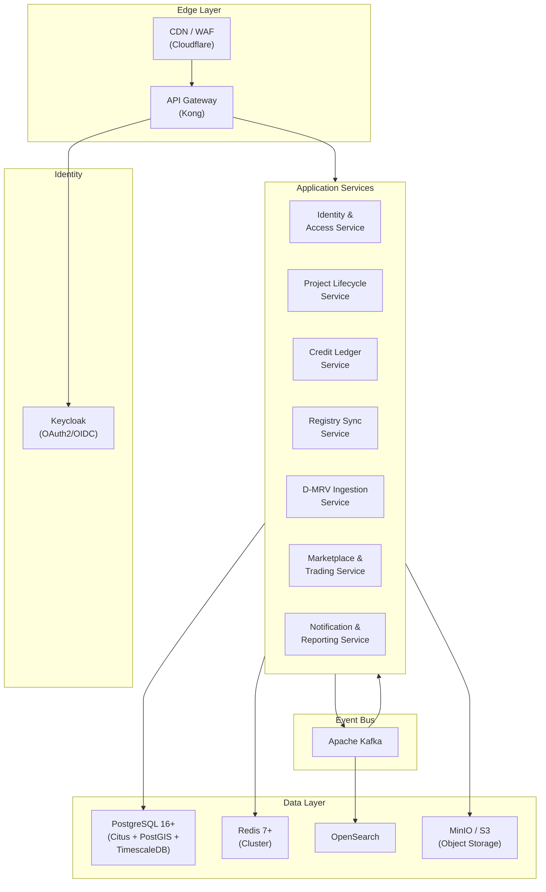
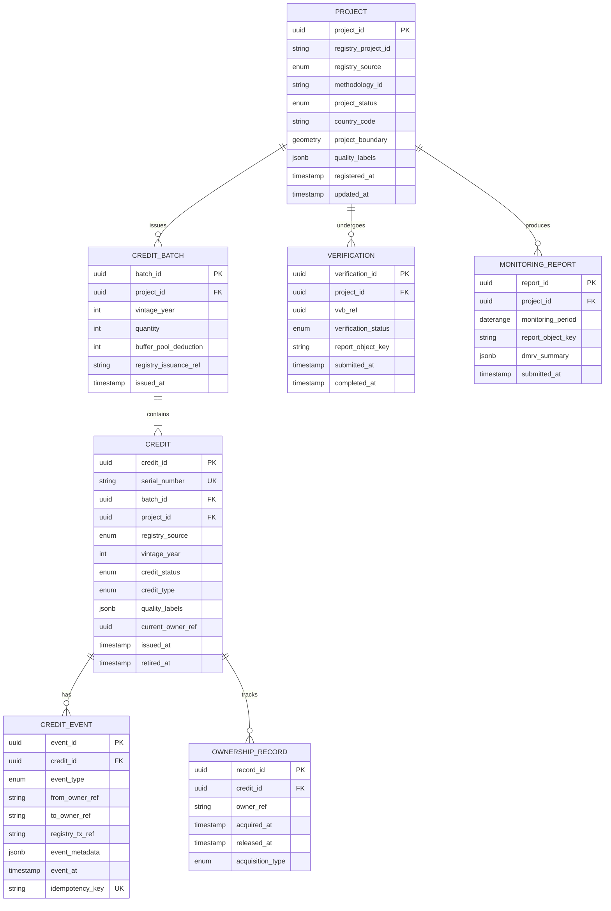
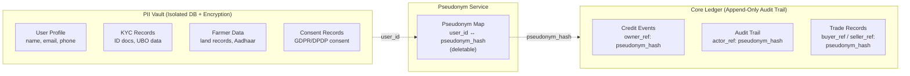
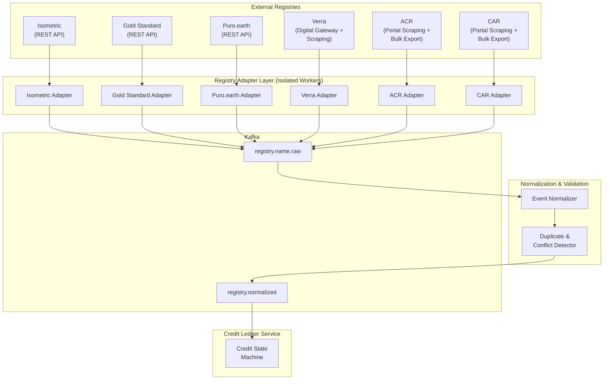
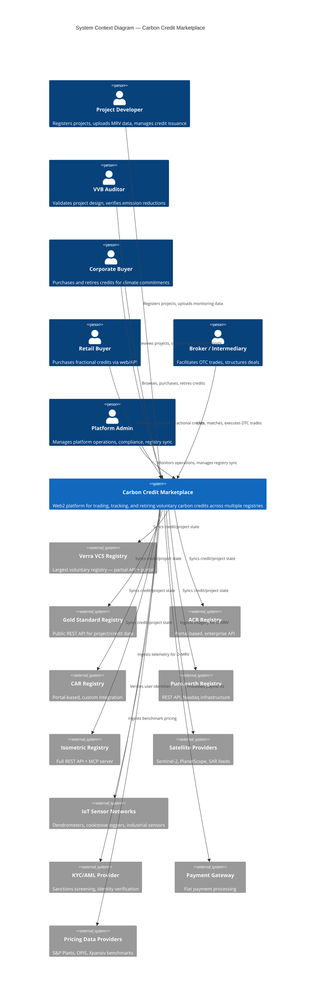
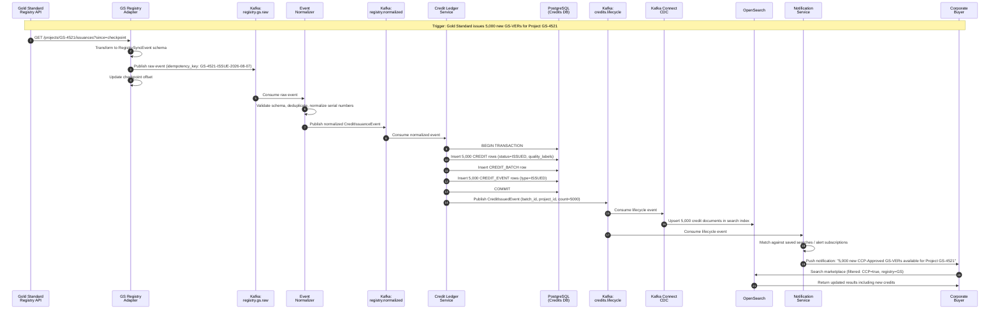

# Phase 2: Core Web2 System Architecture — Voluntary Carbon Credit Marketplace

**Date**: 7 August 2026
**Author Role**: Principal Solutions Architect
**Scope**: Core Web2 system architecture only. Blockchain/tokenization architecture is explicitly out of scope (Phase 3).
**Baseline**: All domain facts sourced from [phase1-voluntary-carbon-marketplace-research.md](file:///c:/carbon-credit-marketplace/research/phase1-voluntary-carbon-marketplace-research.md) unless otherwise noted.

---

## 0. Design Constraints & Assumptions

| Parameter | Value | Source |
|:---|:---|:---|
| Active projects | 100,000 | User requirement |
| Credits tracked | Up to 1 billion | User requirement |
| User base | Global, multi-region | User requirement |
| Operating entity | India-based | User requirement |
| Uptime target | 99.9%+ (~8.7 h downtime/yr) | User requirement |
| Deploy model | Zero-downtime (blue-green / canary) | User requirement |
| Compliance posture | SOC2 / ISO 27001 alignment; GDPR + India DPDP Act | Phase 1 §4 |
| PII isolation | PII must be erasable; must not reside in any immutable/append-only ledger | Phase 1 §4 (GDPR Art. 17 + DPDP Act) |
| Multi-actor workflow | Project developers, VVBs, registries, corporate/retail buyers, brokers | Phase 1 §1 |
| Registry API maturity | Ranges from fully open REST (Isometric, Gold Standard) to portal-only scraping (Verra partial, ACR/CAR closed) | Phase 1 §2 |

### Provisional Dependencies on Unverified Phase 1 Facts

The Phase 1 research document flags the following as requiring re-verification (§"Critical Parameters Requiring Re-Verification"). Architectural decisions that depend on these facts are marked **⚠ PROVISIONAL** throughout this document:

1. **Verra Digital Gateway API Specifications** — Our registry adapter design for Verra assumes OAuth 2.0 + API-key authentication and JSON workflows. If the production API differs materially, the Verra adapter must be rebuilt. *Architecture impact: Registry Sync §4.*
2. **India DPDP Act Implementation Rules** — Our PII isolation and consent-manager design assumes the Act's cross-border transfer whitelist and consent-manager technical standards will follow the draft rules available as of March 2026. If final rules impose data-residency mandates beyond what we model, the PII Vault may require a dedicated India-region-only deployment. *Architecture impact: Data Architecture §3.*
3. **Registry Tokenization Policies** — Out of scope for this phase, but any future blockchain bridge design (Phase 3) depends on whether registries like Verra, Gold Standard, and ACR formally approve permissioned tokenization bridges. *Architecture impact: None in this phase.*
4. **ICVCM Methodology Decisions** — Our quality-label tagging model assumes the current set of CCP-Approved methodologies. New approvals or rejections will require data-model updates but not structural changes. *Architecture impact: Low; data-model additive only.*
5. **Host-Nation Article 6.2 Frameworks** — CORSIA-eligibility metadata flags in our credit model are based on current framework understanding. *Architecture impact: Metadata schema; low structural risk.*

---

## 1. Architectural Style Recommendation

### Decision: Event-Driven Modular Services (Hybrid)

This is neither a pure microservices architecture nor a modular monolith. It is an **event-driven hybrid** composed of a small number of coarse-grained, domain-bounded services (6–8, not 30+) communicating asynchronously via an event bus, with synchronous API calls only at the edge (API gateway → service) and for latency-sensitive reads.

### Options Evaluated

| Criterion | Pure Microservices (30+ services) | Modular Monolith (single deployable) | **Event-Driven Modular Services (selected)** |
|:---|:---|:---|:---|
| **Team scaling** | Excellent — independent deploy per team | Poor above ~15 engineers | Good — 6–8 services map to 3–5 teams |
| **Operational complexity** | Very high — distributed tracing, N deploy pipelines, network partitions | Low — one binary | Moderate — manageable number of services |
| **Data consistency** | Hard — saga patterns required everywhere | Easy — single DB transactions | Moderate — event sourcing for cross-service, ACID within service |
| **Registry sync isolation** | Good — registry adapters are independent | Poor — adapter failure crashes monolith | **Good — registry adapters are isolated workers behind the event bus** |
| **Zero-downtime deploy** | Easy per-service | Possible but risky for large binaries | Easy per-service |
| **Cost at early scale** | High — K8s cluster overhead for 30 services | Low | Moderate — 6–8 services fit a small cluster |
| **Latency** | Higher (inter-service hops) | Lowest (in-process calls) | Moderate — async where latency is tolerable, sync at the edge |

### Why Rejected

- **Pure Microservices**: At 100K projects and an early-stage team (likely <20 engineers), 30+ services create operational overhead that outweighs organizational benefits. The domain boundaries in carbon credit marketplaces are not complex enough to warrant that granularity — the credit lifecycle is fundamentally linear (register → validate → verify → issue → trade → retire).
- **Modular Monolith**: Attractive for speed, but the registry synchronization problem (§4) requires hard isolation. A hung Verra scraper should not affect buyer-facing API latency. Additionally, D-MRV data ingestion (satellite imagery, IoT streams) has fundamentally different scaling characteristics than transactional credit trading — these cannot share a single process pool without resource contention.

### When to Revisit

- **Scale beyond 500K active projects or 10+ engineering teams**: Consider further decomposing the Trading and Credit Lifecycle services into independent microservices.
- **Sub-50ms latency requirements for trading**: Consider a dedicated low-latency trading engine bypassing the event bus for order matching.

### Service Boundaries

| Service | Responsibility | Scaling Profile |
|:---|:---|:---|
| **API Gateway** | Auth, rate limiting, routing, TLS termination | Horizontal, stateless |
| **Identity & Access Service** | User accounts, KYC/AML, RBAC, consent management | Horizontal, stateless (DB-backed) |
| **Project Lifecycle Service** | Project registration, validation/verification workflow, methodology tracking | Moderate — workflow-heavy, DB-bound |
| **Credit Ledger Service** | Credit issuance, serialization, ownership, transfer, retirement — the canonical credit state machine | **Critical path** — ACID, strongly consistent |
| **Registry Sync Service** | Ingests external registry state (Verra, GS, ACR, CAR, Puro, Isometric) via adapters | I/O-bound, independently scalable per-registry |
| **D-MRV Ingestion Service** | Satellite imagery, IoT telemetry, geospatial processing pipelines | Compute/storage-heavy, burst-scalable |
| **Marketplace & Trading Service** | Order book, listing, matching, settlement orchestration | Latency-sensitive, horizontally scalable |
| **Notification & Reporting Service** | Email/webhook notifications, VCMI claim reports, retirement certificates | Asynchronous, queue-driven |

---

## 2. Core Technology Stack

### 2.1 API Gateway & Authentication

| Component | **Selected** | Alternative Considered | Rationale |
|:---|:---|:---|:---|
| API Gateway | **Kong Gateway (OSS) on Kubernetes** | AWS API Gateway; Envoy + custom control plane | Kong provides plugin-based auth, rate limiting, and request transformation without cloud lock-in. AWS API Gateway was rejected due to vendor lock-in and limited customization for multi-region active-active. Envoy is powerful but requires building a control plane — unnecessary complexity at this stage. |
| Auth Protocol | **OAuth 2.0 / OIDC via Keycloak** | Auth0; AWS Cognito; custom JWT issuer | Keycloak is OSS, self-hosted (critical for DPDP Act data-residency), supports RBAC, MFA, and consent scoping. Auth0 is excellent but SaaS-only — risky under potential DPDP data-residency mandates (**⚠ PROVISIONAL** — depends on final DPDP rules). Cognito locks to AWS. Custom JWT issuers are engineering waste when Keycloak exists. |
| AuthZ Model | **RBAC with Attribute-Based Access Control (ABAC) extensions** | Pure RBAC; OPA/Rego | Multi-actor workflows (developer, VVB, buyer, broker, admin) need role-based gates, but per-project and per-credit attribute policies (e.g., "VVB X can only verify projects in methodology Y") require ABAC. OPA/Rego is powerful but adds operational complexity — Keycloak's built-in policy engine covers 90% of cases. OPA may be added later for complex cross-service policies. |

### 2.2 Primary Database

| Component | **Selected** | Alternative Considered | Rationale |
|:---|:---|:---|:---|
| Primary OLTP DB | **PostgreSQL 16+ (with Citus extension for horizontal sharding)** | CockroachDB; Amazon Aurora PostgreSQL; MongoDB | PostgreSQL is the industry standard for transactional workloads with JSONB support for semi-structured registry metadata. Citus enables horizontal sharding when single-node PostgreSQL reaches limits (~500M rows per table). CockroachDB offers built-in distribution but has weaker ecosystem tooling and higher operational learning curve. Aurora locks to AWS. MongoDB was rejected — credit ledger operations require ACID transactions with foreign-key integrity, not document flexibility. |
| Sharding Strategy | Shard by `registry_id` + `project_id` composite for credit tables; tenant-based for user/identity tables | — | Credits from different registries have no cross-registry transactional dependencies, making registry-based sharding natural. |

### 2.3 Time-Series & Spatial Data Store

| Component | **Selected** | Alternative Considered | Rationale |
|:---|:---|:---|:---|
| Time-Series DB | **TimescaleDB (PostgreSQL extension)** | InfluxDB; Amazon Timestream; QuestDB | TimescaleDB runs on the same PostgreSQL infrastructure, reducing operational overhead. IoT telemetry (dendrometer readings, cookstove thermal logs, DAC flow meters) and satellite-derived vegetation indices are classic time-series workloads. InfluxDB is excellent but requires a separate operational stack. Timestream locks to AWS. QuestDB lacks mature ecosystem. |
| Spatial/GIS | **PostGIS (PostgreSQL extension)** | Google BigQuery GIS; dedicated GeoServer | PostGIS is the industry-standard geospatial extension. Project boundary polygons, satellite tile footprints, and deforestation risk maps are stored and queried spatially. BigQuery GIS is powerful for analytics but expensive for transactional spatial queries. GeoServer is a presentation layer, not a data store. |

**Key Advantage**: TimescaleDB + PostGIS + Citus all run as PostgreSQL extensions. This means a single database engine covers OLTP, time-series, and spatial workloads — dramatically reducing operational complexity at early scale. As D-MRV data volumes grow beyond ~10 TB of time-series data, TimescaleDB can be separated into a dedicated cluster.

### 2.4 Message Queue / Event Bus

| Component | **Selected** | Alternative Considered | Rationale |
|:---|:---|:---|:---|
| Event Bus | **Apache Kafka (managed: Confluent Cloud or self-hosted via Strimzi on K8s)** | RabbitMQ; Amazon SQS/SNS; NATS; Apache Pulsar | Kafka is selected because: (1) event sourcing for the credit ledger requires durable, ordered, replayable event logs — Kafka's append-only log is purpose-built for this; (2) registry sync events must be processed exactly-once with offset tracking; (3) D-MRV telemetry streams require high-throughput ingestion. RabbitMQ is excellent for task queues but lacks durable replay. SQS/SNS locks to AWS and lacks ordering guarantees at scale. NATS is lightweight but has weaker durability guarantees. Pulsar is capable but has a smaller operational community. |
| Task Queue (supplement) | **Redis Streams or BullMQ (on Redis)** for short-lived, non-critical async tasks (email, PDF generation) | Celery; SQS | Redis is already in the stack for caching (see §2.5). Using Redis Streams for lightweight task queuing avoids adding another infrastructure component. Celery adds Python-specific complexity. |

**Kafka Topic Design** (high-level):
- `registry.{registry_name}.events` — raw ingested events per registry
- `credits.lifecycle` — credit state transitions (issued, transferred, retired)
- `projects.lifecycle` — project state transitions (listed, validated, verified, registered)
- `dmrv.telemetry.{source_type}` — IoT / satellite data streams
- `marketplace.orders` — trade execution events
- `audit.trail` — immutable audit log entries

### 2.5 Caching Layer

| Component | **Selected** | Alternative Considered | Rationale |
|:---|:---|:---|:---|
| Cache | **Redis 7+ (Cluster mode)** | Memcached; Hazelcast | Redis provides: (1) session caching for API gateway; (2) query result caching for marketplace listings; (3) rate-limiting counters; (4) distributed locking for credit transfer atomicity; (5) BullMQ task queuing. Memcached is simpler but lacks data structures, persistence, and pub/sub. Hazelcast is powerful but adds JVM operational overhead. |
| Cache Strategy | Write-through for credit state; TTL-based for project listings and search results | — | Credit state must never be stale (double-sell risk). Project listings can tolerate 30–60s staleness. |

### 2.6 Object Storage

| Component | **Selected** | Alternative Considered | Rationale |
|:---|:---|:---|:---|
| Object Store | **MinIO (S3-compatible, self-hosted) with cloud S3 as replication target** | AWS S3 only; Google Cloud Storage; Azure Blob | MinIO provides S3-compatible object storage that can run in any region (critical for DPDP Act data-residency). Cloud S3 is used as a replication target for disaster recovery. Pure-cloud S3 locks to a single vendor. GCS/Azure Blob fragment the API surface. |
| Storage Classes | Hot (satellite imagery <30 days), Warm (VVB documents, PDDs), Cold (archived vintages >3 years) | — | Satellite imagery is large (10–100 MB/tile) and frequently accessed during verification; archived vintages are rarely accessed. |

**Stored Objects**: VVB validation/verification reports (PDF), Project Design Documents (PDD), satellite imagery tiles (GeoTIFF/COG), monitoring reports, retirement certificates, KYC identity documents (encrypted, PII Vault access only).

### 2.7 Search & Indexing

| Component | **Selected** | Alternative Considered | Rationale |
|:---|:---|:---|:---|
| Search Engine | **OpenSearch (AWS-managed or self-hosted)** | Elasticsearch; Meilisearch; PostgreSQL full-text | Marketplace search requires faceted filtering (by registry, methodology, vintage, country, CCP status, SDG impact, price range) with sub-second response times across 100K+ projects and 1B+ credits. PostgreSQL full-text search cannot handle this at scale. OpenSearch is the maintained fork of Elasticsearch without licensing concerns (Elastic's SSPL license). Meilisearch is fast but lacks the aggregation pipeline needed for complex faceted search. |
| Indexing Strategy | CDC (Change Data Capture) from PostgreSQL → Kafka → OpenSearch via Kafka Connect sink connector | — | Ensures search index stays consistent with the source-of-truth database without application-level dual-write complexity. |

### 2.8 Technology Stack Summary Diagram



---

## 3. Data Architecture

### 3.1 Core Domain Model

The data model is organized around four bounded contexts with strict ownership boundaries:



### 3.2 PII Isolation Architecture

**Problem**: GDPR Article 17 (Right to Erasure) and India DPDP Act require the ability to permanently delete personal data upon request. However, credit lifecycle events (issuance, transfer, retirement) must be immutable for audit integrity and anti-double-counting. These requirements are in direct conflict.

**Solution**: **PII Vault pattern with pseudonymized references.**



#### Design Rules

1. **Separate database instance**: PII is stored in a dedicated PostgreSQL instance (`pii_vault_db`) with field-level AES-256 encryption at rest, separate backup lifecycle, and restricted network access (only the Identity & Access Service can query it).

2. **Pseudonym references**: All references to users in the credit ledger, audit trail, and trade records use a one-way pseudonym hash (`owner_ref`, `actor_ref`, `buyer_ref`, `seller_ref`). The mapping from `user_id` → `pseudonym_hash` is stored in a deletable mapping table within the PII Vault.

3. **Right to Erasure execution**:
   - Delete the user's PII from `pii_vault_db` (profile, KYC docs, farmer data, consent records).
   - Delete the pseudonym mapping entry.
   - The credit ledger retains events referencing `pseudonym_hash`, but without the mapping, the hash is irreversibly anonymous — satisfying GDPR Article 17 while preserving ledger integrity.

4. **Consent management**: A dedicated consent-management module within the Identity & Access Service records purpose-specific consent (GDPR lawful basis, DPDP Act consent) with timestamps, withdrawal capability, and multi-language notice delivery (supporting regional Indian languages per DPDP Act requirements).

5. **⚠ PROVISIONAL**: If final India DPDP Act implementation rules mandate that farmer PII (land records, Aadhaar-linked data) must be stored exclusively within Indian data centers with no cross-border replication, the PII Vault will require a dedicated India-region-only PostgreSQL instance with no replication to non-India regions. The pseudonym hashes (non-PII) can still replicate globally. This is architecturally supported by the vault isolation pattern but would add operational complexity.

#### Quality Label Data Model

Credits carry multiple quality labels that evolve over time. These are stored as a JSONB array on the `CREDIT` entity:

```json
{
  "quality_labels": [
    {"label": "CCP_APPROVED", "methodology": "VM0047", "assessed_at": "2026-01-15T00:00:00Z"},
    {"label": "CORSIA_ELIGIBLE", "phase": "FIRST_PHASE", "authorization": "LOA-IND-2025-0042"},
    {"label": "CCB_GOLD", "assessed_at": "2025-09-01T00:00:00Z"},
    {"label": "ARTICLE6_AUTHORIZED", "host_country": "IND", "ca_reference": "CA-IND-2026-007"}
  ]
}
```

This is stored as JSONB rather than a normalized table because: (1) labels are read-heavy (every marketplace listing displays them), (2) the set of label types is growing (ICVCM adds new categories), and (3) JSONB supports GIN indexing for efficient filtering in marketplace search queries.

---

## 4. Registry Synchronization Design

### 4.1 The Core Problem

The platform must maintain a consistent local representation of credit state that mirrors the source-of-truth registries. The difficulty is that **registries have wildly different API maturity levels** (Phase 1 §2):

| Registry | API Quality | Sync Strategy |
|:---|:---|:---|
| Isometric | Fully open REST + MCP server, cursor-based pagination | Direct API polling with webhook subscription (if available) |
| Gold Standard | Public REST API for reads | Direct API polling |
| Puro.earth | Public Registry API + MyPuro API | Direct API polling |
| Verra | Partial — Digital Gateway API for workflows; external data requires scraping/third-party wrappers | **⚠ PROVISIONAL**: Hybrid — use Digital Gateway API where available, supplement with scheduled HTML scraping + change detection |
| ACR | Web portal only; enterprise API requires agreement | Scheduled HTML scraping + periodic CSV/JSON bulk export ingestion |
| CAR | Web portal only; custom account integration | Scheduled HTML scraping + periodic bulk export ingestion |

### 4.2 Design Principle: Design for the Weakest Registry

The synchronization architecture is designed around ACR/CAR (the weakest case), not Isometric/Gold Standard (the best case). Every registry adapter must produce the same normalized output — a stream of `RegistrySyncEvent` messages on Kafka — regardless of how it obtains the data.

### 4.3 Registry Adapter Architecture



### 4.4 Adapter Design Patterns

#### Pattern A: API-First Adapters (Isometric, Gold Standard, Puro.earth)

```
1. Scheduled poll (configurable interval: 1–15 min)
2. Fetch new/updated records since last checkpoint (cursor/timestamp-based)
3. Transform to RegistrySyncEvent schema
4. Publish to Kafka topic registry.{name}.raw
5. Update checkpoint offset in adapter state DB
```

- **Idempotency**: Each event carries a deterministic `idempotency_key` derived from `registry_source + serial_number + event_type + registry_timestamp`. The Credit Ledger Service deduplicates on this key.
- **Rate limiting**: Adapters self-throttle based on documented or observed rate limits. Exponential backoff with jitter on 429/5xx responses.

#### Pattern B: Hybrid Adapters (Verra — ⚠ PROVISIONAL)

Verra requires a two-track approach because the Digital Gateway API covers workflow management but not comprehensive external data access:

```
Track 1 (API): Authenticate via OAuth 2.0 + API key → poll Digital Gateway 
              endpoints for project workflow status changes
Track 2 (Scraping): Headless browser (Playwright) scheduled crawl of the 
              Verra Registry public search pages → detect changes via 
              content hashing → extract credit status/retirement events
Track 3 (Third-party): Ingest from third-party Verra data aggregators 
              (e.g., Berkeley VCRD exports) as a reconciliation source
```

**⚠ PROVISIONAL**: This design is based on Phase 1's characterization of Verra's API as "partial/portal-dependent." If Verra's production Digital Gateway API provides comprehensive read access to credit statuses, transfers, and retirements, Track 2 (scraping) can be deprecated. This must be verified with Verra's developer portal before build.

#### Pattern C: Scraping-First Adapters (ACR, CAR)

```
1. Scheduled headless browser crawl (Playwright) — every 30–60 min
2. Navigate portal pages, extract tabular credit/project data
3. Diff against locally cached snapshot (content hash comparison)
4. On detected changes: transform to RegistrySyncEvent, publish to Kafka
5. Supplement with bulk CSV/JSON export ingestion (daily/weekly)
6. Reconciliation job: compare scrape-derived state vs. bulk export 
   state → flag discrepancies for manual review
```

**Scraping Resilience Measures**:
- DOM selectors are externalized as configuration (not hardcoded) — portal UI changes require config updates, not code deploys.
- Screenshot-on-failure captures the page state for debugging.
- Anomaly detection: if a scrape returns >20% fewer records than previous run, it's flagged as a potential portal change rather than auto-ingested.
- Manual fallback: registry sync dashboard exposes a manual "ingest from file upload" capability for operators to upload CSV/PDF exports when scraping breaks.

### 4.5 Conflict Resolution & Consistency

**The canonical state machine for credits**:

```
LISTED → VALIDATED → VERIFIED → ISSUED → ACTIVE → TRANSFERRED* → RETIRED
                                           ↓
                                       CANCELLED
                                       BUFFERED (non-permanence pool)
```

*TRANSFERRED can occur multiple times (chain of ownership).

**Conflict scenarios and resolution**:

| Scenario | Detection | Resolution |
|:---|:---|:---|
| Registry shows credit as RETIRED, local state is ACTIVE | State transition conflict in Credit Ledger Service | **Registry wins**. Apply transition, emit reconciliation event, notify affected owner. |
| Registry shows credit as ISSUED, local state is already ISSUED | Duplicate issuance event | Deduplicate via `idempotency_key`. No-op. |
| Two registries claim same serial number | Cross-registry collision detection | Alert + manual review. This should be impossible per registry serialization rules but must be defensively handled. |
| Scrape returns data inconsistent with previous scrape | Content hash divergence | Queue for reconciliation; do not auto-apply. Operator review required. |
| Registry shows transfer to unknown account | Account not in local system | Create a "shadow" ownership record. If the account later registers on the platform, link it. |

**Consistency model**: **Eventual consistency with registry-authoritative conflict resolution**. The platform is never the source of truth for credit status — the source registry is. The platform's local state converges to match registry state within the sync interval (1–60 min depending on registry). For trading operations, the Credit Ledger Service applies an optimistic locking check: before executing a trade, it verifies the credit's local state timestamp is within an acceptable freshness window (configurable, default 15 min). If stale, it triggers an on-demand re-sync before proceeding.

### 4.6 Registry Sync Monitoring

- **Sync lag dashboard**: Per-registry metric showing `time_since_last_successful_sync`.
- **Discrepancy counter**: Number of unresolved conflicts per registry.
- **SLA alert**: If any registry sync lag exceeds 2 hours, page on-call.
- **Scraper health**: Success rate, DOM parse failure rate, anomaly detection triggers.

---

## 5. Architecture Diagrams

### 5.1 C4 Level 1 — System Context Diagram



### 5.2 C4 Level 2 — Container Diagram

```mermaid
C4Container
    title Container Diagram — Carbon Credit Marketplace

    Person(user, "Platform User", "Developer / VVB / Buyer / Broker")

    System_Boundary(platform, "Carbon Credit Marketplace Platform") {
        Container(cdn, "CDN / WAF", "Cloudflare", "DDoS protection, static asset delivery, TLS termination")
        Container(gateway, "API Gateway", "Kong", "Authentication, rate limiting, request routing")
        Container(web_app, "Web Application", "Next.js / React", "Buyer-facing marketplace UI, project dashboards")
        
        Container(identity_svc, "Identity & Access Service", "Node.js / Go", "User accounts, RBAC, KYC orchestration, consent management")
        Container(project_svc, "Project Lifecycle Service", "Node.js / Go", "Project registration, validation/verification workflows, methodology tracking")
        Container(credit_svc, "Credit Ledger Service", "Go / Rust", "Credit state machine, serialization, ownership tracking, transfer/retirement")
        Container(registry_svc, "Registry Sync Service", "Python / Node.js", "Registry adapters, scraping, normalization, conflict detection")
        Container(dmrv_svc, "D-MRV Ingestion Service", "Python", "Satellite imagery processing, IoT telemetry ingestion, geospatial analysis")
        Container(market_svc, "Marketplace & Trading Service", "Go / Node.js", "Order book, listing management, matching engine, settlement orchestration")
        Container(notify_svc, "Notification & Reporting Service", "Node.js", "Emails, webhooks, VCMI claim reports, retirement certificates")
        
        ContainerDb(pg_main, "Primary Database", "PostgreSQL 16 + Citus", "Projects, credits, trades, workflows")
        ContainerDb(pg_pii, "PII Vault", "PostgreSQL (encrypted)", "User PII, KYC docs, farmer data, consent records")
        ContainerDb(ts_db, "Time-Series Store", "TimescaleDB", "IoT telemetry, satellite-derived indices")
        ContainerDb(redis, "Cache", "Redis Cluster", "Sessions, query cache, rate limits, distributed locks")
        ContainerDb(search, "Search Index", "OpenSearch", "Faceted project/credit search")
        ContainerDb(obj_store, "Object Storage", "MinIO / S3", "PDDs, VVB reports, satellite imagery, certificates")
        Container(kafka, "Event Bus", "Apache Kafka", "Async event streaming, audit log, CDC")
    }

    System_Ext(registries, "Carbon Registries", "Verra, GS, ACR, CAR, Puro, Isometric")
    System_Ext(ext_data, "External Data", "Satellites, IoT, KYC, Payments, Pricing")

    Rel(user, cdn, "HTTPS")
    Rel(cdn, gateway, "Proxied requests")
    Rel(cdn, web_app, "Serves static assets")
    Rel(gateway, identity_svc, "Auth/AuthZ")
    Rel(gateway, project_svc, "Project APIs")
    Rel(gateway, credit_svc, "Credit APIs")
    Rel(gateway, market_svc, "Trade APIs")
    
    Rel(identity_svc, pg_pii, "R/W PII")
    Rel(project_svc, pg_main, "R/W projects")
    Rel(credit_svc, pg_main, "R/W credits")
    Rel(market_svc, pg_main, "R/W trades")
    Rel(market_svc, redis, "Order cache")
    Rel(dmrv_svc, ts_db, "R/W telemetry")
    Rel(dmrv_svc, obj_store, "R/W imagery")
    
    Rel(credit_svc, kafka, "Publishes credit events")
    Rel(registry_svc, kafka, "Publishes sync events")
    Rel(kafka, search, "CDC indexing")
    Rel(kafka, notify_svc, "Event-driven notifications")
    
    Rel(registry_svc, registries, "API / Scraping")
    Rel(dmrv_svc, ext_data, "Satellite / IoT ingestion")
    Rel(identity_svc, ext_data, "KYC verification")
    Rel(market_svc, ext_data, "Payment processing")
```



### 5.3 Event Flow Diagram — Registry Ingestion to Buyer-Facing State Change

This diagram traces a single concrete scenario: **Gold Standard issues new credits for a project already tracked on the platform, and a corporate buyer who has a saved search sees the new credits appear in their marketplace dashboard.**



---

## 6. Three Hardest Technical Problems

### Problem 1 (HARDEST): Registry Synchronization Consistency Under Adversarial Conditions

**Why it's the hardest**: The platform's core value proposition is that it provides a unified, accurate view of credit state across multiple registries. But the platform is never the source of truth — the registries are. And the registries provide inconsistent, unreliable, and sometimes broken data access mechanisms. A synchronization failure doesn't just cause stale UI — it can cause **double-selling** (selling a credit that was already retired on the registry), **phantom credits** (showing credits that were cancelled), or **compliance violations** (showing a credit as CCP-Approved when its methodology was revoked).

**Why it's expensive to fix later**: The registry sync layer touches every downstream system. If the abstraction leaks (e.g., downstream services must know whether a credit came from a scrape or an API), the entire data pipeline becomes coupled to registry-specific behavior.

#### Approach A: Polling + Scraping with Periodic Full Reconciliation

This is the approach described in §4. Registry adapters poll or scrape at intervals, publish events, and a periodic reconciliation job (daily) performs a full-state comparison between local DB and a complete registry export.

| Dimension | Assessment |
|:---|:---|
| **Consistency guarantee** | Eventual (within sync interval + reconciliation window) |
| **Double-sell risk** | Medium — mitigated by freshness checks before trade execution |
| **Operational complexity** | Moderate — scraper maintenance is a constant tax |
| **Cost** | Low — no third-party data fees beyond API subscriptions |
| **Failure mode** | Scraper silently breaks → stale data → detected at next reconciliation (up to 24h delay) |
| **Scalability** | Good — adapters scale independently |

**Mitigation for the failure mode**: Synthetic canary monitoring. The system maintains a set of "canary credits" — credits with known, verified states on each registry. Every sync cycle, the adapter verifies the canary credits' states match expectations. If a canary check fails, the adapter is marked unhealthy and sync results are quarantined.

#### Approach B: Third-Party Registry Data Aggregator as Primary Source

Instead of building and maintaining 6+ registry adapters, subscribe to a third-party registry data aggregator (e.g., Berkeley VCRD, AlliedOffsets, or a commercial provider like Sylvera/BeZero's data feeds) that has already solved the multi-registry ingestion problem.

| Dimension | Assessment |
|:---|:---|
| **Consistency guarantee** | Depends on aggregator's SLA — typically daily or near-real-time |
| **Double-sell risk** | Lower — aggregator has dedicated team maintaining registry connections |
| **Operational complexity** | Low — one integration instead of six |
| **Cost** | High — commercial data licensing fees, potentially per-credit or per-query |
| **Failure mode** | Single point of failure — if the aggregator goes down or changes API, all registries are affected |
| **Scalability** | Good — offloads scaling to the aggregator |
| **Strategic risk** | Critical dependency on a third party that may become a competitor, change terms, or discontinue service |

**Recommendation**: **Approach A (Polling + Scraping) as primary, with Approach B as a reconciliation and fallback data source.** Build the adapter layer because it provides strategic independence and allows real-time integration with advanced registries (Isometric, Gold Standard). Use a third-party aggregator feed as a daily reconciliation check — if the aggregator and our adapters disagree, flag for manual review. This provides defense-in-depth without creating a critical dependency.

---

### Problem 2: Credit State Machine Integrity Across Concurrent Operations

**Why it's hard**: Multiple actors can simultaneously attempt operations on the same credit: a seller lists it for sale, a registry sync reports it as retired, and a buyer attempts to purchase it. The credit state machine must enforce valid transitions and prevent double-sells/double-retirements under concurrent load.

**Why it's expensive to fix later**: The credit state model is the heart of the system. Changing its consistency model after launch means migrating live financial data.

**Design approach**:
- **Optimistic concurrency control** with version numbers on the `CREDIT` table. Every state transition checks `WHERE credit_id = ? AND version = ?`. If the version doesn't match, the operation fails and retries.
- **Distributed locking via Redis** for cross-service operations (e.g., a trade execution that spans the Marketplace Service and Credit Ledger Service). Lock key: `credit:{serial_number}:lock`, TTL: 30 seconds, with fencing tokens.
- **Saga pattern** for multi-credit trades (buying a batch of 1,000 credits). If any credit in the batch fails the state transition, the entire saga rolls back.
- **Registry-authoritative override**: If a registry sync event conflicts with local state, the registry wins. The affected trade is marked as `INVALIDATED` and the buyer is notified and refunded.

---

### Problem 3: D-MRV Data Volume and Storage Cost Management

**Why it's hard**: D-MRV data is massive. A single Sentinel-2 tile is ~800 MB. PlanetScope delivers ~1.5 TB/day globally at 3m resolution. IoT sensors (dendrometers, flux towers, cookstove loggers) generate continuous time-series streams. At 100K projects, even modest satellite coverage generates petabytes per year.

**Why it's expensive to fix later**: Storage architecture decisions (tiling schemes, compression formats, retention policies) are deeply embedded in processing pipelines. Changing them requires reprocessing historical data.

**Design approach**:
- **Cloud-Optimized GeoTIFF (COG)** format for all raster imagery — enables HTTP range-request access without downloading full files.
- **Tiered storage**: Hot (< 30 days, SSD-backed MinIO), Warm (30 days – 1 year, HDD-backed MinIO), Cold (> 1 year, S3 Glacier or equivalent).
- **Derived data over raw data**: Store raw imagery only for the current monitoring period. After verification, store only derived products (NDVI maps, biomass estimates, change detection outputs) + metadata pointers to the original imagery source (Sentinel Hub, Planet API) for re-access if needed.
- **Time-series downsampling**: Raw IoT telemetry is stored at full resolution for 90 days in TimescaleDB. After 90 days, continuous aggregates (hourly/daily averages) are materialized and raw data is purged. Verification-critical summary statistics are preserved indefinitely.
- **Cost projection**: At 100K projects with ~10% having active D-MRV coverage, estimated storage is ~50–100 TB/year for derived products (manageable) vs. ~5–10 PB/year for raw imagery (unmanageable without the tiering strategy above).

---

## 7. Infrastructure & Deployment Architecture

### Multi-Region Strategy

| Region | Role | Services Deployed |
|:---|:---|:---|
| **India (Mumbai / ap-south-1)** | Primary — operating entity, DPDP Act compliance | All services, PII Vault (primary), primary DB |
| **Europe (Frankfurt / eu-central-1)** | Secondary — GDPR compliance, EU buyer proximity | Read replicas, marketplace cache, CDN PoP |
| **US East (Virginia / us-east-1)** | Tertiary — North American registry proximity (ACR, CAR) | Registry sync adapters for ACR/CAR, read replicas |

### Deployment Model

- **Container orchestration**: Kubernetes (EKS/GKE/self-hosted) with Helm charts per service.
- **Zero-downtime deploys**: Blue-green deployments for stateless services; canary deployments for the Credit Ledger Service (too critical for big-bang rollouts).
- **Database migrations**: Online schema changes via `pg_repack` or `gh-ost` equivalent. No locking migrations.
- **Infrastructure as Code**: Terraform for cloud resources; ArgoCD for Kubernetes GitOps.

### Observability Stack

| Layer | Tool | Purpose |
|:---|:---|:---|
| Metrics | Prometheus + Grafana | Service health, registry sync lag, trade latency |
| Logging | Fluentd → OpenSearch | Centralized structured logging |
| Tracing | OpenTelemetry → Jaeger | Distributed trace correlation across services |
| Alerting | Grafana Alertmanager | PagerDuty integration for P1 incidents |
| Audit | Kafka audit trail topic → immutable log | Compliance-grade audit trail |

---

## 8. Security Architecture

### Defense-in-Depth Layers

| Layer | Control |
|:---|:---|
| **Edge** | Cloudflare WAF, DDoS protection, bot management |
| **Transport** | TLS 1.3 everywhere (external and internal mTLS via service mesh) |
| **Authentication** | OAuth 2.0 / OIDC via Keycloak, MFA mandatory for financial operations |
| **Authorization** | RBAC + ABAC policies enforced at API Gateway and service level |
| **Data at Rest** | AES-256 encryption for PII Vault, PostgreSQL TDE for primary DB |
| **Data in Transit** | mTLS between all services (Istio/Linkerd service mesh) |
| **Secrets Management** | HashiCorp Vault for API keys, DB credentials, encryption keys |
| **Network** | Kubernetes Network Policies — PII Vault accessible only from Identity Service |
| **Audit** | Immutable Kafka audit trail for all state-changing operations |
| **KYC/AML** | Third-party integration (Jumio, Onfido, or ComplyAdvantage) for identity verification and sanctions screening |

### SOC2 / ISO 27001 Alignment

- **Access reviews**: Quarterly access reviews for all privileged accounts.
- **Penetration testing**: Annual third-party pentest + continuous bug bounty.
- **Incident response**: Documented IR playbooks for data breach, registry sync failure, and double-sell scenarios.
- **Change management**: All production changes require peer review, CI/CD gates, and automated rollback capability.

---

## 9. Executive Architecture Summary

**Date**: 7 August 2026
**Purpose**: Fixed context for the Phase 3 blockchain architecture team.

---

### Core Structural Decisions

**1. Architectural Style**: Event-driven modular services (6–8 coarse-grained services communicating via Apache Kafka). Not a pure microservices decomposition (too many services for team size) and not a monolith (registry sync and D-MRV require hard process isolation).

**2. Source of Truth**: External carbon registries (Verra, Gold Standard, ACR, CAR, Puro.earth, Isometric) remain the canonical source of truth for credit state. The platform maintains a synchronized local replica. **All platform operations must be reconcilable against registry state.** Any future blockchain layer (Phase 3) must also treat registry state as authoritative — the blockchain cannot override a registry retirement.

**3. Credit State Machine**: Credits follow a strict state machine: `LISTED → VALIDATED → VERIFIED → ISSUED → ACTIVE → TRANSFERRED → RETIRED` (with `CANCELLED` and `BUFFERED` as terminal/side states). State transitions are enforced with optimistic concurrency control (version numbers) and distributed locking (Redis). The Credit Ledger Service is the single service authorized to mutate credit state.

**4. PII Isolation**: All personally identifiable information (farmer data, buyer identities, KYC documents) is isolated in a dedicated PII Vault (separate PostgreSQL instance, field-level AES-256 encryption). The credit ledger and audit trail reference users only via pseudonymized hashes. The pseudonym mapping is deletable to satisfy GDPR Article 17 / DPDP Act erasure rights. **The Phase 3 blockchain layer must NEVER store PII or pseudonym mappings on-chain.** Only pseudonym hashes may appear in on-chain records.

**5. Registry Synchronization**: Six registry-specific adapters (ranging from REST API polling to headless-browser scraping) produce normalized events onto Kafka. The platform is designed for the weakest-case registry (ACR/CAR: portal scraping + bulk export), not the best-case (Isometric: full REST API). Verra's adapter design is **provisional** pending verification of Digital Gateway API production capabilities.

**6. Data Stores**: PostgreSQL 16 with Citus (horizontal sharding), PostGIS (geospatial), and TimescaleDB (time-series) as the primary database engine. Redis for caching and distributed locking. Apache Kafka for event streaming and audit logging. OpenSearch for marketplace search. MinIO/S3 for object storage.

**7. D-MRV Pipeline**: Satellite imagery (Sentinel-2, PlanetScope) and IoT telemetry are ingested by a dedicated D-MRV service. Raw imagery is retained only for the current monitoring period; derived products are retained long-term. Time-series data is downsampled after 90 days. **The Phase 3 blockchain layer should reference D-MRV data via content hashes (e.g., IPFS CIDs or SHA-256 of derived products), not store raw D-MRV data on-chain.**

**8. Auth & Identity**: Keycloak (self-hosted) for OAuth 2.0 / OIDC with RBAC + ABAC. Six actor roles: Project Developer, VVB Auditor, Corporate Buyer, Retail Buyer, Broker, Platform Admin. KYC/AML via third-party provider integration.

**9. Multi-Region**: Primary in India (Mumbai) for DPDP Act compliance. Secondary in EU (Frankfurt) for GDPR and EU buyer latency. Tertiary in US East for North American registry proximity.

**10. Compliance Boundaries**: SOC2/ISO 27001 posture. PII Vault has the strictest access controls (only the Identity & Access Service can query it). Audit trail is immutable (Kafka log with retention = indefinite). All financial operations require MFA.

### Interfaces the Phase 3 Blockchain Layer Must Respect

| Interface Point | Contract |
|:---|:---|
| Credit state queries | Read from Credit Ledger Service API or consume `credits.lifecycle` Kafka topic |
| PII access | **Prohibited on-chain.** Read via Identity Service API only, never cached in smart contracts |
| D-MRV verification data | Reference via content hash only; retrieve full data from object storage via API |
| Trade settlement | Orchestrate via Marketplace Service → Credit Ledger Service. Blockchain settlement must call back to Credit Ledger Service to confirm state transition |
| Audit trail | Append to the existing Kafka audit topic; blockchain transaction hashes should be included as metadata |
| Registry reconciliation | Blockchain credit state must be reconcilable against registry state via the same reconciliation pipeline |

### Key Risks for Phase 3 to Plan For

1. **Registry-blockchain state divergence**: If a credit is tokenized on-chain but the registry retires it off-chain, the platform must detect this conflict and handle the on-chain token (burn it, flag it, compensate the holder). This is the hardest cross-phase integration problem.
2. **Verra tokenization policy**: Verra's 2022 prohibition on unauthorized tokenization is still in effect. Phase 3 must not proceed for Verra credits without a formal permissioned bridging agreement. (**⚠ PROVISIONAL** — re-verify registry tokenization policies.)
3. **Latency mismatch**: On-chain settlement (seconds to minutes) vs. registry settlement (minutes to hours). The platform's consistency model must handle this temporal gap without allowing double-spends.

---

*End of Phase 2 Core Architecture Document.*
