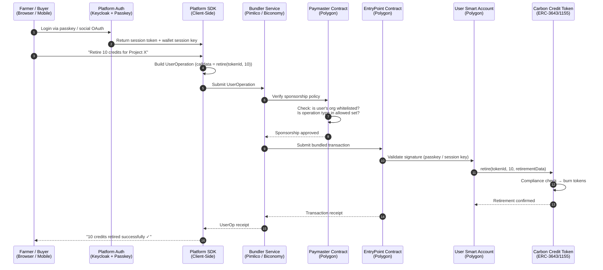
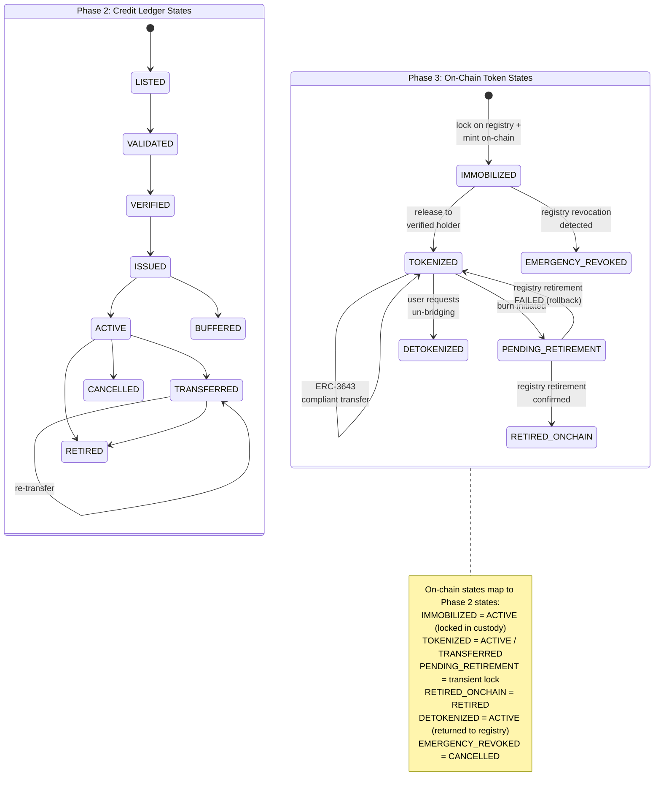
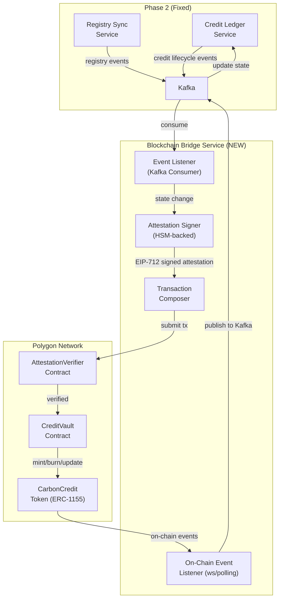
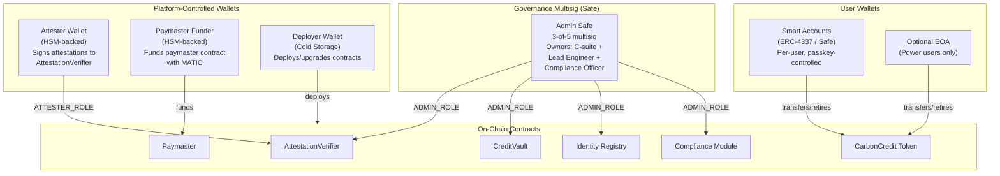
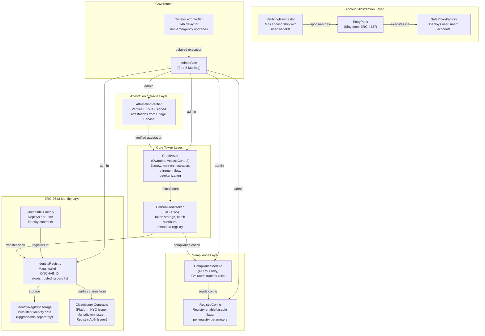
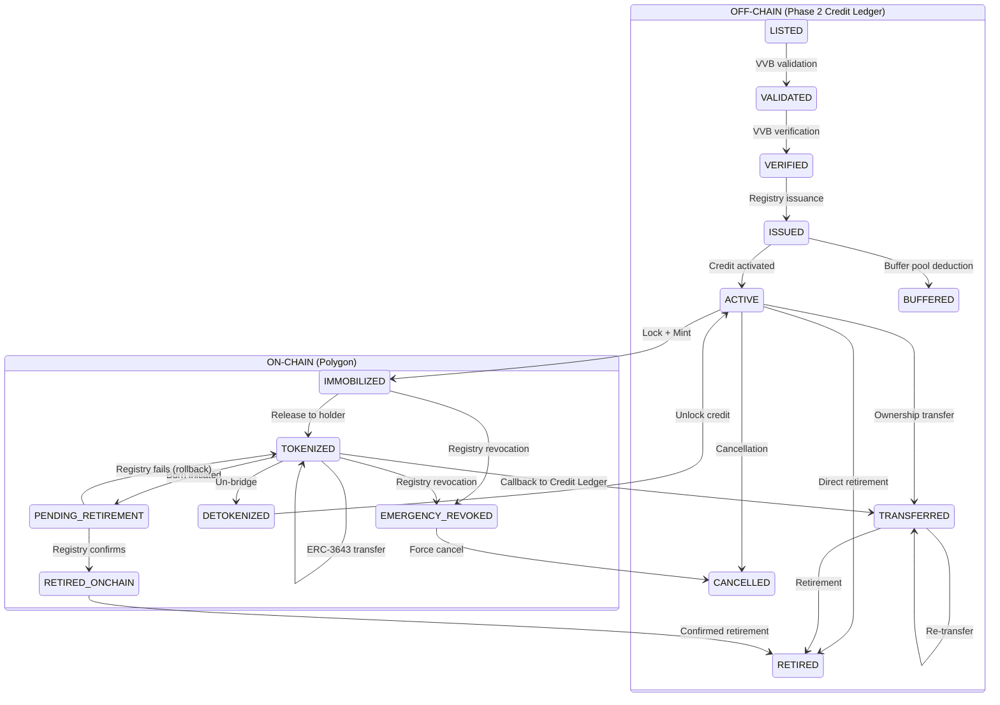
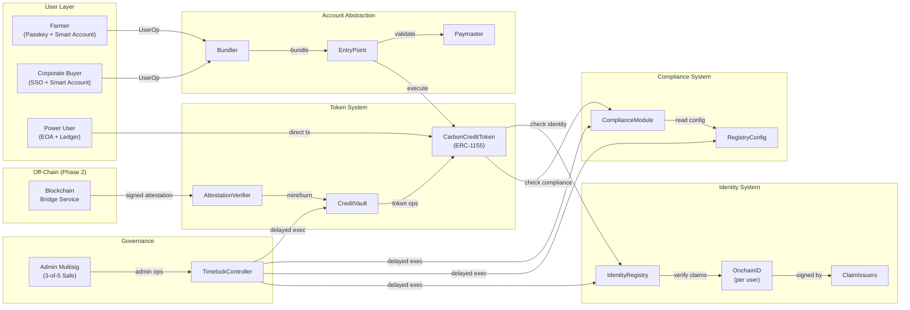
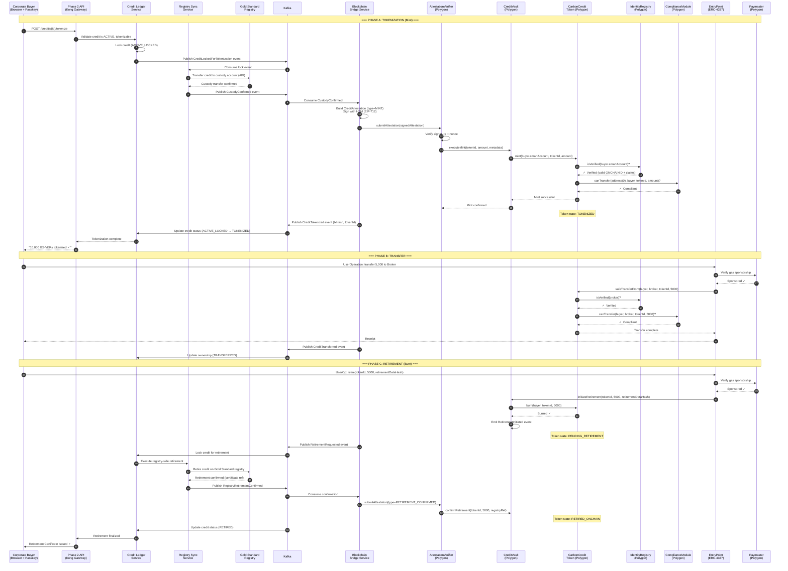

# Phase 3: Blockchain & Smart Contract Architecture — Voluntary Carbon Credit Marketplace

**Date**: 18 August 2026
**Author Role**: Senior Blockchain Architect
**Scope**: On-chain and hybrid blockchain architecture only. Phase 2's services, databases, and event bus are treated as fixed integration points. End-to-end user workflows (Phase 4) and API schemas (Phase 5) are out of scope.
**Baseline**: All domain facts sourced from [phase1-voluntary-carbon-marketplace-research.md](file:///c:/carbon-credit-marketplace/research/phase1-voluntary-carbon-marketplace-research.md), system architecture from [phase2-core-architecture.md](file:///c:/carbon-credit-marketplace/architecture/phase2-core-architecture.md), and blockchain-specific findings from [phase3a-blockchain-domain-refresh.md](file:///c:/carbon-credit-marketplace/research/phase3a-blockchain-domain-refresh.md).

---

## 0. Phase 2 Integration Constraints (Fixed — Not Open for Redesign)

The following constraints are inherited from Phase 2 and are non-negotiable for this architecture:

| Constraint | Source | Implication for Phase 3 |
| :--- | :--- | :--- |
| External registries are the authoritative source of truth | Phase 2 §9, item 2 | On-chain state is a **subordinate mirror**, never a parallel authority. Every on-chain token must be reconcilable against registry state. |
| No PII or pseudonym-to-identity mappings on-chain | Phase 2 §3.2, §9 item 4 | Only `owner_ref` and `actor_ref` pseudonym hashes may appear on-chain. ONCHAINID claims must contain **only** compliance attestation flags, never personal data. |
| D-MRV data referenced by content hash only | Phase 2 §9 item 7 | Smart contracts store IPFS CIDs or SHA-256 digests. Raw sensor/satellite data never touches the chain. |
| On-chain settlement must call back to Credit Ledger Service | Phase 2 §9, Interfaces table | The blockchain is not an independent settlement layer. Every on-chain state change must be confirmed by the Credit Ledger Service before or after execution. |
| Credit state machine: `LISTED → VALIDATED → VERIFIED → ISSUED → ACTIVE → TRANSFERRED → RETIRED` (+ `CANCELLED`, `BUFFERED`) | Phase 2 §4.5 | The on-chain token lifecycle must map onto this existing machine, not introduce a conflicting second machine. |
| Event bus integration via Kafka | Phase 2 §2.4 | Blockchain events are published to Kafka topics; the Blockchain Bridge Service consumes from `credits.lifecycle` and `registry.normalized`. |

---

## 1. Network Validation: Polygon

### Decision: Polygon PoS (with future Polygon zkEVM migration path)

Polygon was selected outside this phase. This section validates the choice and flags risks.

#### Validation Against Phase 3a Findings

| Criterion | Polygon PoS Assessment | Phase 3a Reference |
| :--- | :--- | :--- |
| **Gas cost** | $0.005–$0.05 per tx — acceptable for credit-level operations (mint, transfer, retire) | Phase 3a §Blockchain Infrastructure |
| **Finality** | ~2s probabilistic, ~30 min for Ethereum checkpoint finality — acceptable for carbon credit settlement where registry confirmation is the bottleneck, not chain finality | Phase 3a §Blockchain Infrastructure |
| **EVM compatibility** | Full EVM — ERC-3643, ERC-4337, ERC-1155 all natively supported | Phase 3a §ERC-3643, §ERC-4337 |
| **Ecosystem tooling** | Mature — Hardhat, Foundry, OpenZeppelin, The Graph, production-grade RPC providers | Phase 3a §ERC-4337 Tooling |
| **Carbon market history** | Toucan Protocol, KlimaDAO, BCT/NCT pools — deep legacy liquidity | Phase 3a §Toucan/KlimaDAO Case Study |
| **ERC-4337 infrastructure** | Biconomy, Pimlico, ZeroDev all support Polygon with production paymasters and bundlers | Phase 3a §ERC-4337 Tooling |

**Assessment**: Polygon is a technically valid choice. Gas costs are low enough for per-credit operations. EVM compatibility ensures full support for the ERC-3643 + ERC-4337 stack. Ecosystem maturity is high.

#### Risk: Toucan/KlimaDAO Reputational Association

Phase 3a explicitly documents that Polygon was the execution layer for the Toucan/KlimaDAO quality-arbitrage failure — the episode that triggered Verra's 2022 tokenization ban and destroyed corporate buyer confidence in on-chain carbon (Phase 3a §Toucan/KlimaDAO Case Study). This is a **reputational risk**, not a technical risk. The network itself did not cause the failure; the failure was caused by:

1. **Retire-then-mint bridging** (pre-retiring credits off-chain before tokenization)
2. **Blind fungible pooling** (BCT pools accepting any VCU without quality differentiation)
3. **Speculative demand decoupled from actual retirements**

**What in this architecture actively prevents a repeat:**

| Toucan/KlimaDAO Failure Mode | This Architecture's Structural Prevention |
| :--- | :--- |
| Retire-then-mint bridging | §4: Immobilization/custody model — credits are **locked**, not retired, before minting. Un-retirement is impossible. Detokenization restores the credit to active status. |
| Blind fungible pooling (BCT) | §2: ERC-3643/ERC-1155 hybrid design — each token batch preserves project ID, vintage, methodology, CCP status. No generic fungible pool contract is deployed. Tokens cannot be deposited into undifferentiated pools. |
| Un-KYC'd speculative trading | §2: ERC-3643 identity gating — every transfer requires verified ONCHAINID claims. Anonymous DeFi pool deposits are rejected at the protocol level. |
| Speculative decoupling | §4: Every on-chain token has a 1:1 backing to an immobilized registry credit. No algorithmic treasury or rebase mechanism. No yield farming incentive. Token value derives solely from the underlying credit. |

**When to Revisit**: If institutional counterparties explicitly refuse Polygon due to reputational association, evaluate migration to Base (Coinbase L2 — lower reputational baggage, sub-cent gas via EIP-4844). The ERC-3643 + ERC-4337 stack is chain-agnostic within the EVM ecosystem; migration cost is moderate (contract redeployment + liquidity migration) but not trivial (oracle/indexer reconfiguration).

---

## 2. Token Standard: ERC-3643/ERC-1155 Hybrid

### The Core Problem

Phase 3a's explicit lesson from Toucan's failure is: **"metadata preservation over blind fungibility"** (Phase 3a §Architectural Takeaways). A single fungible ERC-20 (or ERC-3643 in fungible mode) per registry would reproduce exactly the BCT problem — different projects, vintages, and quality levels collapsed into one price. But pure ERC-721 (one NFT per credit) creates 1 billion NFTs for the target credit volume, making gas costs prohibitive and marketplace UX unusable.

### Decision: ERC-3643-Governed ERC-1155 Semi-Fungible Tokens

The architecture deploys an **ERC-1155 multi-token contract wrapped inside ERC-3643's identity and compliance layer**. This is not a standard ERC-3643 deployment — it is a custom integration where:

- **ERC-1155** handles token storage, batch minting, and semi-fungible transfer mechanics
- **ERC-3643's Identity Registry + Compliance Module** gates every transfer with identity verification and compliance checks
- Tokens are fungible **within** a batch (same project + vintage + methodology + quality tier) but **non-fungible across** batches

#### Why This Hybrid, Not Alternatives

| Approach | Evaluation | Verdict |
| :--- | :--- | :--- |
| **Pure ERC-3643 (fungible, one token per registry)** | Reproduces BCT's blind fungibility. A Verra token and a Gold Standard token may be independently fungible, but credits from VM0047 ARR 2025 vintage and VM0006 REDD+ 2012 vintage are collapsed into the same Verra token. This is the exact failure mode Phase 3a warns against. | **Rejected** |
| **Pure ERC-3643 (fungible, one token per project-vintage)** | Avoids cross-project pooling, but at 100K projects × 10 vintages = 1M+ independent ERC-20 token contracts. Deployment gas, indexing, and DEX listing overhead are unmanageable. | **Rejected** |
| **Pure ERC-721 (one NFT per credit)** | Maximum metadata granularity, but 1B NFTs at scale. Batch operations (buy 10,000 credits) require 10,000 individual transfers. Gas and UX are prohibitive. | **Rejected** |
| **ERC-1155 without ERC-3643 governance** | Correct semi-fungible model, but no identity gating. Tokens can be transferred to un-KYC'd wallets, violating registry requirements and this architecture's compliance model. | **Rejected** |
| **ERC-3643/ERC-1155 hybrid (selected)** | Semi-fungible batches preserve project-level metadata. ERC-3643 identity + compliance layer gates all transfers. Batch operations are gas-efficient. One contract manages all token IDs. | **Selected** |

#### Token ID Encoding

Each ERC-1155 `tokenId` encodes the credit batch identity:

```
tokenId = keccak256(registry_source, project_id, vintage_year, methodology_id, quality_tier)
```

Where `quality_tier` is a composite of CCP status, CORSIA eligibility, and Article 6 authorization. This ensures:

- Credits from the same project/vintage/quality are fungible (interchangeable, batch-transferable)
- Credits from different projects, vintages, or quality levels are **never** fungible
- Adding a new quality label creates a new `tokenId`, not a mutation of an existing one

#### On-Chain Metadata per Token ID

Each `tokenId` maps to an immutable metadata struct stored on-chain:

```solidity
struct CreditBatchMetadata {
    bytes32 registrySource;      // e.g., keccak256("GOLD_STANDARD")
    bytes32 projectId;           // registry project ID hash
    uint16  vintageYear;         // e.g., 2025
    bytes32 methodologyId;       // e.g., keccak256("VM0047_v1.1")
    bytes32 qualityTier;         // composite hash of CCP, CORSIA, Art6 flags
    bytes32 hostCountry;         // ISO 3166-1 Alpha-3 hash
    bytes32 projectType;         // e.g., keccak256("ARR"), keccak256("BIOCHAR")
    bytes32 dmrvDataHash;        // IPFS CID or SHA-256 of D-MRV summary
    uint256 totalSupplyMinted;   // total credits minted for this batch
    uint256 bufferPoolDeduction; // credits deducted to non-permanence buffer
    bool    active;              // false if batch is suspended/cancelled
}
```

**Quality label evolution**: If a credit batch gains CCP-Approved status after minting, the platform does not mutate the existing `tokenId`. Instead, it mints a new `tokenId` with the updated quality tier and atomically burns the old tokens / mints new tokens for current holders. This preserves the immutability of quality commitments — a buyer who purchased pre-CCP tokens at a lower price is not retroactively upgraded without explicit re-pricing.

### ERC-3643 Component Architecture

#### 2.1 Identity Registry

The Identity Registry maps Polygon wallet addresses to verified ONCHAINID identity contracts. It answers the question: "Is this wallet address associated with a KYC'd entity that is permitted to hold carbon credit tokens?"

**Design**:

- One `IdentityRegistry` contract per token contract (or shared across the platform if gas-optimized)
- The registry maps `address → ONCHAINID contract address`
- Only wallets with a registered ONCHAINID can receive token transfers
- The Identity & Access Service (Phase 2) is the off-chain authority that triggers identity registration after KYC completion
- **No PII on-chain**: The ONCHAINID contract stores only claim topic codes and claim issuer signatures, never personal data

**Registration flow**:

1. User completes KYC via Phase 2's Identity & Access Service (Keycloak + third-party KYC provider)
2. Phase 2 issues a KYC completion event on Kafka
3. The Blockchain Bridge Service (new service, §5) deploys an ONCHAINID contract for the user (or reuses existing) and registers it in the Identity Registry
4. The user's wallet address is now permitted to receive carbon credit tokens

#### 2.2 Claim Issuers

Claim Issuers are trusted entities that sign attestation claims attached to a user's ONCHAINID. For this platform, the following claim issuers are registered:

| Claim Issuer | Claim Topics Issued | Trust Source |
| :--- | :--- | :--- |
| **Platform KYC Issuer** (platform-operated) | `KYC_VERIFIED`, `AML_CLEARED`, `ENTITY_TYPE` (individual / corporate / project_developer) | Phase 2 Identity & Access Service KYC completion |
| **Jurisdiction Issuer** (platform-operated) | `JURISDICTION_APPROVED` (country whitelist), `SANCTIONS_CLEAR` | Phase 2 sanctions screening results |
| **Registry Authorization Issuer** (platform-operated) | `REGISTRY_AUTHORIZED_{REGISTRY_NAME}` — issued only to wallets linked to accounts with valid registry custody agreements | Registry Sync Service confirmation |
| **CORSIA Compliance Issuer** (future, optional) | `CORSIA_BUYER_ELIGIBLE` — for airline buyers under CORSIA Phase 1 | External CORSIA verification flow |

**Claim lifecycle**:

- Claims have an `expiry` timestamp (e.g., KYC valid for 12 months)
- The Blockchain Bridge Service renews claims on-chain when the off-chain KYC is refreshed
- Revoked claims (e.g., entity fails re-screening) are removed from the ONCHAINID, immediately blocking further token transfers

#### 2.3 Compliance Module

The Compliance Module is a smart contract that encodes transfer rules evaluated on every `safeTransferFrom` call. If any rule fails, the transfer reverts.

**Compliance rules for carbon credit tokens**:

| Rule ID | Rule Logic | Rationale |
| :--- | :--- | :--- |
| `RULE_KYC` | Both sender and receiver must have `KYC_VERIFIED` claim with `expiry > block.timestamp` | Registry mandate: no anonymous holding |
| `RULE_SANCTIONS` | Both parties must have `SANCTIONS_CLEAR` claim | OFAC/EU/UN sanctions compliance |
| `RULE_JURISDICTION` | Receiver's `JURISDICTION_APPROVED` claim must include the token's `hostCountry` (for credits requiring Article 6 CA authorization) | Article 6 corresponding adjustment requirements |
| `RULE_REGISTRY_AUTH` | For tokens from registries requiring partner agreements (Verra — if enabled), both parties must have `REGISTRY_AUTHORIZED_VERRA` claim | Verra's permissioned bridging requirement |
| `RULE_MAX_HOLDING` | No single wallet may hold > X% of total supply of any `tokenId` (configurable, default 25%) | Prevent market manipulation / cornering |
| `RULE_TRANSFER_COOLDOWN` | Tokens cannot be re-transferred within N blocks of receipt (configurable, default 0 — disabled initially) | Anti-wash-trading (activatable if needed) |

**Upgradeability**: The Compliance Module is deployed behind a UUPS proxy, allowing new rules to be added without redeploying the token contract. Rule additions require multisig approval (§6).

#### 2.4 ONCHAINID Integration

Each verified user receives a minimal ONCHAINID identity contract on Polygon:

```
ONCHAINID Contract (per user)
├── owner: user's wallet address (or smart account address for ERC-4337 users)
├── claims[]:
│   ├── topic: KYC_VERIFIED
│   │   issuer: PlatformKYCIssuer.address
│   │   signature: <EIP-712 signed claim>
│   │   data: keccak256(entity_type)  // NO PII — only entity category hash
│   │   expiry: 1756483200  // 12 months from issuance
│   ├── topic: SANCTIONS_CLEAR
│   │   issuer: JurisdictionIssuer.address
│   │   ...
│   └── topic: JURISDICTION_APPROVED
│       issuer: JurisdictionIssuer.address
│       data: keccak256(country_whitelist_bitmap)
│       ...
```

**Critical constraint enforcement**: The `data` field of every claim contains only hashed categorical data (entity type hashes, country code bitmaps). It never contains names, addresses, tax IDs, or any information that could identify a natural person. The pseudonym hash (`owner_ref` from Phase 2) is used as the mapping key between on-chain wallet addresses and off-chain identity — and this mapping exists **only** in Phase 2's PII Vault, never on-chain.

---

## 3. Account Abstraction (ERC-4337): Gasless Onboarding

### Design Goal

Farmers, project developers, and institutional buyers must interact with tokenized carbon credits without:

- Managing private keys or seed phrases
- Holding MATIC (or any native gas token)
- Understanding blockchain transaction mechanics

### Architecture



### Component Decisions

#### 3.1 Smart Account Implementation

| Component | **Selected** | Alternative Considered | Rationale |
| :--- | :--- | :--- | :--- |
| Smart Account | **Safe (formerly Gnosis Safe) + ERC-4337 module** | Kernel (ZeroDev), SimpleAccount (Ethereum Foundation reference), Biconomy Smart Account | Safe is the most audited smart account implementation (~$100B+ secured). The 4337 module enables Safe accounts to operate as ERC-4337 smart accounts. ZeroDev's Kernel is lighter but less battle-tested. SimpleAccount is a reference implementation, not production-grade. |
| Account Factory | **SafeProxyFactory with deterministic CREATE2 deployment** | Custom factory | Deterministic addresses allow pre-computing a user's wallet address before deployment — enables receiving tokens before first transaction. |

#### 3.2 Authentication & Key Management

| User Type | Authentication Method | Key Storage | Rationale |
| :--- | :--- | :--- | :--- |
| **Farmers / Individuals** | WebAuthn passkeys (device biometric) | Device secure enclave (TPM / Secure Enclave) | No seed phrase. Passkey is tied to the user's device biometric. If device is lost, recovery via platform-held recovery key (§6). Phase 3a confirms passkey support is production-mature. |
| **Corporate buyers** | OAuth 2.0 SSO (Azure AD, Google Workspace) + session keys | HSM-backed session keys with time/operation-scoped permissions | Corporations won't install crypto wallets. SSO login generates a session key valid for N hours with scoped permissions (e.g., "can retire up to 10,000 credits"). |
| **Brokers / Power users** | Optional: MetaMask / hardware wallet (Ledger) for self-custody | User-managed EOA or hardware wallet | Power users who want self-custody can connect a standard wallet. The platform still requires ONCHAINID verification. |

#### 3.3 Paymaster Design

| Parameter | Value | Rationale |
| :--- | :--- | :--- |
| **Paymaster type** | Verifying Paymaster (sponsored gas) | Users never pay gas. Platform absorbs gas costs as an operational expense (~$0.01–0.05 per tx at current Polygon gas). |
| **Sponsorship policy** | Whitelist-based: only platform-registered users (with valid session) can use the paymaster. Per-user daily gas budget: $5 (configurable). | Prevents abuse by limiting gas sponsorship to authenticated, KYC'd users with rate limits. |
| **Funding** | Platform treasury funds the paymaster contract with MATIC. Automated top-up when balance drops below 100 MATIC. | Operational cost at 10,000 tx/day ≈ $150–500/day at current gas prices. Manageable. |
| **Provider** | **Pimlico** (primary) with **Biconomy** as fallback bundler/paymaster | Phase 3a confirms both are production-mature with Polygon support. Dual-provider avoids single-point dependency. |

#### 3.4 Bundler Infrastructure

| Parameter | Value |
| :--- | :--- |
| **Primary bundler** | Pimlico hosted bundler (production SLA) |
| **Fallback bundler** | Self-hosted bundler (Stackup open-source) on platform Kubernetes cluster |
| **Submission strategy** | Client SDK submits to primary; on 3 consecutive failures (timeout / 5xx), auto-failover to fallback |

### Operational Complexity

- **Gas budget monitoring**: Grafana dashboard tracking paymaster balance, daily gas spend per user, and projected runway.
- **Session key rotation**: Session keys expire after configurable TTL (default 24h). Expired sessions require re-authentication via passkey/SSO.
- **Recovery**: If a user loses their passkey device, a platform-held recovery guardian (a Safe module signer) can rotate the account's signing key after identity re-verification through Phase 2's KYC process. This is a social recovery model, not a seed phrase recovery.

### Cost Implications

| Cost Item | Estimate (10,000 tx/day) | Notes |
| :--- | :--- | :--- |
| Gas sponsorship (paymaster) | $150–500/day | Polygon PoS gas at $0.015–0.05/tx |
| Bundler service fees | $200–500/month | Pimlico enterprise tier |
| Smart account deployment (one-time per user) | ~$0.10–0.30 per account | CREATE2 deployment, amortized over user lifetime |

### When to Revisit

- **Gas cost spike**: If Polygon gas exceeds $0.50/tx sustained, consider migrating to Base or Arbitrum (sub-cent gas via EIP-4844 blobs).
- **ERC-4337 v0.7+ / EIP-7702**: Native account abstraction at the protocol level may deprecate the bundler/paymaster architecture. Monitor Polygon's roadmap for native AA integration.

---

## 4. Registry-Mirroring and Retirement Mechanics: Immobilization/Custody Model

### Design Principle

This architecture follows the **immobilization/custody model** exclusively. Per Phase 3a's explicit lesson and the hard constraint from Phase 2: credits are locked in registry-side custody (not retired) before minting. The Toucan retire-then-mint model is explicitly rejected.

### Custody Account Structure

For each supported registry, the platform (or a designated custodian) operates a **dedicated custody account** on the registry:

| Registry | Custody Account Type | Status |
| :--- | :--- | :--- |
| Gold Standard | Platform partner account (requires bilateral agreement with GS) | ⚠ PROVISIONAL — requires executed agreement |
| Puro.earth | API-integrated partner account via Nasdaq infrastructure | ⚠ PROVISIONAL — requires executed agreement |
| Isometric | Authenticated API organization account | ⚠ PROVISIONAL — requires executed agreement |
| Verra | **Disabled by default** — gated behind config flag (§7) | Blocked until operational partner program launches |
| ACR | **Disabled by default** — no published tokenization framework | Blocked until formal policy published |
| CAR | **Disabled by default** — no published tokenization framework | Blocked until formal policy published |

### The Lock → Mint → Transfer → Burn/Retire State Machine

#### On-Chain Token States

The on-chain token lifecycle defines four states that map onto Phase 2's existing credit state machine:

| On-Chain State | Description | Phase 2 Credit State Mapping |
| :--- | :--- | :--- |
| `IMMOBILIZED` | Credit locked in registry custody account; on-chain token minted but held by the Vault contract (not yet released to a user) | `ACTIVE` (credit is active on registry, but locked in custody sub-account) |
| `TOKENIZED` | Token released from Vault to a verified holder; freely transferable among ERC-3643-verified wallets | `ACTIVE` / `TRANSFERRED` (ownership changes happen on-chain, reflected back to Phase 2) |
| `PENDING_RETIREMENT` | On-chain burn initiated; waiting for registry-side retirement confirmation | Transient state — not a Phase 2 state; the Credit Ledger Service holds the credit in a `RETIREMENT_PENDING` lock |
| `RETIRED` | On-chain token burned; registry-side retirement confirmed | `RETIRED` |

#### State Transition Diagram (Mapped Against Phase 2)



#### Detailed State Transitions

**Transition 1: Lock → Mint (ACTIVE → IMMOBILIZED)**

```
Preconditions:
  - Credit is in ACTIVE state on Phase 2 Credit Ledger
  - Registry adapter confirms credit is active and un-encumbered on source registry
  - Credit's registry has tokenization enabled (not Verra unless config flag is on, §7)
  - Requesting user has valid ONCHAINID with all required claims

Steps:
  1. User requests tokenization via Phase 2 API
  2. Credit Ledger Service locks the credit (status → ACTIVE_LOCKED, adds lock reason: "TOKENIZATION")
  3. Blockchain Bridge Service instructs the registry adapter to transfer the credit 
     to the platform's custody account on the source registry
  4. Registry adapter confirms custody transfer (via API or manual verification)
  5. Blockchain Bridge Service calls CreditVault.mint(tokenId, amount, creditMetadata)
  6. CreditVault holds minted tokens in escrow
  7. Credit Ledger Service receives mint confirmation, publishes 
     CreditTokenizedEvent to Kafka credits.lifecycle topic
  8. Blockchain Bridge Service calls CreditVault.release(tokenId, amount, recipientAddress)
  9. ERC-3643 compliance check executes on recipient
  10. Tokens arrive in recipient's smart account
  
Failure handling:
  - If registry custody transfer fails (step 4): Credit Ledger Service 
    unlocks the credit. No on-chain action taken.
  - If on-chain mint fails (step 5): Credit remains in registry custody. 
    Retry or manual intervention. Credit Ledger Service keeps lock until resolved.
```

**Transition 2: Transfer (TOKENIZED → TOKENIZED)**

```
Preconditions:
  - Sender holds tokens of the specified tokenId
  - Both sender and receiver have valid ONCHAINIDs with required claims
  - Compliance Module approves the transfer

Steps:
  1. Sender calls safeTransferFrom(sender, receiver, tokenId, amount, data) 
     — or via ERC-4337 UserOperation for gasless flow
  2. ERC-3643 Identity Registry verifies both parties
  3. Compliance Module evaluates all rules (§2.3)
  4. If all checks pass: token balance updates atomically on-chain
  5. Transfer event emitted on-chain
  6. Blockchain Bridge Service's event listener detects Transfer event
  7. Publishes CreditTransferEvent to Kafka credits.lifecycle topic
  8. Credit Ledger Service updates ownership (owner_ref = new pseudonym hash, 
     status = TRANSFERRED)
  
Failure handling:
  - If compliance check fails: transaction reverts. No state change.
  - If Credit Ledger Service callback fails: reconciliation job detects on-chain 
    transfer without matching off-chain record → flags for manual review.
```

**Transition 3: Burn/Retire (TOKENIZED → PENDING_RETIREMENT → RETIRED)**

```
Preconditions:
  - Holder has tokens to retire
  - Holder has valid ONCHAINID
  - Retirement beneficiary data provided (off-chain, stored in Phase 2 only)

Steps:
  1. Holder calls CreditVault.initiateRetirement(tokenId, amount, retirementDataHash)
     — retirementDataHash = SHA-256 of retirement beneficiary info (stored off-chain)
  2. CreditVault burns the tokens from holder's balance
  3. CreditVault emits RetirementInitiated(tokenId, amount, retirementDataHash, onChainTxHash)
  4. Token state: PENDING_RETIREMENT (cannot be un-burned)
  5. Blockchain Bridge Service detects RetirementInitiated event
  6. Publishes RetirementRequestedEvent to Kafka
  7. Credit Ledger Service receives event, places credit in RETIREMENT_PENDING lock
  8. Credit Ledger Service instructs Registry Sync Service to execute registry-side 
     retirement (API call or manual queue for portal-only registries)
  9. Registry adapter confirms retirement on source registry
  10. Credit Ledger Service updates credit status to RETIRED, publishes 
      CreditRetiredEvent to Kafka
  11. Blockchain Bridge Service receives confirmation, calls 
      CreditVault.confirmRetirement(tokenId, amount, registryRetirementRef)
  12. CreditVault records retirement as finalized (immutable on-chain record)
  13. Notification Service issues Retirement Certificate to holder

Failure handling:
  - If registry-side retirement fails (step 9): Credit Ledger Service alerts 
    operations team. The on-chain tokens are already burned, so the holder 
    cannot re-trade them. Resolution options:
    a) Retry registry retirement
    b) If unrecoverable: mint replacement tokens to holder with explanatory event
  - This failure mode is serious but bounded — the platform controls the 
    custody account, so registry retirement should succeed unless the registry 
    itself is down.
```

**Transition 4: Detokenization (TOKENIZED → DETOKENIZED)**

```
Steps:
  1. Holder requests detokenization via platform
  2. CreditVault.detokenize(tokenId, amount, holderAddress) burns on-chain tokens
  3. Blockchain Bridge Service instructs registry adapter to transfer credit 
     from custody account back to holder's registry account
  4. Registry transfer confirmed
  5. Credit Ledger Service unlocks credit, status returns to ACTIVE
  6. Credit is now a normal off-chain credit again, tradeable on traditional markets
```

**Transition 5: Emergency Revocation (IMMOBILIZED/TOKENIZED → EMERGENCY_REVOKED)**

```
Trigger: Registry sync detects that a credit backing an on-chain token has been 
         retired, cancelled, or revoked on the source registry — WITHOUT going 
         through the platform's retirement flow.

This is a DEFECT STATE. Per the hard constraint: "an on-chain token existing 
after registry-side retirement is a defect state requiring immediate 
reconciliation, not a tolerable edge case."

Steps:
  1. Registry adapter detects state divergence (registry says RETIRED/CANCELLED, 
     platform says ACTIVE_LOCKED)
  2. Registry Sync Service publishes CRITICAL ReconciliationAlert to Kafka
  3. Credit Ledger Service immediately locks all operations on affected credits
  4. Blockchain Bridge Service calls CreditVault.emergencyRevoke(tokenId, amount)
     — requires OPERATOR_ROLE multisig (§6)
  5. CreditVault force-burns affected tokens from current holder(s)
  6. Holder is notified of revocation with compensation / dispute process
  7. Incident is logged in immutable audit trail (Kafka + on-chain event)
  8. Post-incident: investigate root cause (unauthorized registry-side action, 
     registry error, or malicious actor)

Operational SLA: Emergency revocation must execute within 1 hour of detection. 
  Monitoring alert fires if any reconciliation discrepancy is unresolved for >30 min.
```

### Reconciliation Pipeline

A dedicated **reconciliation job** runs every 15 minutes (configurable):

1. For each tokenized credit batch: query the Phase 2 Credit Ledger Service for current registry state
2. Compare against on-chain token supply (via The Graph subgraph or direct RPC)
3. Discrepancies are classified:
   - **Type A: Benign lag** — on-chain transfer occurred < 5 min ago, Credit Ledger not yet updated → auto-resolves
   - **Type B: Missing callback** — on-chain event exists but Credit Ledger has no matching record → replay from on-chain event log
   - **Type C: State conflict** — registry says RETIRED but tokens still exist → **EMERGENCY REVOCATION** (see above)
4. Metrics: `reconciliation_discrepancy_count`, `reconciliation_type_c_count` (must always be 0)

---

## 5. Oracle Design: Credit Ledger Attestation Model

### Design Principle

The oracle design follows a **push attestation model**, not a polling model. The Credit Ledger Service pushes signed attestations on-chain; the blockchain does not independently poll registries or the Credit Ledger.

### Why Not Standard Oracle Patterns

| Oracle Pattern | Why Rejected |
| :--- | :--- |
| **Chainlink / Band (external oracle networks)** | The data source is the platform's own Credit Ledger Service, not an external public API. Using Chainlink to read our own database adds cost and latency without adding trust — the platform is already the trusted party for registry data ingestion. |
| **On-chain polling of registry APIs** | Violates Phase 2 constraint: the blockchain must not independently access registries. Also technically impractical (smart contracts cannot make HTTP calls). |
| **UMA / optimistic oracle** | Dispute-based oracles are designed for contested facts. Credit state is not disputed — it's deterministically derived from registry state via Phase 2's reconciliation pipeline. Adding a dispute window adds latency without value. |

### Attestation Architecture



### Blockchain Bridge Service (New Service)

This is the **only new service** introduced by Phase 3. It sits between Phase 2's Kafka event bus and the Polygon network:

| Responsibility | Mechanism |
| :--- | :--- |
| **Consume credit lifecycle events** from Kafka | Kafka consumer group: `blockchain-bridge` |
| **Sign attestations** for on-chain state changes | HSM-backed ECDSA signer (§6) |
| **Submit transactions** to Polygon | Via JSON-RPC to Polygon node (Alchemy/Infura redundant endpoints) |
| **Listen to on-chain events** | WebSocket subscription to contract events; fallback to polling |
| **Publish on-chain events back to Kafka** | Transforms on-chain events to platform event schema, publishes to `blockchain.events` Kafka topic |

### Attestation Message Format

Every on-chain state change submitted by the Bridge Service carries an EIP-712 typed signature:

```solidity
struct CreditAttestation {
    bytes32 attestationType;    // MINT, RETIREMENT_CONFIRMED, EMERGENCY_REVOKE, STATE_UPDATE
    uint256 tokenId;            // ERC-1155 token ID
    uint256 amount;             // number of credits
    bytes32 creditLedgerRef;    // Phase 2 credit event ID (UUID hash)
    bytes32 registryRef;        // registry transaction reference hash
    uint256 timestamp;          // attestation creation time
    uint256 nonce;              // replay protection
}
```

The `AttestationVerifier` contract:

1. Recovers the signer from the EIP-712 signature
2. Verifies the signer is in the `ATTESTER_ROLE` set (multisig-managed)
3. Verifies the nonce is sequential (replay protection)
4. Forwards the attestation to the `CreditVault` for execution

### Latency Characteristics

| Event Direction | Expected Latency | Bottleneck |
| :--- | :--- | :--- |
| Registry → Credit Ledger → On-Chain | 1–60 min (registry-dependent) + ~5s (Kafka + tx submission) | Registry sync interval (Phase 2 §4) |
| On-Chain → Credit Ledger | ~5–15s | Polygon block time + event listener processing |

### Failure Handling

- **Bridge Service downtime**: Credit Ledger Service continues operating normally (it's the source of truth). On-chain state freezes. When Bridge Service recovers, it replays missed Kafka events from the last committed offset.
- **Polygon RPC failure**: Automatic failover to secondary RPC provider. Transaction queue persisted in Redis with retry logic.
- **Attestation signer key compromise**: Emergency pause all contract operations via `PAUSER_ROLE` (§6). Rotate signer key. Resume with new attester.

---

## 6. Custody and Key Management

### Wallet Architecture



### Key Management Tiers

| Wallet | Key Storage | Access Control | Rotation Policy |
| :--- | :--- | :--- | :--- |
| **Admin Multisig** (3-of-5 Safe) | Hardware wallets (Ledger) held by 5 named individuals: CEO, CTO, Lead Blockchain Engineer, Head of Compliance, External Legal Counsel | Requires 3/5 signatures for: contract upgrades, role changes, emergency pause, adding claim issuers, enabling new registries | Annual signer rotation review. Immediate rotation on personnel departure. |
| **Attester Wallet** | AWS CloudHSM or Azure Managed HSM (FIPS 140-2 Level 3) | Automated — only the Blockchain Bridge Service has API access. Key never leaves HSM boundary. | Rotate every 6 months. Old attester key removed from `ATTESTER_ROLE` after new key is operational. |
| **Paymaster Funder** | AWS CloudHSM (separate from Attester) | Automated — funding bot with spending cap (max 1000 MATIC per day) | Rotate every 12 months. |
| **Deployer Wallet** | Air-gapped hardware wallet (Ledger, held in physical safe) | Manual — used only for contract deployments and upgrades. Never connected to internet-facing systems. | Never rotated (not a hot key). Transferred on personnel change. |
| **User Smart Accounts** | Device-bound passkeys (TPM/Secure Enclave) or corporate SSO session keys | User-controlled with platform recovery guardian | Passkey rotation on device change. Session keys auto-expire (24h default). |

### Access Control Roles (On-Chain)

| Role | Assigned To | Permissions |
| :--- | :--- | :--- |
| `DEFAULT_ADMIN_ROLE` | Admin Multisig | Grant/revoke all other roles |
| `ATTESTER_ROLE` | Attester Wallet address | Submit signed attestations to `AttestationVerifier` |
| `MINTER_ROLE` | `CreditVault` contract (called by `AttestationVerifier` on valid attestation) | Mint new tokens |
| `BURNER_ROLE` | `CreditVault` contract | Burn tokens on retirement/revocation |
| `PAUSER_ROLE` | Admin Multisig + Attester Wallet (emergency) | Pause all token transfers |
| `IDENTITY_MANAGER_ROLE` | Blockchain Bridge Service wallet | Add/remove entries in Identity Registry |
| `COMPLIANCE_MANAGER_ROLE` | Admin Multisig | Update compliance rules |
| `CLAIM_ISSUER_ROLE` | Platform Claim Issuer wallets (HSM-backed) | Sign and attach claims to ONChainIDs |

### Institutional Custody Model

For institutional buyers holding large positions (>100,000 credits):

- **Segregated Safe accounts**: Each institutional client can optionally use a dedicated Safe multisig (e.g., 2-of-3 with institutional signers) instead of a single smart account
- **Off-chain custody confirmation**: The Blockchain Bridge Service provides signed attestation receipts for each on-chain operation, suitable for institutional audit files
- **Insurance boundary**: The platform's operational insurance covers the Attester and Paymaster wallets. User smart account security is the user's responsibility (documented in terms of service), with platform recovery guardian as a safety net

---

## 7. Verra Tokenization: Disabled by Default

### Design Rationale

Phase 3a confirms: Verra has proposed an immobilization/partner program but has **not operationally launched** it. Verra's 2022 prohibition on unauthorized tokenization remains in effect (Phase 3a §Verra VCS). Designing Verra tokenization as generally available would be architecturally dishonest — it would create deployment pressure to launch a feature that cannot legally operate.

### Implementation

```solidity
// In RegistryConfig.sol (simplified)
mapping(bytes32 => bool) public registryTokenizationEnabled;

// Default state at deployment:
// registryTokenizationEnabled[keccak256("VERRA")] = false;
// registryTokenizationEnabled[keccak256("ACR")] = false;
// registryTokenizationEnabled[keccak256("CAR")] = false;
// registryTokenizationEnabled[keccak256("GOLD_STANDARD")] = true;  // if agreement signed
// registryTokenizationEnabled[keccak256("PURO_EARTH")] = true;     // if agreement signed
// registryTokenizationEnabled[keccak256("ISOMETRIC")] = true;      // if agreement signed

function enableRegistry(bytes32 registryId) external onlyRole(DEFAULT_ADMIN_ROLE) {
    // Requires 3-of-5 multisig approval
    registryTokenizationEnabled[registryId] = true;
    emit RegistryEnabled(registryId, block.timestamp);
}
```

### Gating Rules

| Rule | Enforcement Point | Bypass Condition |
| :--- | :--- | :--- |
| `CreditVault.mint()` reverts if `!registryTokenizationEnabled[credit.registrySource]` | On-chain (CreditVault contract) | `DEFAULT_ADMIN_ROLE` multisig calls `enableRegistry()` |
| Blockchain Bridge Service ignores `CreditTokenizedEvent` for disabled registries | Off-chain (Bridge Service config) | Config flag: `verra.tokenization.enabled = false` |
| Phase 2 Credit Ledger Service does not offer "tokenize" action for Verra credits in API | Off-chain (API business logic) | Feature flag: `VERRA_TOKENIZATION_ENABLED` environment variable |

### Three-Layer Defense

Tokenization of a Verra credit requires passing **all three** gates. Enabling one layer without the others has no effect:

1. **Phase 2 API gate** (feature flag) — prevents user-facing tokenization request
2. **Bridge Service gate** (config flag) — prevents attestation signing
3. **Smart contract gate** (on-chain mapping) — prevents minting even if steps 1-2 are bypassed

### Enabling Criteria

The multisig should only enable Verra tokenization when **all** of the following are documented:

- [ ] Signed bilateral agreement between the platform and Verra authorizing immobilization/custody model
- [ ] Verra-assigned custody account with API-level transfer capabilities
- [ ] Legal opinion confirming the arrangement complies with Verra's Terms of Use v5+
- [ ] Compliance review confirming no MiCA/VASP registration gaps
- [ ] Successful end-to-end test on Polygon testnet (Mumbai/Amoy) with real Verra sandbox credits

---

## 8. Smart Contract Architecture Map

### Contract Inventory



### Contract Details

| Contract | Proxy Pattern | Size Estimate | External Dependencies |
| :--- | :--- | :--- | :--- |
| `CarbonCreditToken` | UUPS Proxy | ~800 LOC | OpenZeppelin ERC-1155, AccessControl |
| `CreditVault` | UUPS Proxy | ~1200 LOC | CarbonCreditToken, AttestationVerifier, IdentityRegistry |
| `IdentityRegistry` | UUPS Proxy | ~400 LOC | IdentityRegistryStorage, ClaimIssuer interface |
| `IdentityRegistryStorage` | UUPS Proxy | ~200 LOC | — |
| `ComplianceModule` | UUPS Proxy | ~500 LOC | IdentityRegistry, RegistryConfig |
| `RegistryConfig` | UUPS Proxy | ~200 LOC | — |
| `AttestationVerifier` | UUPS Proxy | ~400 LOC | AccessControl, EIP-712 |
| `VerifyingPaymaster` | Non-upgradeable (replaceable) | ~300 LOC | ERC-4337 EntryPoint |
| `OnchainID Factory` | Non-upgradeable | ~200 LOC | OnchainID library |
| `ClaimIssuer` (x3) | Non-upgradeable | ~150 LOC each | OnchainID library |
| `AdminSafe` | Safe Proxy | Standard Safe | Safe contracts |
| `TimelockController` | Non-upgradeable | Standard OZ | OpenZeppelin Governance |

**Total estimated Solidity**: ~4,500–5,000 LOC (excluding tests and deployment scripts)

### Upgrade Policy

| Change Type | Process | Timelock |
| :--- | :--- | :--- |
| **Emergency pause** | Any `PAUSER_ROLE` holder (Attester wallet or Multisig) | Immediate |
| **Compliance rule addition** | Multisig proposal → TimelockController | 24 hours |
| **Contract logic upgrade (UUPS)** | Multisig proposal → TimelockController → upgrade execution | 48 hours |
| **Identity Registry changes** | Blockchain Bridge Service (automated for user onboarding) | Immediate (automated) |
| **Registry enable/disable** | Multisig proposal → TimelockController | 24 hours |

---

## 9. Diagrams

### 9.1 On-Chain Credit Token Lifecycle (Mapped Against Phase 2 State Machine)



### 9.2 Smart Contract Interaction Diagram



### 9.3 Sequence Diagram: Complete Mint-to-Retire Flow



---

## 10. Hardest Problem: Registry-to-Chain State Consistency Under the Immobilization Model

### Why This Is the Hardest Problem

The immobilization/custody model creates a **distributed state machine spanning two independent systems** (the source registry and the Polygon blockchain) with fundamentally different consistency guarantees. The registry is the source of truth but provides weak, asynchronous, and heterogeneous data access (Phase 2 §4). The blockchain provides strong atomic consistency but is the subordinate mirror. The gap between these two systems is where every critical failure mode lives:

- A credit is retired on the registry by an unauthorized actor → on-chain token still exists (double-claim risk)
- A registry API is down for hours → on-chain tokens are being transferred without confirmation that the underlying credit is still valid
- A custody transfer fails silently → on-chain tokens are minted without registry backing

No other problem in this phase has this combination of: (a) unbounded failure modes, (b) cross-system coordination, (c) real financial risk, and (d) dependency on third-party systems the platform does not control.

### Approach A: Synchronous Confirmation (Lock-Step)

Every on-chain state change requires **synchronous confirmation** from the Credit Ledger Service before execution. The smart contract does not execute until the off-chain confirmation is received.

**Mechanism**:

```
1. User initiates on-chain action (e.g., transfer)
2. Smart contract emits PendingAction event, places tokens in escrow
3. Blockchain Bridge Service detects event, queries Credit Ledger Service
4. Credit Ledger Service confirms credit is still valid on registry
5. Bridge Service submits confirmation attestation to smart contract
6. Smart contract executes the action (or reverts if confirmation is negative)
```

| Dimension | Assessment |
| :--- | :--- |
| **Consistency guarantee** | Strong — every on-chain action is registry-confirmed before finalization |
| **State divergence risk** | Very low — confirmation is pre-execution |
| **Latency** | High — every transfer adds 5–60 seconds (Bridge Service round-trip). For registries with slow API responses (ACR, CAR), this could be minutes. |
| **User experience** | Poor — users see a "pending" state for every operation. Unacceptable for marketplace UX. |
| **Operational complexity** | Very high — Bridge Service becomes a critical-path bottleneck. Any Bridge Service outage freezes all on-chain activity. |
| **Gas cost** | Higher — two transactions per action (request + confirmation) |
| **Composability** | Zero — other smart contracts cannot call carbon credit transfers in a single transaction. Breaks DeFi composability if ever needed. |

**When this makes sense**: Only for mint and retirement operations, where the stakes justify the latency.

### Approach B: Optimistic Execution with Async Reconciliation (Selected)

On-chain transfers execute **optimistically** (relying on ERC-3643 compliance checks, not per-transfer registry confirmation). A reconciliation pipeline asynchronously detects and corrects state divergence.

**Mechanism**:

```
1. User initiates on-chain transfer
2. ERC-3643 compliance check verifies identity + rules (on-chain, instant)
3. Transfer executes atomically on-chain
4. Blockchain Bridge Service detects transfer event, publishes to Kafka
5. Credit Ledger Service updates ownership record
6. Reconciliation job (every 15 min) compares on-chain state vs. registry state
7. If divergence detected: emergency revocation (§4, Transition 5)
```

| Dimension | Assessment |
| :--- | :--- |
| **Consistency guarantee** | Eventual — divergence window of up to 15 min (reconciliation interval) |
| **State divergence risk** | Low-medium — mitigated by reconciliation + immediate emergency revocation |
| **Latency** | Low — transfers are instant (single on-chain tx, ~2s finality) |
| **User experience** | Excellent — transfers feel like standard token transfers |
| **Operational complexity** | Moderate — reconciliation job must be highly reliable. False positives in divergence detection cause unnecessary emergency revocations (very costly in user trust). |
| **Gas cost** | Lower — one transaction per action |
| **Composability** | Full — standard ERC-1155 transfer semantics |

**The residual risk and its mitigation**: The 15-minute reconciliation window is the period during which an on-chain token could theoretically exist after its underlying credit has been registry-revoked. This risk is mitigated by:

1. **The platform controls the custody account**: Unauthorized registry-side actions on custody-held credits should be impossible — the registry would need to revoke credits from the platform's own custody account, which should only happen in extreme circumstances (legal seizure, registry policy violation).
2. **Canary monitoring**: The reconciliation job checks a set of known-state canary credits every cycle. If canaries diverge, all operations are paused before checking the full population.
3. **Immediate escalation**: Any Type C discrepancy (state conflict) triggers an emergency alert (PagerDuty P1) with a 30-minute resolution SLA.

### Recommendation

**Hybrid approach**: Use **Approach A (synchronous confirmation) for mint and retirement operations** (high-stakes, infrequent, latency-tolerant). Use **Approach B (optimistic execution) for transfers** (high-frequency, latency-sensitive, lower individual risk because the underlying credit remains immobilized regardless of who holds the token).

| Operation | Consistency Model | Rationale |
| :--- | :--- | :--- |
| **Mint** (lock + mint) | Synchronous (Approach A) | Minting without confirmed custody is catastrophic — it creates unbacked tokens. Worth the latency. |
| **Transfer** | Optimistic (Approach B) | Underlying credit remains in custody regardless of on-chain holder. Divergence risk is low — the credit's existence is not in question, only its on-chain ownership. |
| **Retirement** (burn + registry retire) | Synchronous (Approach A) | Retirement without registry confirmation creates a double-claim. Worth the latency. |
| **Detokenization** | Synchronous (Approach A) | Releasing a credit from custody without confirming the on-chain token is burned risks double-counting. |

---

## Executive Blockchain Architecture Summary

**Date**: 18 August 2026
**Purpose**: Fixed context for Phase 4 (workflows) and Phase 5 (API schemas).

---

### Structural Decisions

**1. Network**: Polygon PoS. Technically validated: low gas ($0.005–0.05/tx), full EVM compatibility, mature ERC-4337 infrastructure. **⚠ PROVISIONAL**: Reputational risk from Toucan/KlimaDAO association. If institutional counterparties refuse Polygon, migration to Base (Coinbase L2) is the fallback — the entire ERC-3643 + ERC-4337 stack is EVM-portable.

**2. Token Standard**: ERC-3643/ERC-1155 hybrid. Credits are semi-fungible: fungible within a batch (same project + vintage + methodology + quality tier), non-fungible across batches. This prevents the BCT-style quality-arbitrage failure while keeping gas costs manageable. ERC-3643's Identity Registry + Compliance Module gates every transfer.

**3. Account Abstraction**: ERC-4337 with Safe smart accounts, WebAuthn passkey authentication, and platform-sponsored gas via Verifying Paymaster. Primary bundler: Pimlico. Fallback: self-hosted Stackup. No user ever needs to hold MATIC or manage a seed phrase.

**4. Registry Mirroring**: Immobilization/custody model (not retire-then-mint). Credits are locked in registry custody accounts before minting. On-chain tokens are transferable among ERC-3643-verified holders. Final retirement burns tokens on-chain and triggers registry-side retirement. Emergency revocation handles unauthorized registry-side state changes. **⚠ PROVISIONAL**: All registry custody agreements must be executed before tokenization is enabled for any given registry.

**5. Oracle/Attestation**: Push model — the Blockchain Bridge Service (new service) consumes Kafka events from Phase 2's Credit Ledger Service, signs EIP-712 attestations with an HSM-backed key, and submits them to the on-chain AttestationVerifier. No external oracle network. No on-chain polling of registries.

**6. Custody & Keys**: 3-of-5 multisig (Safe) for admin operations. HSM-backed Attester wallet for automated attestations. Air-gapped Deployer wallet. Passkey-based user smart accounts with platform recovery guardian.

**7. Verra Tokenization**: **Disabled by default** at three layers (API feature flag, Bridge Service config, smart contract on-chain gate). Cannot be enabled without 3-of-5 multisig approval and a confirmed bilateral agreement with Verra. **⚠ PROVISIONAL**: ACR and CAR are also disabled — no published tokenization framework exists for either registry.

**8. Consistency Model**: Mint and retirement use synchronous registry confirmation (high-stakes, latency-tolerant). Transfers use optimistic execution with 15-minute async reconciliation (latency-sensitive, bounded risk). Any state divergence is treated as P1 incident with 30-minute resolution SLA.

### Interfaces This Phase Exposes to Phase 4

| Interface | Contract |
| :--- | :--- |
| Tokenize a credit | Phase 2 API → Credit Ledger lock → Bridge Service → AttestationVerifier → CreditVault.mint() |
| Transfer a token | User → ERC-4337 EntryPoint → CarbonCreditToken.safeTransferFrom() (compliance-checked) |
| Retire a token | User → CreditVault.initiateRetirement() → Bridge Service → Registry retirement → CreditVault.confirmRetirement() |
| Detokenize | User → CreditVault.detokenize() → Bridge Service → Registry custody release |
| Check token balance | Standard ERC-1155 balanceOf() |
| Check compliance eligibility | ComplianceModule.canTransfer() (view function) |
| Verify identity status | IdentityRegistry.isVerified() (view function) |

### Items Flagged ⚠ PROVISIONAL for Further Verification

| Item | Dependency | Verification Action |
| :--- | :--- | :--- |
| Polygon network selection | Institutional counterparty acceptance | Survey target institutional buyers on Polygon acceptance vs. Base/Arbitrum |
| Gold Standard custody agreement | Bilateral agreement with Gold Standard | Execute partnership agreement with Gold Standard's Digital Assets Working Group |
| Puro.earth custody agreement | Bilateral agreement with Puro.earth/Nasdaq | Execute partnership agreement via Nasdaq enterprise infrastructure |
| Isometric custody agreement | Bilateral agreement with Isometric | Execute partnership agreement via Isometric's authorized integrator program |
| Verra tokenization enablement | Verra operational partner program launch | Monitor Verra announcements; do not enable until program is confirmed operational |
| ACR/CAR tokenization policy | Public policy publication by ACR/CAR | Monitor registry announcements; do not enable without explicit authorization |
| ERC-4337 v0.7 / EIP-7702 impact | Polygon protocol upgrades | Monitor Polygon Improvement Proposals for native AA support that may simplify bundler/paymaster architecture |
| India DPDP Act impact on Bridge Service hosting | Final DPDP implementation rules | If Bridge Service processes any data derived from PII (even indirectly via pseudonym hashes), verify cross-border data flow compliance |
| Gas cost projections | Polygon PoS gas market conditions | Re-evaluate if sustained gas exceeds $0.50/tx — trigger Base/Arbitrum migration analysis |
| Smart contract audit | Pre-deployment requirement | Commission Tier-1 audit firm (Trail of Bits, OpenZeppelin, Consensys Diligence) for full audit of all contracts before mainnet deployment |

---

*End of Phase 3 Blockchain Architecture Document.*
