# Phase 4: End-to-End Actor Workflows & State Machines — Voluntary Carbon Credit Marketplace

**Date**: 18 August 2026
**Author Role**: Lead Technical Product Manager & Systems Designer
**Scope**: End-to-end actor workflows and state transitions only. Phases 2–3 are treated as FIXED. No architecture redesign; no API request/response schemas (Phase 5).
**Baseline**:
- Domain facts: [phase1-voluntary-carbon-marketplace-research.md](file:///c:/carbon-credit-marketplace/research/phase1-voluntary-carbon-marketplace-research.md)
- Core Web2 architecture: [phase2-core-architecture.md](file:///c:/carbon-credit-marketplace/architecture/phase2-core-architecture.md)
- Blockchain domain research: [phase3a-blockchain-domain-refresh.md](file:///c:/carbon-credit-marketplace/research/phase3a-blockchain-domain-refresh.md)
- Blockchain architecture: [phase3-blockchain-architecture.md](file:///c:/carbon-credit-marketplace/architecture/phase3-blockchain-architecture.md)

---

## 0. Governing Principles & Cross-Cutting Conventions

### 0.1 Tokenization Starting Condition

Per Phase 3 §7 and the custody account status table (Phase 3 §4):

> **Tokenization is DISABLED for every registry at launch.** Gold Standard, Puro.earth, and Isometric tokenization is gated behind bilateral agreements that are ⚠ PROVISIONAL — not yet executed. Verra, ACR, and CAR are explicitly blocked with no published tokenization framework.

**Design rule applied throughout this document**: Every workflow below is designed to be **fully functional on the Phase 2 Web2 path alone**, with zero dependency on tokenization being active. Where tokenization is relevant, it appears as a clearly demarcated **optional sub-flow** gated by `RegistryConfig.registryTokenizationEnabled == true` for the credit's specific registry.

### 0.2 Actor Reference Matrix

| Actor | Keycloak Role | Permissions Summary | Device / Connectivity Profile |
|:---|:---|:---|:---|
| **Project Developer — Smallholder Farmer** | `PROJECT_DEVELOPER` | Register projects, upload monitoring data, submit spatial boundaries, view credit status | Mobile-first (Android); intermittent 2G/3G connectivity; may lack formal ID documents in some regions |
| **Project Developer — Institutional** | `PROJECT_DEVELOPER` | Same functional permissions; different KYC track | Desktop/laptop; reliable broadband; standard corporate documentation (DUNS, LEI, tax filings) |
| **VVB Auditor** | `VVB_AUDITOR` | Receive assignments, access project data and D-MRV summaries, submit validation/verification reports, approve/reject verification rounds | Desktop; reliable connectivity; accredited under ISO 14065 |
| **Registry** | *(External system — not a platform actor)* | Source-of-truth for credit state; issues serial numbers; confirms retirements | Interacted with via Registry Sync Service adapters (Phase 2 §4) |
| **Corporate Buyer** | `CORPORATE_BUYER` | Browse marketplace, place orders, execute purchases, retire credits, generate VCMI claim reports | Desktop; reliable connectivity; corporate procurement workflows |
| **Retail Buyer** | `RETAIL_BUYER` | Browse marketplace, purchase fractional/small volumes, retire credits | Mobile or desktop; consumer-grade connectivity |
| **Broker/Intermediary** | `BROKER` | List credits on behalf of sellers, match OTC counterparties, execute brokered trades, manage client portfolios | Desktop; reliable connectivity; may hold inventory positions |
| **Platform Admin/Operations** | `PLATFORM_ADMIN` | Manage registry sync, review flagged reconciliation issues, override stuck workflows, manage user KYC escalations, configure feature flags | Desktop; internal tooling access |

### 0.3 Failure State Conventions

Every workflow step specifies failure handling using three categories:

1. **Timeout**: What happens if a step does not complete within its expected SLA.
2. **Rejection/Dispute**: What happens if an actor contests or rejects an outcome.
3. **System Override**: What happens if Phase 2's registry-authoritative conflict resolution (Phase 2 §4.5) or Phase 3's emergency revocation (Phase 3 §4 Transition 5) fires mid-workflow.

### 0.4 Notation for Optional Tokenization Sub-Flows

Throughout this document, tokenization-dependent steps are enclosed in clearly marked blocks:

> 🔗 **OPTIONAL: Tokenization Sub-Flow** — *Activates only when `RegistryConfig.registryTokenizationEnabled == true` for this credit's registry.*

---

## 1. Workflow 1: Project Developer Onboarding & Land Verification

### 1.1 Overview

This workflow covers the complete journey from a new project developer (farmer or institution) arriving at the platform to having a verified, spatially-bounded project registered and eligible for credit issuance. It spans two Phase 2 services: **Identity & Access Service** (KYC) and **Project Lifecycle Service** (registration + D-MRV data submission).

### 1.2 KYC Track Differentiation

| KYC Dimension | Smallholder Farmer Track | Institutional Developer Track |
|:---|:---|:---|
| **Identity Documents** | Government ID (Aadhaar, national ID, voter ID); may accept community attestation + field agent verification where formal documents are unavailable | Corporate registration certificate, LEI/DUNS number, director IDs, UBO disclosure |
| **KYC Provider Flow** | Simplified e-KYC (Aadhaar-based OTP/biometric in India; SMS-OTP + photo ID upload elsewhere); field agent assisted onboarding option | Standard corporate KYC via third-party provider (Jumio/Onfido); automated document verification + sanctions screening |
| **Connectivity Accommodation** | Offline-capable mobile app that queues submissions; sync on connectivity; SMS-based status notifications | Standard web portal; email notifications |
| **Consent Management** | Plain-language consent in regional language (Hindi, Swahili, Portuguese per region); audio consent option for low-literacy users (Phase 2 §3.2 — DPDP Act requirement) | Standard digital consent form; corporate data-sharing agreement |
| **Sanctions/PEP Screening** | Basic screening against OFAC/EU/UN lists | Full screening: OFAC/EU/UN sanctions, PEP database, adverse media, UBO analysis |
| **KYC Refresh Cycle** | Every 24 months (lower risk profile) | Every 12 months (higher transaction volumes) |

### 1.3 Sequence Diagram

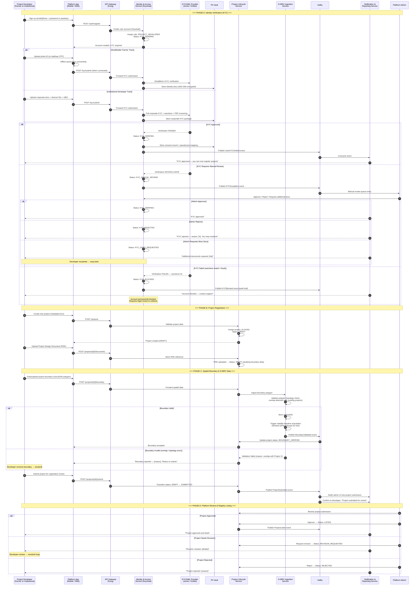

### 1.4 Failure States & Recovery

| Step | Failure Scenario | Recovery Action |
|:---|:---|:---|
| **KYC submission** | Timeout: KYC provider does not respond within 120s | Retry with exponential backoff (3 attempts). If persistent, queue for manual review. User sees "Verification in progress — we'll notify you." |
| **KYC submission** | Farmer loses connectivity mid-upload | Offline-capable app stores submission locally. Auto-retries on reconnection. Partial uploads resume via chunked upload protocol. |
| **KYC submission** | Farmer has no formal ID documents | Field agent assisted flow: community leader attestation + field agent photo verification + GPS-stamped site visit. Escalated to admin manual review track. |
| **Boundary validation** | D-MRV Service detects overlap with existing project | Developer is shown the conflicting project boundary (anonymized) on a map. Must adjust polygon and resubmit. |
| **Boundary validation** | Satellite data unavailable for AOI (cloud cover, no recent pass) | D-MRV Service queues a future acquisition request. Project proceeds to SUBMITTED without baseline — satellite data is acquired asynchronously and attached when available. |
| **Project review** | Admin does not act within 5 business days | Escalation alert to senior admin. Developer notified: "Your project is under extended review." SLA: 10 business days max before escalation to operations lead. |
| **Registry-authoritative override mid-flow** | Registry Sync detects that the project was rejected/delisted on the source registry after platform listing | Credit Ledger Service transitions project to CANCELLED. Developer notified with registry reason. No credits can be issued. |

---

## 2. Workflow 2: VVB Audit Workflow

### 2.1 Overview

This workflow covers the end-to-end VVB (Validation and Verification Body) engagement: from assignment to final report submission. It maps directly to Phase 2's `VERIFICATION` entity and the Project Lifecycle Service's `LISTED → VALIDATED → VERIFIED` state transitions.

### 2.2 VVB Assignment Model

| Dimension | Design |
|:---|:---|
| **Assignment mechanism** | Developer selects from a platform-curated list of accredited VVBs eligible for the project's methodology. Platform enforces no conflict-of-interest rules (validator ≠ verifier for same monitoring period). |
| **VVB eligibility filtering** | ABAC policy in Keycloak: VVB must hold accreditation for the project's registry + methodology + geography (Phase 2 §2.1 ABAC extensions). |
| **Engagement contract** | Off-platform bilateral agreement between developer and VVB. Platform records the assignment but does not intermediate payment. |
| **Rotation requirement** | Platform enforces registry-mandated VVB rotation rules (e.g., Verra requires rotation every N verification periods). |

### 2.3 Sequence Diagram

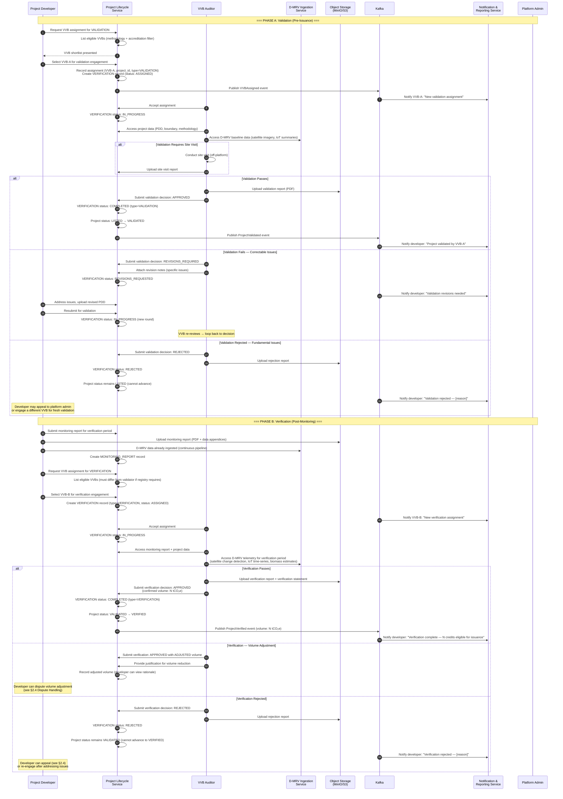

### 2.4 Dispute Handling: Developer Contests VVB Decision

| Dispute Scenario | Resolution Process |
|:---|:---|
| Developer disputes **validation rejection** | Developer files dispute with Platform Admin. Admin reviews VVB report + project data. Options: (a) request VVB to reconsider with specific points, (b) allow developer to engage alternate VVB for independent re-validation, (c) uphold rejection. Timeline: 15 business days. |
| Developer disputes **verification volume adjustment** | Developer submits counter-evidence (additional D-MRV data, alternative calculations). Admin mediates between developer and VVB. If unresolved, admin may commission an independent third-party technical review (cost borne by developer). Timeline: 20 business days. |
| Developer disputes **verification rejection** | Same escalation as validation rejection. Developer may engage alternate VVB. If second VVB also rejects, project is flagged and cannot proceed without admin override. |
| VVB fails to deliver report within agreed timeline | After 2× the agreed deadline, developer can request VVB re-assignment. Platform cancels the current VERIFICATION record (status: TIMED_OUT) and developer selects a new VVB. No penalty to developer. |

### 2.5 Failure States & Recovery

| Step | Failure Scenario | Recovery Action |
|:---|:---|:---|
| **VVB assignment** | No eligible VVBs available for methodology/geography | Platform Admin notified. Developer informed of wait time. Platform onboards additional VVBs as needed. |
| **VVB report upload** | Upload fails (large PDF, network timeout) | Chunked upload with resume. ObjStore returns pre-signed upload URL valid for 24h. Retry from last successful chunk. |
| **VVB report submission** | VVB submits incomplete report (missing verification statement) | PLS validates report completeness against checklist before accepting. Returns specific missing items to VVB. |
| **Timeout** | VVB does not accept assignment within 10 business days | Assignment auto-expires. Developer is notified and prompted to select another VVB. |
| **Timeout** | VVB does not complete review within registry-prescribed timeline | Escalation to admin. Warning sent to VVB. If unresolved in 30 days, VVB's platform accreditation is reviewed. |
| **Registry override** | Registry revokes VVB's accreditation during active engagement | Platform Admin immediately reassigns. Active VERIFICATION record is voided (status: CANCELLED — VVB_DISQUALIFIED). Developer selects new VVB. |
| **Registry override** | Registry delists or cancels the project during verification | Project status → CANCELLED via registry-authoritative reconciliation (Phase 2 §4.5). Active verification is voided. Developer and VVB notified. |

---

## 3. Workflow 3: Registry Issuance → Platform Activation

### 3.1 Overview

This workflow traces the path from registry-confirmed credit issuance (detected by the Registry Sync Service per Phase 2 §4) through the credit becoming `ACTIVE` and listable on the marketplace. It then shows the **optional** tokenization sub-flow (Phase 3 §4 lock→mint) as a gated branch.

### 3.2 Sequence Diagram

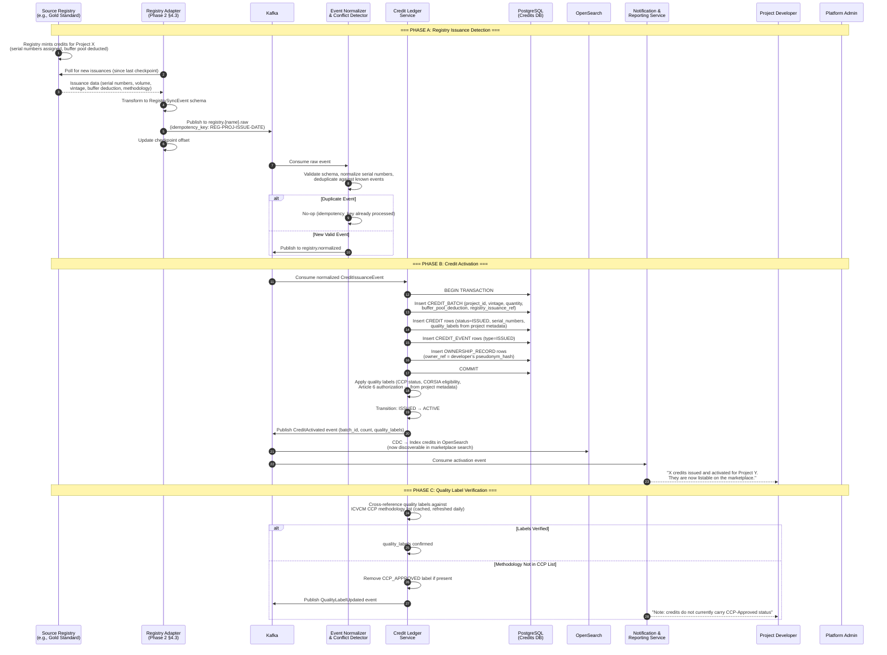

### 3.3 Optional Tokenization Sub-Flow

> 🔗 **OPTIONAL: Tokenization Sub-Flow** — *Activates only when `RegistryConfig.registryTokenizationEnabled == true` for this credit's registry. Per Phase 3 §7, this is currently `false` for ALL registries pending bilateral agreement execution.*

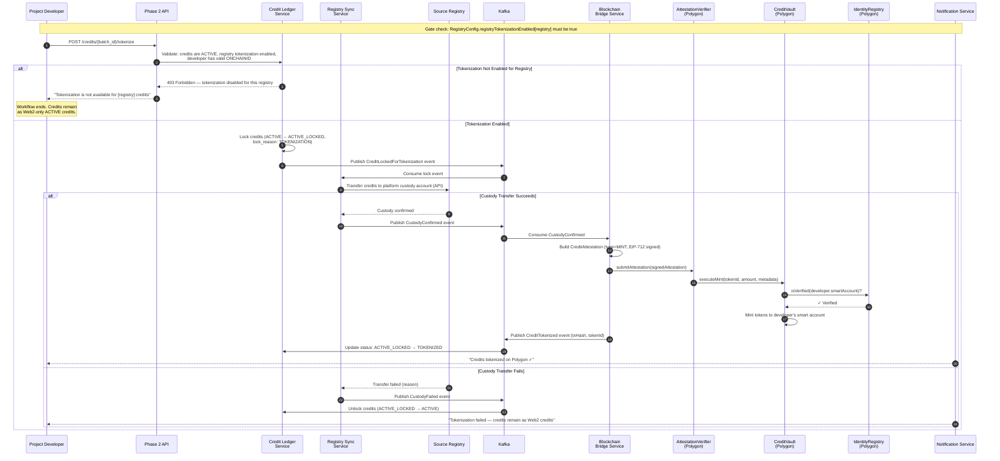

### 3.4 Failure States & Recovery

| Step | Failure Scenario | Recovery Action |
|:---|:---|:---|
| **Registry polling** | Adapter cannot reach registry API (timeout / 5xx) | Exponential backoff with jitter. After 3 failures, adapter marked unhealthy. Admin alerted via sync lag dashboard (Phase 2 §4.6). No credits are created from stale data. |
| **Registry polling** | Scraper-based adapter (ACR/CAR) returns >20% fewer records than previous run | Anomaly detection triggers quarantine. Scrape results held for admin review. Not auto-ingested. |
| **Duplicate issuance** | Same issuance event received twice | Idempotency key deduplication in Credit Ledger Service. No-op. |
| **Serial number collision** | Two registries claim same serial number | Cross-registry collision detection (Phase 2 §4.5). Alert + admin manual review. Should be impossible per registry serialization rules. |
| **Quality label conflict** | Registry reports methodology that is not in ICVCM CCP-Approved list | Credit is activated without CCP label. Quality label can be updated later if ICVCM approves the methodology. |
| **Tokenization: custody transfer timeout** | Registry does not confirm custody transfer within 30 minutes | Credit Ledger Service keeps lock for 2 hours. If still unconfirmed, auto-unlock credits back to ACTIVE. Admin alerted for investigation. |
| **Tokenization: on-chain mint fails** | Polygon transaction reverts (gas, contract error) | Credits remain in registry custody. Bridge Service retries 3×. If persistent, admin intervenes. Credits stay ACTIVE_LOCKED until resolved (never lost). |
| **Registry-authoritative override** | Registry cancels/revokes credits after platform activation | Credit Ledger Service transitions credits to CANCELLED (Phase 2 §4.5 — registry wins). If credits were tokenized, emergency revocation fires (Phase 3 §4 Transition 5). |

---

## 4. Workflow 4: Primary Sale and Secondary Trading

### 4.1 Overview

This workflow covers four distinct trade execution paths:
1. **Web2 marketplace purchase** (direct ownership transfer in Credit Ledger Service)
2. **On-chain purchase** (for tokenized credits, ERC-3643 compliant transfer)
3. **Broker-facilitated OTC trade** (bilateral negotiation with broker intermediation)
4. **Discovery/search** via OpenSearch (Phase 2 §2.7)

### 4.2 Marketplace Discovery (All Paths)

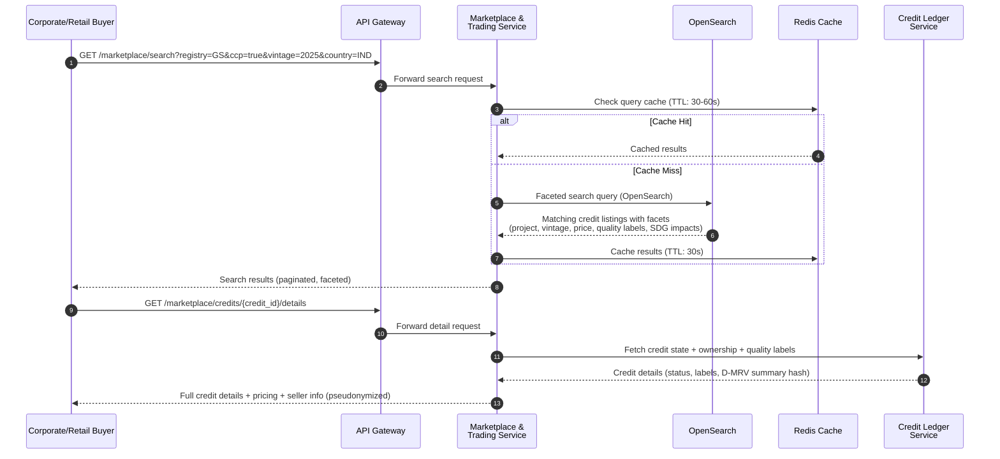

### 4.3 Path A: Web2 Marketplace Purchase (Primary Path)

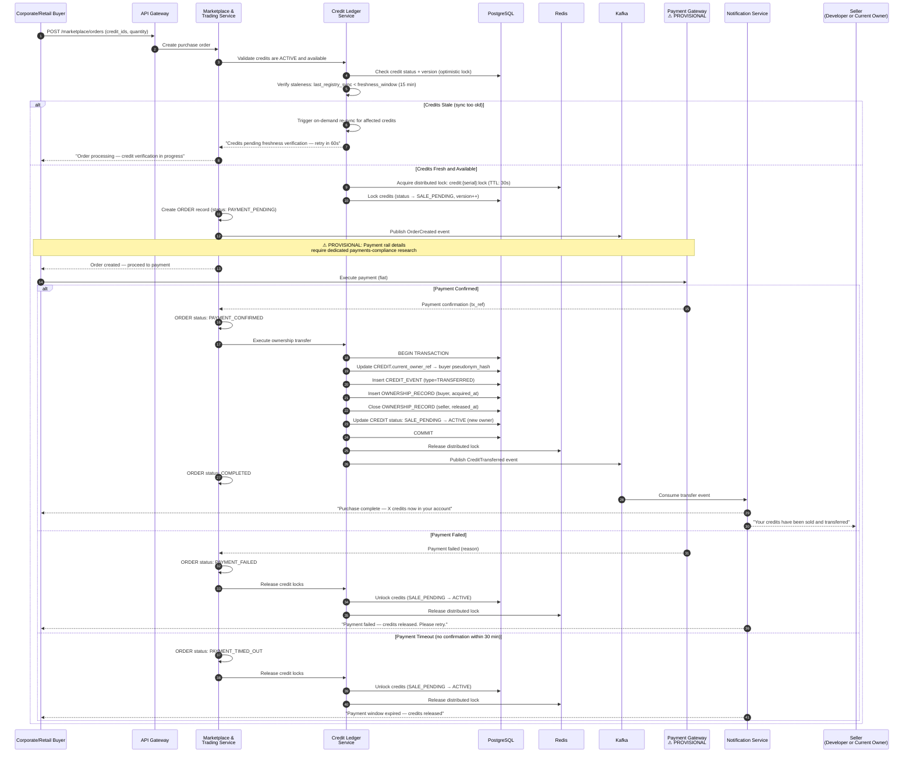

### 4.4 Path B: On-Chain Transfer (Tokenized Credits Only)

> 🔗 **OPTIONAL: On-Chain Path** — *Only available for credits where tokenization is active.*

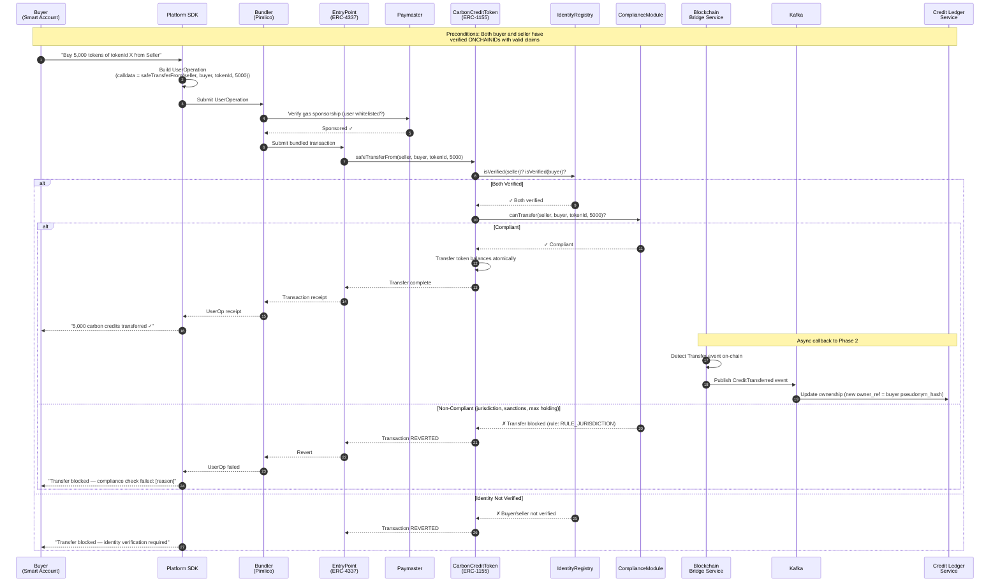

### 4.5 Path C: Broker-Facilitated OTC Trade

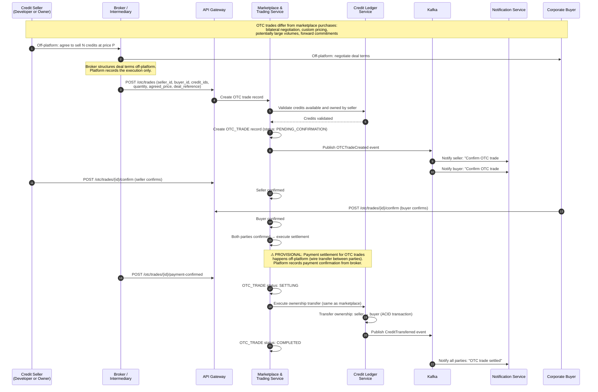

### 4.6 Failure States & Recovery

| Step | Failure Scenario | Recovery Action |
|:---|:---|:---|
| **Search** | OpenSearch cluster unavailable | MTS falls back to direct PostgreSQL query (slower, limited faceting). Degraded experience, not outage. |
| **Credit freshness** | Credit Ledger detects stale registry sync (>15 min) | On-demand re-sync triggered. Order held in PENDING until freshness confirmed or 5-minute timeout. |
| **Distributed lock** | Redis lock acquisition fails (contention) | Retry with jitter (3 attempts over 5s). If persistent, order rejected with "credits temporarily unavailable — please retry." |
| **Payment** | Payment gateway timeout (>30 min) | Credits auto-released from SALE_PENDING → ACTIVE. Order marked PAYMENT_TIMED_OUT. Buyer can re-attempt. |
| **Payment** | Payment succeeds but Credit Ledger update fails | Saga compensation: MTS detects CLS failure, queues compensating refund via payment gateway. Order marked SETTLEMENT_FAILED — admin review required. |
| **On-chain transfer** | Compliance Module rejects transfer | Transaction reverts cleanly. No state change. Buyer informed of specific rule violation. |
| **On-chain transfer** | Bridge Service fails to detect on-chain Transfer event | Reconciliation job (every 15 min) detects on-chain transfer without matching off-chain record. Auto-replays from event log. |
| **OTC trade** | One party does not confirm within 72 hours | Trade expires. Status → EXPIRED. Credits remain with seller. All parties notified. |
| **OTC trade** | Buyer disputes credit quality after settlement | See §10 (Riskiest Workflow — Dispute Resolution). Quality disputes are the most complex failure mode. |
| **Registry-authoritative override** | Registry retires credit during active sale | Credit Ledger transitions credit to RETIRED (registry wins). If SALE_PENDING, order is cancelled and buyer refunded. If already transferred, buyer is notified of registry retirement — credit is no longer tradeable. |
| **Emergency revocation (Phase 3)** | Registry revokes tokenized credit mid-transfer | Emergency revocation fires (Phase 3 §4 Transition 5). On-chain tokens force-burned. Buyer compensated per incident response process. |

---

## 5. Workflow 5: Credit Retirement

### 5.1 Overview

This workflow covers both the Web2-only retirement path and the on-chain retirement path, producing a retirement certificate in either case. VCMI claims-code reporting content is flagged as ⚠ PROVISIONAL.

### 5.2 Path A: Web2-Only Retirement (Primary Path)

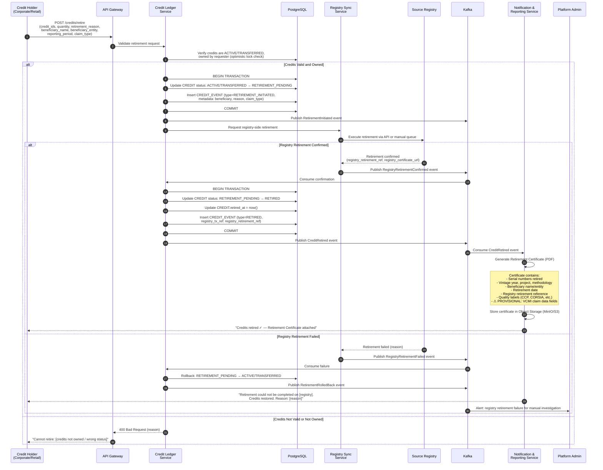

### 5.3 Path B: On-Chain Retirement (Tokenized Credits)

> 🔗 **OPTIONAL: On-Chain Retirement Path** — *Only for credits that have been tokenized (Phase 3 §4 Transition 3).*

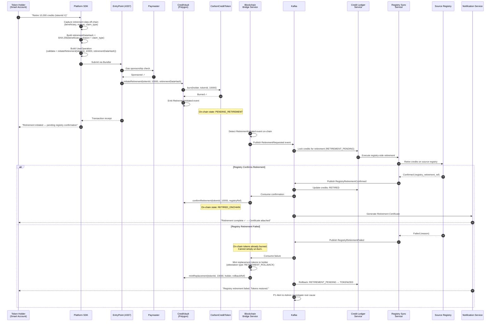

### 5.4 VCMI Claims-Code Reporting

> ⚠ **PROVISIONAL**: The following VCMI reporting structure is architecturally outlined but the specific field requirements have not been independently verified against the latest VCMI Claims Code of Practice. The workflow captures what data must be captured and when the certificate is generated — not the specific VCMI-mandated field names or validation rules.

**Data captured at retirement time** (regardless of Web2 or on-chain path):

| Data Field | Description | Populated By |
|:---|:---|:---|
| Credit serial numbers | Specific serial numbers being retired | System (from Credit Ledger) |
| Vintage year | Year of the emission reduction/removal | System (from credit metadata) |
| Project reference | Registry project ID + platform project ID | System |
| Methodology | Methodology ID and version | System |
| Quality labels | CCP status, CORSIA eligibility, Article 6 authorization, CCB labels | System |
| Beneficiary name | Entity claiming the environmental benefit | User input |
| Beneficiary entity type | Corporate / individual / government | User input |
| Retirement purpose | Voluntary offset, VCMI claim, CORSIA compliance, resale prohibition | User input |
| ⚠ PROVISIONAL: VCMI claim tier | Silver / Gold / Platinum designation | User input (to be validated against VCMI rules) |
| ⚠ PROVISIONAL: Scope coverage | Which emission scopes (1, 2, 3) this retirement addresses | User input |
| ⚠ PROVISIONAL: Internal reduction evidence | Evidence of concurrent internal emission reductions | User-provided document reference |
| Retirement timestamp | UTC timestamp of retirement execution | System |
| Registry retirement reference | Source registry's retirement certificate/reference number | System (from registry confirmation) |
| On-chain transaction hash | If tokenized: Polygon transaction hash of burn | System (if applicable) |

**Certificate generation timing**: The Notification & Reporting Service generates the retirement certificate **only after** registry-side retirement is confirmed. It is never generated on a pending or unconfirmed retirement.

### 5.5 Failure States & Recovery

| Step | Failure Scenario | Recovery Action |
|:---|:---|:---|
| **Retirement request validation** | Credits not owned by requester | Request rejected with 403. No state change. |
| **Retirement request validation** | Credits in SALE_PENDING state (active trade in progress) | Request rejected: "Credits are locked for a pending trade. Complete or cancel the trade first." |
| **Registry-side retirement** | Registry API timeout (portal-only registries like ACR/CAR) | Retirement enters manual queue. Admin manually executes retirement on registry portal. Credits remain in RETIREMENT_PENDING until confirmed. SLA: 48 hours for manual registries. |
| **Registry-side retirement** | Registry rejects retirement (invalid serial number, already retired) | Rollback: credits restored to ACTIVE/TRANSFERRED. Admin investigates discrepancy — may indicate a reconciliation failure. |
| **On-chain burn + registry failure** | Tokens burned on-chain but registry retirement fails | Replacement tokens minted to holder (Phase 3 §4 Transition 3 failure handling). This is a serious incident — admin investigation required. The platform controls the custody account, so registry retirement should succeed unless the registry itself is down. |
| **Certificate generation** | PDF generation fails | Retirement is still valid (state is RETIRED). Certificate generation retried asynchronously. Buyer can request re-generation from account dashboard. |
| **Buyer disputes retirement** | Buyer claims they did not initiate retirement | Audit trail (Kafka) provides immutable record of the retirement request including auth token, timestamp, and IP. If the account was compromised, the incident response process applies. Retirement cannot be reversed (it's permanent on the registry). |
| **Registry-authoritative override** | Registry shows credit as already retired (before our retirement request) | Credit Ledger Service detects the existing retirement during reconciliation. Credits are marked RETIRED with the registry's retirement date. Buyer is notified that credits were retired externally. If tokenized, emergency revocation fires. |

---

## 6. Workflow 6: Corporate Buyer Payment & Settlement

### 6.1 Overview

> ⚠ **PROVISIONAL**: The actual payment rail, cross-border/forex handling, and any FEMA/RBI implications of the India-based operating entity receiving international payments require dedicated payments-compliance research before implementation. This workflow models the structural flow (order → payment confirmation → credit release) without inventing specific banking or payment-provider integration details.

### 6.2 Structural Payment Workflow

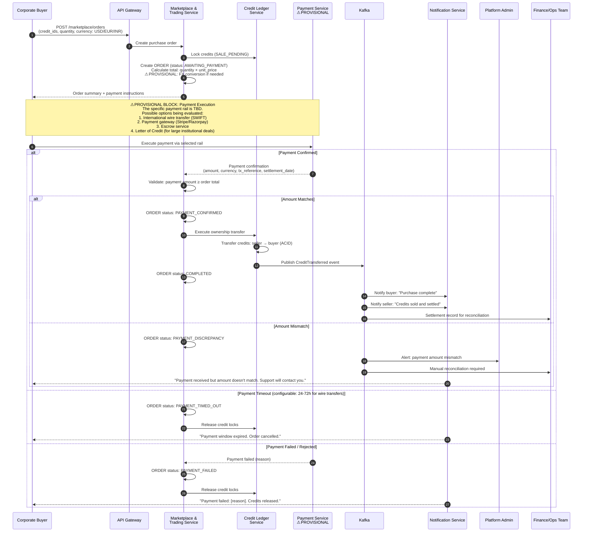

### 6.3 ⚠ PROVISIONAL: Payment & Settlement Considerations

The following require dedicated payments-compliance research and are **not designed in this phase**:

| Topic | Status | Research Required |
|:---|:---|:---|
| **Payment rails** | ⚠ PROVISIONAL | Evaluate: Stripe (card/ACH), Razorpay (India domestic), SWIFT (international wire), stablecoin settlement (for on-chain path). Each has different settlement latency, cost, and regulatory implications. |
| **Cross-border/forex** | ⚠ PROVISIONAL | India-based operating entity receiving USD/EUR payments. FEMA (Foreign Exchange Management Act) compliance: which transactions qualify as current account vs. capital account? Liberalized Remittance Scheme (LRS) limits for Indian retail buyers purchasing international credits? |
| **RBI implications** | ⚠ PROVISIONAL | If platform holds funds in escrow before credit release: does this require a payment aggregator license under RBI guidelines? PA-PG (Payment Aggregator / Payment Gateway) framework applicability. |
| **Tax treatment** | ⚠ PROVISIONAL | GST on platform commission/fees. Withholding tax on international payments to project developers. Carbon credit sale classification: goods, services, or financial instruments? |
| **Escrow model** | ⚠ PROVISIONAL | For large institutional trades: should the platform operate an escrow account? If so, regulatory requirements for escrow licensure. Alternative: use a regulated escrow partner. |
| **Multi-currency pricing** | ⚠ PROVISIONAL | Credits may be listed in USD. Buyers in INR/EUR need FX conversion. Who bears FX risk: buyer, seller, or platform? At what point is the rate locked? |
| **Refund / chargeback handling** | ⚠ PROVISIONAL | Carbon credit sales are generally non-reversible (credits transfer on the registry). How to handle card chargebacks or payment disputes after settlement. |

### 6.4 Failure States & Recovery

| Step | Failure Scenario | Recovery Action |
|:---|:---|:---|
| **Order creation** | Credits no longer available (sold to another buyer) | Optimistic lock detects version mismatch. Order rejected: "Some credits are no longer available." Buyer shown updated availability. |
| **Payment execution** | Wire transfer delayed beyond timeout window | Admin can extend payment window manually for verified institutional buyers. Standard timeout: 72h for wire, 30 min for card/UPI. |
| **Payment confirmation** | Payment gateway webhook fails (doesn't notify platform) | Platform polls payment gateway for order status every 5 min as fallback. If payment detected, order proceeds. If not detected after timeout, credits released. |
| **Settlement** | Credit transfer succeeds but payment later reversed (chargeback) | ⚠ PROVISIONAL: This is the highest-risk payment failure mode. Credits are already transferred and potentially re-sold or retired. Platform must pursue chargeback dispute. May require pre-authorization holds for card payments. Wire transfers are not reversible (lower risk). |
| **Registry override** | Registry retires/cancels credits between payment confirmation and ownership transfer | Transfer fails. Buyer refunded. Order marked SETTLEMENT_FAILED — REGISTRY_OVERRIDE. |
| **FX rate movement** | Exchange rate changes between order creation and payment confirmation | ⚠ PROVISIONAL: Rate lock mechanism TBD. Options: (a) lock rate for payment window duration, (b) re-price at settlement time, (c) buyer bears FX risk with disclosed rate at checkout. |

---

## 7. Cross-Workflow State Machine Summary

### 7.1 Unified Credit State Machine (Phase 2 + Phase 3)

This diagram consolidates all credit states across both the Web2 and on-chain paths, showing every valid transition and the workflow that triggers it.

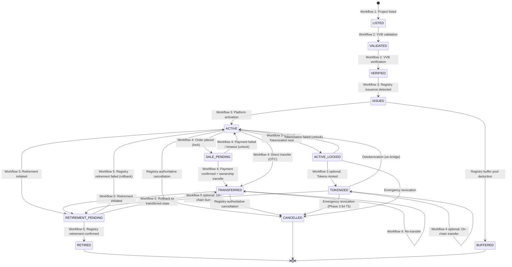

### 7.2 Project State Machine

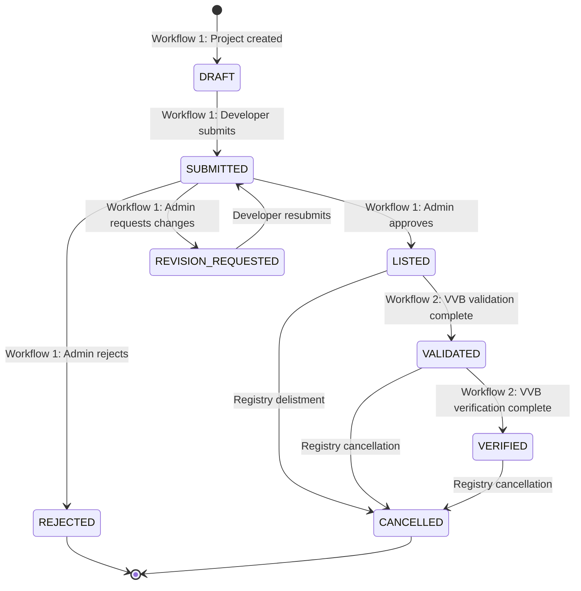

---

## 8. Actor-Permission Matrix

This matrix maps every significant action to the actors authorized to perform it and the Phase 2 service that enforces the permission.

| Action | Project Developer | VVB Auditor | Corporate Buyer | Retail Buyer | Broker | Platform Admin | Enforcement Point |
|:---|:---:|:---:|:---:|:---:|:---:|:---:|:---|
| Register account | ✓ | ✓ | ✓ | ✓ | ✓ | ✓ | Identity & Access Service |
| Complete KYC | ✓ | ✓ | ✓ | ✓ | ✓ | — | Identity & Access Service |
| Create project | ✓ | — | — | — | — | ✓ | Project Lifecycle Service |
| Upload PDD / boundary data | ✓ | — | — | — | — | — | Project Lifecycle Service |
| Submit project for review | ✓ | — | — | — | — | — | Project Lifecycle Service |
| Approve/reject project | — | — | — | — | — | ✓ | Project Lifecycle Service |
| Accept VVB assignment | — | ✓ | — | — | — | — | Project Lifecycle Service |
| Submit validation/verification report | — | ✓ | — | — | — | — | Project Lifecycle Service |
| Override VVB decision | — | — | — | — | — | ✓ | Project Lifecycle Service |
| List credits for sale | ✓ (own credits) | — | ✓ (own credits) | ✓ (own credits) | ✓ (client credits with auth) | ✓ | Marketplace & Trading Service |
| Search marketplace | ✓ | ✓ (read-only) | ✓ | ✓ | ✓ | ✓ | Marketplace & Trading Service |
| Purchase credits (marketplace) | ✓ | — | ✓ | ✓ | ✓ (on behalf of clients) | — | Marketplace & Trading Service |
| Execute OTC trade | ✓ | — | ✓ | — | ✓ (primary executor) | ✓ | Marketplace & Trading Service |
| Retire credits | ✓ (own credits) | — | ✓ (own credits) | ✓ (own credits) | ✓ (client credits with auth) | ✓ (admin override) | Credit Ledger Service |
| Request tokenization | ✓ | — | ✓ | ✓ | ✓ | ✓ | Credit Ledger Service + Blockchain Bridge |
| Trigger emergency revocation | — | — | — | — | — | ✓ (+ multisig for on-chain) | Blockchain Bridge Service |
| Manage registry sync | — | — | — | — | — | ✓ | Registry Sync Service |
| Review KYC escalations | — | — | — | — | — | ✓ | Identity & Access Service |
| Generate VCMI claim report | — | — | ✓ | — | — | ✓ | Notification & Reporting Service |

---

## 9. Cross-Cutting Failure Modes

These failure modes can fire **during any workflow** and must be handled by every service.

### 9.1 Registry-Authoritative Conflict Resolution (Phase 2 §4.5)

**Trigger**: Registry Sync Service detects that registry state conflicts with local platform state.

**Resolution**: Registry wins, always. The specific impact depends on the active workflow:

| Active Workflow State | Impact of Registry Override |
|:---|:---|
| Credit in SALE_PENDING (active purchase) | Order cancelled. Buyer refunded. Credits moved to registry state. |
| Credit in RETIREMENT_PENDING | If registry already retired: retirement confirmed (no action needed). If registry cancelled: retirement aborted, credits cancelled. |
| Credit TOKENIZED (on-chain) | Emergency revocation fires (Phase 3 §4 Transition 5). Tokens force-burned. Holder compensated per incident response. |
| Project in LISTED/VALIDATED (active VVB engagement) | VVB engagement voided. Developer and VVB notified. Project status follows registry. |

### 9.2 Emergency Revocation (Phase 3 §4 Transition 5)

**Trigger**: Registry sync detects that a credit backing an on-chain token has been retired, cancelled, or revoked on the source registry without going through the platform's flow.

**Execution**:
1. Registry Sync Service publishes CRITICAL ReconciliationAlert
2. Credit Ledger Service immediately locks all operations on affected credits
3. Blockchain Bridge Service calls `CreditVault.emergencyRevoke()` (requires OPERATOR_ROLE multisig)
4. Tokens force-burned from current holder(s)
5. Holder notified with compensation/dispute process
6. Incident logged in immutable audit trail

**SLA**: Execute within 1 hour of detection. Monitoring alert fires if unresolved >30 min.

---

## 10. Riskiest Workflow: Secondary Trading & Quality Disputes

### 10.1 Identification

**The riskiest workflow is Workflow 4 (Primary Sale and Secondary Trading)**, specifically the scenario where a **buyer disputes a credit's quality label after purchase**.

**Why this is the riskiest**:

1. **Actor disagreement**: The buyer, seller, platform, and VVB all have conflicting incentives. The buyer wants compensation; the seller wants finality; the platform wants to preserve marketplace trust; the VVB's reputation is at stake.
2. **Fraud vector**: A seller could list credits with inflated quality labels (e.g., claiming CCP-Approved status for a non-CCP methodology). The damage occurs after settlement — the buyer may have already retired the credits.
3. **Deadlock potential**: If the buyer refuses to accept the credits and the seller refuses to take them back, the credits are in limbo. For on-chain credits, the tokens cannot be force-transferred without emergency mechanisms.
4. **Cascading impact**: A quality dispute undermines marketplace trust. If a corporate buyer retires disputed credits and later discovers the quality label was wrong, their VCMI claim is compromised — creating legal and reputational exposure far beyond the transaction value.

### 10.2 Dispute Resolution — Design A: Automated Rule-Based Resolution

**Mechanism**:

```
1. Buyer files quality dispute (within 30 days of purchase)
2. System automatically pulls:
   - Credit quality labels at time of sale (from immutable CREDIT_EVENT log)
   - Current registry state (live query via Registry Sync Service)
   - VVB verification report (from Object Storage)
   - ICVCM CCP methodology list (cached, timestamp-verified)
3. Automated rules evaluate:
   a) Was the quality label accurate at time of sale? (Cross-reference serial number 
      against registry data + ICVCM list)
   b) Has the quality label changed since sale? (Methodology revoked by ICVCM?)
   c) Was the credit's status accurate? (Registry confirms credit was ACTIVE?)
4. Automated ruling:
   - If label was accurate at sale: DISPUTE REJECTED — buyer accepted the credit 
     as-is. No refund.
   - If label was inaccurate at sale (e.g., CCP claimed but methodology not in 
     CCP list): DISPUTE UPHELD — automatic reversal. Credits returned to seller, 
     buyer refunded.
   - If label changed after sale (e.g., ICVCM revoked methodology): DISPUTE 
     ESCALATED — no clear fault. Platform absorbs loss or mediates.
5. Resolution executed automatically (refund + credit re-transfer) within 48 hours
```

| Dimension | Assessment |
|:---|:---|
| **Speed** | Fast — automated resolution within 48 hours |
| **Cost** | Low — no human review for clear-cut cases |
| **Trust** | Medium — works well for objective facts (label accuracy) but fails for subjective quality assessments ("the D-MRV data looks unreliable") |
| **Coverage** | Only handles disputes about factual label accuracy. Cannot handle subjective quality disagreements or claims of seller misrepresentation in non-label fields. |
| **Fraud deterrence** | Moderate — sellers know that inaccurate labels will be caught. But sophisticated fraud (manipulated D-MRV data underlying a technically accurate label) bypasses this. |
| **Appeal mechanism** | Limited — automated decisions feel impersonal. Buyers may distrust the platform if they cannot escalate to a human. |

### 10.3 Dispute Resolution — Design B: Human-in-the-Loop Arbitration

**Mechanism**:

```
1. Buyer files quality dispute (within 30 days of purchase)
2. Platform assigns a neutral Dispute Reviewer (internal senior analyst or 
   external domain expert from a rotating panel)
3. Dispute Reviewer has access to:
   - All data in Design A (labels, registry state, VVB reports, ICVCM list)
   - D-MRV raw data summaries + satellite imagery for the project
   - Communication thread between buyer and seller
   - Historical trade data for the same project/credit batch
4. Process:
   a) Both parties submit written statements (5 business days)
   b) Reviewer may request additional evidence from VVB
   c) Reviewer may request independent D-MRV assessment 
      (cost: shared equally by parties, refunded to winner)
   d) Reviewer issues binding decision (15 business days)
5. Possible outcomes:
   - DISPUTE UPHELD: full reversal (credits returned, buyer refunded)
   - DISPUTE PARTIALLY UPHELD: credits stay with buyer, partial price 
     adjustment
   - DISPUTE REJECTED: no action, buyer keeps credits as-is
   - DISPUTE ESCALATED TO EXTERNAL ARBITRATION: for disputes >$100K, 
     referred to an independent arbitration body
6. Decision is published (anonymized) on platform for transparency
```

| Dimension | Assessment |
|:---|:---|
| **Speed** | Slow — 15-20 business days for resolution |
| **Cost** | High — reviewer time ($500–2,000 per dispute), potential independent D-MRV assessment ($2,000–10,000) |
| **Trust** | High — both parties feel heard. Human judgment handles nuance and subjective quality concerns. Published decisions create precedent and trust. |
| **Coverage** | Handles all dispute types: factual label errors, subjective quality concerns, D-MRV reliability challenges, seller misrepresentation. |
| **Fraud deterrence** | Strong — human reviewers can detect patterns (same seller repeatedly selling disputed credits) and recommend account sanctions. |
| **Appeal mechanism** | Built-in: external arbitration for high-value disputes. |

### 10.4 Recommendation: Tiered Hybrid

| Dispute Type | Resolution Mechanism | Rationale |
|:---|:---|:---|
| **Factual label accuracy** (CCP status, CORSIA eligibility, serial number validity) | **Design A — Automated** | Objectively verifiable. Speed is critical. No subjectivity involved. |
| **Subjective quality / D-MRV reliability** | **Design B — Human arbitration** | Requires expert judgment. Automated rules cannot assess satellite imagery quality or D-MRV methodology appropriateness. |
| **Seller misrepresentation / fraud allegations** | **Design B — Human arbitration** with potential account suspension | Requires investigation. Pattern analysis across multiple trades. May involve VVB re-engagement. |
| **Disputes > $100K** | **Design B → External arbitration** | Financial materiality warrants independent third-party review. |

### 10.5 Dispute Failure States

| Failure | Recovery |
|:---|:---|
| Buyer disputes after 30-day window | Dispute rejected (time-barred). Buyer can still report quality concerns to platform for future trade warnings on that project. |
| Seller account deleted / inactive during dispute | Platform holds credits in escrow. Dispute proceeds without seller participation (default judgment in buyer's favor for factual disputes). |
| Credit retired during dispute period | Retirement is irreversible. If dispute is upheld, remedy is financial compensation (not credit reversal). |
| Tokenized credit disputed | On-chain tokens are locked in escrow smart contract during dispute. If upheld, tokens returned via CreditVault mechanism. |
| Reviewer conflict of interest discovered | Reviewer replaced. Dispute timeline extended by 5 days. Previous reviewer's analysis discarded. |

---

## 11. Executive Workflow Summary

**Date**: 18 August 2026
**Purpose**: Fixed context for Phase 5 (API schemas) and implementation teams.

---

### Structural Decisions

**1. Web2-First Design**: All six workflows are fully functional without tokenization. Every user-facing flow executes entirely through Phase 2's service mesh (Identity & Access, Project Lifecycle, Credit Ledger, Marketplace & Trading, Registry Sync, D-MRV Ingestion, Notification & Reporting). Tokenization activates as an optional enhancement layer only when `RegistryConfig.registryTokenizationEnabled == true` for a specific registry — which is currently `false` for all registries.

**2. Two KYC Tracks**: Smallholder farmers and institutional developers follow different KYC paths with different document requirements, connectivity accommodations, and consent mechanisms. Both converge to the same `KYC_VERIFIED` status required for marketplace participation.

**3. VVB Audit is Developer-Initiated**: The platform does not auto-assign VVBs. Developers select from a filtered list of eligible, accredited VVBs. The platform enforces accreditation and rotation rules but does not intermediate the VVB-developer financial relationship.

**4. Credits Activate Only After Registry Confirmation**: The credit issuance → activation path is entirely registry-driven. The platform's Registry Sync Service detects issuances; the Credit Ledger Service creates and activates credits only after registry confirmation. There is no platform-initiated credit creation.

**5. Three Trade Execution Paths**: Web2 marketplace purchase (primary), on-chain ERC-3643 compliant transfer (optional, for tokenized credits), and broker-facilitated OTC (bilateral, off-platform negotiation with on-platform settlement recording).

**6. Retirement is Registry-Gated**: Both the Web2 and on-chain retirement paths require registry-side retirement confirmation before a retirement certificate is generated. No certificate is produced on a pending retirement.

**7. Dispute Resolution is Tiered**: Factual label disputes use automated rule-based resolution (48h). Subjective quality disputes use human arbitration (15 business days). Disputes over $100K can escalate to external arbitration.

### Items Flagged ⚠ PROVISIONAL

| Item | Reason | Action Required Before Phase 5 |
|:---|:---|:---|
| **Payment rail integration** | No payment provider selected. FEMA/RBI implications not researched. | Commission dedicated payments-compliance research. Evaluate Stripe, Razorpay, SWIFT, and stablecoin settlement. Determine PA-PG licensing requirements. |
| **Cross-border forex handling** | FX conversion mechanism, rate locking, and risk bearing not designed. | Include in payments-compliance research. Determine LRS applicability for Indian retail buyers. |
| **VCMI claims-code field requirements** | Specific VCMI-mandated reporting fields not independently verified. | Obtain latest VCMI Claims Code of Practice and map exact field requirements. Update retirement certificate template. |
| **Escrow model for large trades** | Whether platform holds funds in escrow is TBD. | Determine regulatory requirements for escrow services (RBI guidelines). Evaluate third-party escrow partners. |
| **Tax treatment of credit sales** | GST applicability, withholding tax, and classification (goods vs. services vs. financial instruments) not determined. | Commission tax opinion from Indian tax counsel familiar with carbon market instruments. |
| **External arbitration body** | No specific arbitration institution selected for high-value disputes. | Evaluate: Singapore International Arbitration Centre (SIAC), ICC Arbitration, or specialized environmental/commodity arbitration bodies. |
| **All registry custody agreements** | Gold Standard, Puro.earth, and Isometric custody agreements are not yet executed. Verra/ACR/CAR have no published tokenization framework. | Tokenization sub-flows cannot be activated until agreements are executed. Web2 workflows are unaffected. |

### Workflow Interfaces for Phase 5 API Design

| Workflow | Primary API Endpoints Required |
|:---|:---|
| **1. Developer Onboarding** | `POST /auth/register`, `POST /kyc/submit`, `POST /projects`, `POST /projects/{id}/documents`, `POST /projects/{id}/boundary`, `POST /projects/{id}/submit` |
| **2. VVB Audit** | `GET /projects/{id}/eligible-vvbs`, `POST /projects/{id}/vvb-assignment`, `POST /verifications/{id}/accept`, `POST /verifications/{id}/submit-report`, `POST /verifications/{id}/decision` |
| **3. Registry Issuance** | Internal (event-driven via Kafka, no user-facing API). Optional: `POST /credits/{batch_id}/tokenize` |
| **4. Primary Sale & Trading** | `GET /marketplace/search`, `GET /marketplace/credits/{id}`, `POST /marketplace/orders`, `POST /marketplace/orders/{id}/pay`, `POST /otc/trades`, `POST /otc/trades/{id}/confirm` |
| **5. Credit Retirement** | `POST /credits/retire`, `GET /credits/{id}/retirement-certificate` |
| **6. Corporate Payment** | `POST /marketplace/orders` (shared with Workflow 4), `POST /marketplace/orders/{id}/payment-confirmed`, `GET /orders/{id}/settlement-status` |

### Key Phase 2 Service Dependencies per Workflow

| Workflow | Primary Services | Supporting Services |
|:---|:---|:---|
| 1. Onboarding | Identity & Access, Project Lifecycle, D-MRV Ingestion | Notification |
| 2. VVB Audit | Project Lifecycle | Notification, D-MRV Ingestion (read) |
| 3. Issuance | Registry Sync, Credit Ledger | Notification |
| 4. Trading | Marketplace & Trading, Credit Ledger | OpenSearch, Redis, Notification |
| 5. Retirement | Credit Ledger, Registry Sync | Notification (certificate generation) |
| 6. Payment | Marketplace & Trading, Credit Ledger | Notification, ⚠ Payment Service (TBD) |

---

*End of Phase 4 Marketplace Workflows Document.*
