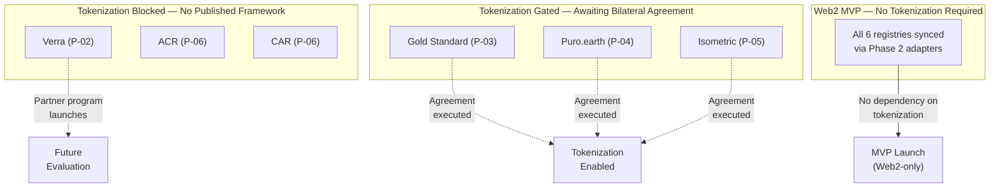
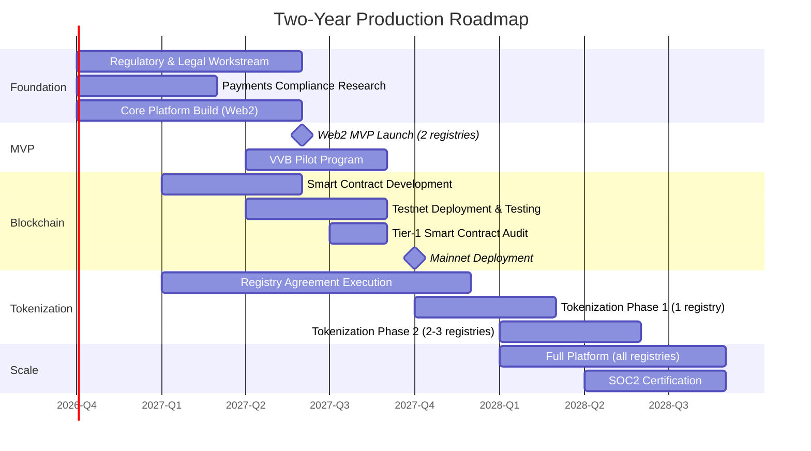

# Phase 6: Adversarial Risk Audit & Production Roadmap — Voluntary Carbon Credit Marketplace

**Date**: 19 August 2026
**Author Role**: Principal Security Auditor & Distributed Systems Red-Teamer
**Scope**: Adversarial review of the complete architecture (Phases 1–5). No redesign — assess, recommend, and sequence.
**Baseline**:
- Domain research: [phase1-voluntary-carbon-marketplace-research.md](file:///c:/carbon-credit-marketplace/research/phase1-voluntary-carbon-marketplace-research.md)
- Core Web2 architecture: [phase2-core-architecture.md](file:///c:/carbon-credit-marketplace/architecture/phase2-core-architecture.md)
- Blockchain domain research: [phase3a-blockchain-domain-refresh.md](file:///c:/carbon-credit-marketplace/research/phase3a-blockchain-domain-refresh.md)
- Blockchain architecture: [phase3-blockchain-architecture.md](file:///c:/carbon-credit-marketplace/architecture/phase3-blockchain-architecture.md)
- Marketplace workflows: [phase4-marketplace-workflows.md](file:///c:/carbon-credit-marketplace/architecture/phase4-marketplace-workflows.md)
- API specifications: [phase5-api-specifications.md](file:///c:/carbon-credit-marketplace/architecture/phase5-api-specifications.md)

---

## Part 1: Consolidated Provisional Risk Register

Every prior document flagged items as **⚠ PROVISIONAL** — facts, design choices, or external dependencies that are architecturally committed to but not yet verified, agreed, or legally cleared. This is the first unified register of all such items. Nothing below is new analysis; this is a compilation from the existing corpus.

### 1.1 Registry & Business Agreements

| # | Item | Source | What's Unresolved | Resolution Requires |
|:--|:-----|:-------|:-------------------|:--------------------|
| P-01 | **Verra Digital Gateway API production specifications** | Phase 1 §"Critical Parameters" #1; Phase 2 §0 #1; Phase 2 §4.4 Pattern B | OAuth 2.0 + API-key auth and JSON workflows assumed but not production-tested. If the production API differs materially, the Verra adapter must be rebuilt. | Live developer-portal access; authenticated test calls against production Digital Gateway endpoints. |
| P-02 | **Verra tokenization partner program** | Phase 3a §Verra VCS; Phase 3 §7; Phase 4 §0.1 | Verra's 2022 prohibition on unauthorized tokenization remains in effect. No operational approved-partner program has launched. | Monitor Verra announcements. Do not enable tokenization for Verra credits under any circumstances until a signed bilateral custody agreement exists and is reviewed by legal counsel. |
| P-03 | **Gold Standard custody agreement** | Phase 3 §4 Custody Account table; Phase 4 §11 | Bilateral tokenization/custody agreement with Gold Standard not yet executed. | Execute partnership agreement with Gold Standard's Digital Assets Working Group. |
| P-04 | **Puro.earth / Nasdaq custody agreement** | Phase 3 §4 Custody Account table; Phase 4 §11 | Bilateral tokenization/custody agreement with Puro.earth not yet executed. | Execute partnership agreement via Nasdaq enterprise infrastructure. |
| P-05 | **Isometric custody agreement** | Phase 3 §4 Custody Account table; Phase 4 §11 | Bilateral tokenization/custody agreement with Isometric not yet executed. | Execute partnership agreement via Isometric's authorized integrator program. |
| P-06 | **ACR / CAR tokenization policy** | Phase 3a §ACR/CAR; Phase 3 §7; Phase 4 §11 | Neither ACR nor CAR has published a formal tokenization framework or policy stance. | Monitor registry announcements. Tokenization remains disabled. No action can be taken until policies are published. |

### 1.2 Regulatory & Legal

| # | Item | Source | What's Unresolved | Resolution Requires |
|:--|:-----|:-------|:-------------------|:--------------------|
| P-07 | **India DPDP Act implementation rules** | Phase 1 §"Critical Parameters" #4; Phase 2 §0 #2; Phase 2 §3.2 | Cross-border transfer whitelist and consent-manager technical standards assumed from March 2026 draft rules. If final rules mandate India-only data residency for farmer PII, the PII Vault needs a dedicated India-region-only PostgreSQL instance. | Formal legal review of final DPDP implementation rules when published by the Indian Data Protection Board. |
| P-08 | **India DPDP Act impact on Bridge Service** | Phase 3 §"Provisional Items" | If the Blockchain Bridge Service processes any data derived from PII (even indirectly via pseudonym hashes), cross-border data flow compliance must be verified. | Legal opinion on whether pseudonym hashes derived from PII constitute personal data under DPDP Act. |
| P-09 | **Payment rail integration** | Phase 4 §6.3; Phase 5 §8 | No payment provider selected. FEMA/RBI implications of India-based entity receiving international payments not researched. PA-PG (Payment Aggregator / Payment Gateway) licensing requirements unknown. | Commission dedicated payments-compliance research. Evaluate Stripe, Razorpay, SWIFT, stablecoin settlement. Determine PA-PG licensing requirements with Indian legal counsel. |
| P-10 | **Cross-border forex handling** | Phase 4 §6.3; Phase 5 §8.2 | FX conversion mechanism, rate locking, risk bearer, and Liberalized Remittance Scheme (LRS) applicability for Indian retail buyers all undetermined. | Include in payments-compliance research. Legal opinion on LRS applicability. |
| P-11 | **Tax treatment of carbon credit sales** | Phase 4 §6.3 | GST applicability on platform commission/fees, withholding tax on international payments to developers, and classification of carbon credit sales (goods vs. services vs. financial instruments) all undetermined. | Commission tax opinion from Indian tax counsel with carbon market familiarity. |
| P-12 | **Escrow model for large trades** | Phase 4 §6.3; Phase 5 §8 | Whether the platform holds buyer funds in escrow before credit release is TBD. If so, regulatory requirements for escrow licensure under RBI guidelines apply. | Determine RBI regulatory requirements. Evaluate third-party escrow partners. |
| P-13 | **VASP / MSB / MiCA licensing** | Phase 1 §4 (Tokenization Governance); Phase 3a §ERC-3643 | If tokenized carbon credits are classified as utility tokens or asset-referenced tokens under EU MiCA, VASP registration and whitepaper publication may be required. FATF Travel Rule compliance for digital asset transfers. | Formal regulatory counsel opinion on whether platform operation triggers VASP/MSB/payment-aggregator licensing obligations — see Part 2, Category 5 for detailed analysis. |

### 1.3 Technical Dependencies

| # | Item | Source | What's Unresolved | Resolution Requires |
|:--|:-----|:-------|:-------------------|:--------------------|
| P-14 | **ICVCM methodology decisions** | Phase 1 §"Critical Parameters" #2; Phase 2 §0 #4 | Quality-label tagging assumes current CCP-Approved methodology set. New approvals or revocations require data-model updates. | Monitor ICVCM announcements. Low structural risk — additive changes only. |
| P-15 | **Host-Nation Article 6.2 frameworks** | Phase 1 §"Critical Parameters" #3; Phase 2 §0 #5 | CORSIA-eligibility metadata flags based on current framework understanding. | Re-verify host-country authorization procedures. Low structural risk — metadata schema change only. |
| P-16 | **VCMI Claims Code field requirements** | Phase 4 §5.4; Phase 5 §7.3 | Specific VCMI-mandated reporting fields on retirement certificates not independently verified against latest VCMI Claims Code of Practice. | Obtain latest VCMI specification. Map exact field requirements. Update retirement certificate template. |
| P-17 | **Polygon network acceptance** | Phase 3 §1; Phase 3 §"Provisional Items" | Reputational risk from Toucan/KlimaDAO association on Polygon. If institutional counterparties refuse Polygon, migration to Base (Coinbase L2) is required. | Survey target institutional buyers on Polygon acceptance vs. Base/Arbitrum before mainnet deployment. |
| P-18 | **ERC-4337 v0.7 / EIP-7702** | Phase 3 §3 "When to Revisit"; Phase 3 §"Provisional Items" | Native account abstraction at the Polygon protocol level may deprecate the bundler/paymaster architecture. | Monitor Polygon Improvement Proposals. No immediate action required. |
| P-19 | **Polygon gas cost projections** | Phase 3 §"Provisional Items" | Gas cost estimates ($0.005–$0.05/tx) based on current conditions. If sustained gas exceeds $0.50/tx, migration analysis required. | Re-evaluate quarterly. Trigger Base/Arbitrum migration analysis if threshold is breached. |
| P-20 | **Smart contract Tier-1 audit** | Phase 3 §8 "Provisional Items" | All smart contracts require a comprehensive audit by a Tier-1 firm (Trail of Bits, OpenZeppelin, Consensys Diligence) before mainnet deployment. | Commission audit. Budget: $150K–$400K. Timeline: 8–12 weeks. |
| P-21 | **OTC payment verification** | Phase 5 §6.3 | Platform records the broker's payment confirmation for OTC trades without independent verification. | Determine if independent payment verification is required (bank API integration or escrow service). |
| P-22 | **External arbitration body** | Phase 4 §10.4 | No specific arbitration institution selected for high-value disputes (>$100K). | Evaluate: Singapore International Arbitration Centre (SIAC), ICC Arbitration, or specialized environmental/commodity arbitration bodies. |
| P-23 | **Isometric webhook support** | Phase 5 §10.2 | Webhook subscription capability for Isometric marked provisional. | Verify with Isometric API documentation. |

### 1.4 Registry Dependency Summary

---

## Part 2: Adversarial Risk Audit

### Methodology

Each finding identifies a **specific attack vector or failure scenario** grounded in the actual architecture. Where an existing design decision already addresses a category's core risk, that is acknowledged and the analysis focuses on residual uncovered gaps. Findings are severity-ranked:

- **Critical**: Leads to financial loss, double-counting, regulatory violation, or complete service disruption. Requires resolution before production launch.
- **High**: Creates significant operational, reputational, or legal exposure. Requires resolution within 90 days of launch.
- **Medium**: Creates manageable risk that can be mitigated operationally or scheduled for post-launch hardening.

---

### Category 1: Double-Spend / Double-Retirement

**Existing mitigation acknowledged**: Phase 2 §4.5 defines registry-authoritative conflict resolution. Phase 2 §6 Problem 2 specifies optimistic concurrency control with version numbers and Redis distributed locking. Phase 3 §4 Transition 5 specifies emergency revocation for registry-blockchain divergence. These are structurally sound.

| ID | Finding | Severity | Attack Vector / Failure Scenario | Affected Component | Mitigation |
|:---|:--------|:---------|:---------------------------------|:-------------------|:-----------|
| DS-1 | **Race between 15-min reconciliation and concurrent trade + retirement** | **Critical** | A seller lists credits for sale on the marketplace (Web2 path) while simultaneously requesting retirement via the on-chain path. The distributed lock in Redis keys on `credit:{serial_number}:lock` (Phase 2 §6), but the on-chain retirement path (Phase 3 §4 Transition 3) burns tokens before the Bridge Service publishes the RetirementRequested event to Kafka (steps 1–4 execute on-chain; step 5 is async). During the async gap (~5–15s per Phase 3 §5 "Latency Characteristics"), the Credit Ledger Service may not yet know the retirement is in progress and could allow a sale lock on the same credit. | Credit Ledger Service, Blockchain Bridge Service, Redis | **Add a "pending on-chain action" state to the Credit Ledger Service.** When a tokenized credit enters any on-chain workflow (retirement, transfer, detokenization), the Blockchain Bridge Service must acquire a Redis lock for the affected serial numbers *before* submitting the on-chain transaction (not after). This extends the lock boundary to cover the on-chain execution gap. Alternatively, require all on-chain retirement requests to route through the Phase 2 API first (which acquires the lock) before submitting to the CreditVault contract. |
| DS-2 | **Registry sync latency creates sale-window for already-retired credits** | **High** | For portal-only registries (ACR, CAR) with 30–60 min scraping intervals (Phase 2 §4.4 Pattern C), a credit may be retired directly on the source registry by its holder outside the platform. The 15-min freshness window (Phase 2 §4.5) passes because the scraper hasn't yet detected the retirement. A buyer on the platform purchases the credit during this window. The purchase completes successfully. The next reconciliation cycle detects the discrepancy and triggers CANCELLED, but the buyer has already paid. | Registry Sync Service (ACR/CAR adapters), Credit Ledger Service | **For scraping-dependent registries, increase the freshness staleness penalty.** Before executing any trade on an ACR/CAR credit, trigger an on-demand re-scrape (not just check the last sync timestamp). If the re-scrape cannot complete within 5 minutes, reject the trade with "credit verification in progress." This is operationally expensive but necessary for low-API-maturity registries. Also: treat the buyer-refund-on-CANCELLED scenario as a defined SLA obligation, not an ad-hoc incident. |
| DS-3 | **Batch-trade saga partial failure leaks locked credits** | **Medium** | The saga pattern for multi-credit trades (Phase 2 §6, Problem 2) rolls back the entire batch if any credit fails state transition. However, if the saga coordinator (Marketplace & Trading Service) crashes mid-saga after locking some credits but before completing the transaction or initiating rollback, the locked credits remain in `SALE_PENDING` state with no active saga owner. The 30-second Redis lock TTL (Phase 2 §2.5) will expire, but the PostgreSQL `SALE_PENDING` status persists. | Marketplace & Trading Service, PostgreSQL | **Implement a "stale lock reaper" background job.** Credits in `SALE_PENDING` state for more than 5 minutes without an associated active order in `PAYMENT_PENDING` or later status should be automatically released to `ACTIVE`. Log as a P2 incident. This job should run every 60 seconds. |

---

### Category 2: Oracle and D-MRV Integrity

**Existing mitigation acknowledged**: Phase 3 §5 specifies a push attestation model with HSM-backed EIP-712 signing, rejecting external oracle networks. Phase 2 §6 Problem 1 specifies canary credit monitoring. These are sound design choices.

| ID | Finding | Severity | Attack Vector / Failure Scenario | Affected Component | Mitigation |
|:---|:--------|:---------|:---------------------------------|:-------------------|:-----------|
| OR-1 | **D-MRV data poisoning via compromised IoT sensors** | **High** | An attacker physically compromises a field IoT sensor (dendrometer, cookstove logger) or intercepts its LoRaWAN/cellular uplink. Manipulated telemetry data flows into the D-MRV Ingestion Service (Phase 2 §1, Service Boundaries), inflating biomass growth or cookstove usage metrics. The VVB may rely on this data during verification (Phase 4 §2.3), issuing an inflated verification statement. Quality labels are assigned based on this data, leading to over-credited issuance. | D-MRV Ingestion Service, Project Lifecycle Service | **Implement statistical anomaly detection in the D-MRV Ingestion Service.** Flag telemetry readings that deviate >3σ from historical baselines for the same sensor or from peer-group sensors in the same project. Flagged data should trigger VVB attention and a "D-MRV anomaly" quality annotation on affected credits. Additionally, require satellite cross-validation for any ground-sensor-only claims (i.e., no single data modality should be sufficient for high-value credits). |
| OR-2 | **Attestation Signer compromise: blast radius is full token supply** | **Critical** | The HSM-backed Attester Wallet (Phase 3 §6) holds the `ATTESTER_ROLE`, which is the sole authority for submitting signed attestations to the AttestationVerifier contract. If the HSM key is extracted or the Bridge Service API credentials that access the HSM are compromised, an attacker can: (a) mint unbacked tokens for any `tokenId` where `registryTokenizationEnabled == true`, (b) submit fraudulent `RETIREMENT_CONFIRMED` attestations, and (c) issue `EMERGENCY_REVOKE` commands to destroy legitimate holders' tokens. The blast radius is the **entire on-chain token supply** across all enabled registries. | Blockchain Bridge Service (AttestationSigner), AttestationVerifier contract | **Reduce the blast radius.** (1) Implement per-attestation-type rate limits in the AttestationVerifier contract: cap minting to max N tokens per block/hour (configurable by multisig). (2) Require dual attestation for MINT and EMERGENCY_REVOKE operations: one from the Attester Wallet and one from a separate co-signer wallet (a "threshold attestation" model — not the admin multisig, which serves a different governance role). (3) Emit anomaly alerts to PagerDuty if mint volume in a 1-hour window exceeds historical 95th-percentile. |
| OR-3 | **Satellite imagery substitution attack** | **Medium** | The D-MRV Ingestion Service ingests satellite tiles from providers (Sentinel-2, PlanetScope) via API connectors (Phase 2 §6, Problem 3). A man-in-the-middle attack on the API connection, or a compromised API key for a commercial provider (Planet Labs), could allow substitution of imagery showing healthy vegetation cover over a deforested or degraded project site. The `dmrv_data_hash` stored on-chain (Phase 3 §2) would be a valid hash of the fraudulent imagery. | D-MRV Ingestion Service, Object Storage (MinIO/S3) | **Verify imagery provenance via provider-signed metadata.** Sentinel-2 data from Copernicus includes provider-signed manifests. PlanetScope provides scene metadata with acquisition timestamps and satellite IDs. The D-MRV Ingestion Service should validate these signatures and cross-reference acquisition timestamps against orbital prediction databases. Flag any imagery where provenance metadata is missing, unsigned, or inconsistent with predicted satellite passes. |

---

### Category 3: Key Management and Custody

**Existing mitigation acknowledged**: Phase 3 §6 specifies a well-structured key tier model (HSM-backed attester, air-gapped deployer, 3-of-5 multisig, passkey-based user accounts). The model is sound in design.

| ID | Finding | Severity | Attack Vector / Failure Scenario | Affected Component | Mitigation |
|:---|:--------|:---------|:---------------------------------|:-------------------|:-----------|
| KM-1 | **Admin Multisig 3-of-5: social engineering on signer concentration** | **High** | The 3-of-5 multisig signers are: CEO, CTO, Lead Blockchain Engineer, Head of Compliance, External Legal Counsel (Phase 3 §6). Three of five signers are employees of the same organization — potentially in the same office, subject to the same physical security perimeter, and vulnerable to the same social-engineering campaign (e.g., spear-phishing targeting the company's email domain). A compromised 3-of-5 quorum can: upgrade all UUPS proxy contracts, enable Verra tokenization, modify compliance rules, and issue emergency pauses. | Admin Multisig (Safe), all UUPS proxy contracts | **Require geographic and organizational diversity in signers.** At least 2 of 5 signers should be external parties (legal counsel, independent board member, or a trusted third-party custodian). Signers' hardware wallets (Ledger) should use different firmware sources and be stored in at least two physically distinct secure locations. Additionally, implement an on-chain `TimelockController` (already specified in Phase 3 §8) for all non-emergency multisig actions — this provides a 24–48 hour window for community or independent monitor review. |
| KM-2 | **Passkey recovery via platform guardian: single point of trust** | **High** | If a user loses their passkey device, the platform-held recovery guardian (a Safe module signer) rotates the Smart Account's signing key after identity re-verification via KYC (Phase 3 §3.4). This means the platform itself can unilaterally take over any user's smart account by triggering the recovery flow. A compromised platform admin with access to both the recovery guardian key and the KYC override could hijack user accounts and drain their token holdings. | User Smart Accounts (Safe), Recovery Guardian wallet | **Implement time-delayed recovery with user notification.** Recovery via the platform guardian should impose a 72-hour time-lock during which the original passkey (if available) can cancel the recovery. The user should be notified via all registered channels (email, phone, push notification) when recovery is initiated. Additionally, the recovery guardian key should be held in a separate HSM from the Attester Wallet (distinct access control boundary). For high-value accounts (>$100K in token holdings), require multi-party recovery (platform guardian + user-designated backup contact). |
| KM-3 | **Session key scope over-permission for corporate buyers** | **Medium** | Corporate buyers authenticate via OAuth 2.0 SSO and receive session keys with time/operation-scoped permissions (Phase 3 §3.2). The example scope is "can retire up to 10,000 credits" for N hours. If the session key's scope is too permissive (e.g., "can transfer unlimited credits") or the TTL is too long (e.g., 7 days instead of 24h), a compromised corporate workstation could silently transfer or retire the company's entire credit portfolio. | Platform SDK, Session Key module in Safe Smart Account | **Enforce conservative default session key scopes.** Default session key permissions: maximum 1,000 credits per transaction, 10,000 credits per session, 24-hour TTL. Require explicit per-session scope escalation via MFA for higher limits. Log all session key grants and operations for corporate audit trail. |

---

### Category 4: Registry Sync Fragility as an Attack Surface

**Existing mitigation acknowledged**: Phase 2 §4.4 Pattern C specifies externalized DOM selectors, anomaly detection (>20% record drop), screenshot-on-failure, and manual fallback for scraping-based adapters. These are good defensive measures.

| ID | Finding | Severity | Attack Vector / Failure Scenario | Affected Component | Mitigation |
|:---|:--------|:---------|:---------------------------------|:-------------------|:-----------|
| RS-1 | **DOM-selector configuration tampering (insider threat)** | **High** | DOM selectors for ACR/CAR scrapers are externalized as configuration (Phase 2 §4.4 Pattern C). An insider with access to the configuration repository (Git, ConfigMap, or environment variables) could modify selectors to either: (a) skip retirement status fields, causing the platform to show retired credits as still active; or (b) inject false serial numbers into the extraction pipeline, creating phantom credits. Because the anomaly detector checks only record count (>20% drop), a selector change that extracts the same number of records but from different fields would not trigger it. | Registry Sync Service (ACR/CAR adapters), Configuration management | **Treat scraper configuration as a security-sensitive artifact.** (1) DOM selector configurations must be version-controlled with mandatory peer-review and signed commits. (2) Changes to selector config require approval from the same review process as code changes — not just ops config updates. (3) Implement content-level anomaly detection in addition to record-count anomaly detection: hash the schema/structure of extracted records and alert if the field set changes between scrape cycles. (4) Run canary-credit checks (Phase 2 §6, Problem 1) not just for state consistency but for field completeness. |
| RS-2 | **Registry portal serves manipulated data to specific IP ranges** | **Medium** | A sophisticated attacker who has compromised a registry portal's web infrastructure (or executed a BGP hijack targeting the scraper's outbound IP range) could serve manipulated HTML to the scraper while the legitimate portal serves correct data to all other users. The scraper would ingest the manipulated data, and the anomaly detector might not fire if the manipulated data has a plausible record count and structure. | Registry Sync Service (ACR/CAR adapters), Network infrastructure | **Cross-validate scraped data from multiple network paths.** Run parallel scraper instances from different cloud regions (India, US, EU per Phase 2 §7 multi-region strategy) and compare results. If instances disagree on credit states for the same serial numbers, quarantine all results and alert. Also: for any registry that provides periodic bulk exports (CSV/JSON), treat the bulk export as the higher-authority source and flag discrepancies between scrape-derived state and bulk-export-derived state. |
| RS-3 | **Verra adapter silent degradation during Digital Gateway API changes** | **Medium** | The Verra adapter uses a hybrid approach (Phase 2 §4.4 Pattern B): Track 1 (API) + Track 2 (scraping). If Verra modifies the Digital Gateway API without notice (e.g., adds required parameters, changes authentication scopes), Track 1 may begin returning 4xx errors. If the adapter falls back to Track 2 (scraping) silently without logging the API failure prominently, operations may not notice that the higher-confidence data source has degraded. The sync continues using lower-confidence scraped data (confidence_score 0.7 vs. 1.0 per Phase 5 §10.1), but downstream consumers may not differentiate. | Registry Sync Service (Verra adapter), Monitoring | **Make data-source degradation a first-class operational alert.** If the Verra adapter falls from API mode to scraping mode, fire a P2 alert (not just log it). The `confidence_score` field in `RegistrySyncEvent` (Phase 5 §10.1) must be propagated to the Credit Ledger Service and surfaced in marketplace search results as a data-freshness indicator. Credits with confidence_score < 0.8 should display a "data freshness warning" in the buyer-facing UI. |

---

### Category 5: Regulatory and Sanctions Risk

**Existing mitigation acknowledged**: Phase 3 §2.3 specifies ERC-3643 compliance rules including `RULE_SANCTIONS` (OFAC/EU/UN), `RULE_KYC`, `RULE_JURISDICTION`, and `RULE_REGISTRY_AUTH`. Phase 4 §1.2 specifies sanctions/PEP screening during KYC. These provide a solid compliance framework.

| ID | Finding | Severity | Attack Vector / Failure Scenario | Affected Component | Mitigation |
|:---|:--------|:---------|:---------------------------------|:-------------------|:-----------|
| RG-1 | **Sanctions evasion via stale ONCHAINID claims** | **High** | ONCHAINID claims have an `expiry` timestamp (Phase 3 §2.2 — KYC valid for 12 months). An entity sanctioned after initial KYC clearance can continue transferring tokens until the claim expires — up to 12 months of unchecked trading. The `RULE_SANCTIONS` compliance check verifies that a `SANCTIONS_CLEAR` claim exists and is not expired, but does not trigger a real-time re-screening. | Compliance Module (on-chain), Identity Registry, Identity & Access Service | **Implement near-real-time sanctions list webhook integration.** The Identity & Access Service should subscribe to OFAC/EU/UN sanctions list update feeds (updated daily). When a new sanctions entry matches an existing user, immediately: (1) revoke the user's `SANCTIONS_CLEAR` claim on their ONCHAINID (the Blockchain Bridge Service can do this), and (2) freeze their platform account. This reduces the exposure window from 12 months to <24 hours. The `SANCTIONS_CLEAR` claim expiry should also be shortened from 12 months to 90 days. |
| RG-2 | **Platform operation may trigger VASP/MSB licensing independent of tokenization** | **Critical** | This is flagged for regulatory counsel, not resolved here. The platform facilitates the purchase and sale of carbon credits for fiat currency, including cross-border transactions with FX conversion (Phase 4 §6). Even without tokenization, acting as an intermediary in multi-party transactions with payment settlement may trigger: (a) Money Services Business (MSB) registration in the US (FinCEN), (b) Payment Aggregator licensing in India (RBI PA-PG guidelines — Phase 4 §6.3), (c) Payment Services Directive (PSD2) authorization in the EU if handling EU buyer payments, (d) if tokenization is active: VASP registration under FATF guidance, and MiCA compliance in the EU. **This is independent of which registry is involved.** | Platform operating entity, Marketplace & Trading Service, Payment Service | **Commission a formal multi-jurisdictional regulatory opinion before MVP launch.** The opinion must cover: (1) whether facilitating carbon credit sales constitutes a "payment service" or "money transmission" in India, US, EU; (2) whether the platform must register as a Payment Aggregator under RBI guidelines; (3) whether tokenization triggers VASP classification; (4) what escrow/custody licenses are required if the platform holds buyer funds between payment and credit release. **This is a launch-blocker for any payment-handling beyond directing users to an external payment link.** |
| RG-3 | **Compliance Module rule gaps: secondary-market concentration and wash-trading** | **Medium** | `RULE_MAX_HOLDING` limits a single wallet to 25% of a `tokenId`'s supply (Phase 3 §2.3). `RULE_TRANSFER_COOLDOWN` is disabled by default. These rules do not prevent: (a) Sybil-based concentration — one entity controlling multiple KYC'd wallets each holding <25%; (b) wash trading between controlled wallets to create artificial volume; (c) pump-and-dump schemes on low-supply `tokenId` batches. The Compliance Module only evaluates per-transfer rules; it has no behavioral/pattern analysis capability. | Compliance Module (on-chain), Marketplace & Trading Service | **Implement off-chain behavioral monitoring.** The Marketplace & Trading Service should run pattern-detection algorithms on trade data: flag circular transfer patterns (A→B→C→A), unusual concentration of purchases on a single `tokenId` from correlated wallets, and volume spikes inconsistent with the credit's project type/vintage. These are off-chain alerts — the on-chain Compliance Module cannot perform behavioral analysis. Also: consider implementing UBO cross-referencing between ONCHAINID records to detect the same ultimate beneficial owner behind multiple wallets. |

---

### Category 6: Payment and Settlement Fraud

**Existing mitigation acknowledged**: Phase 4 §4.3 specifies optimistic locking, distributed locks, and payment timeout windows. Phase 4 §6.4 explicitly identifies chargeback-after-settlement as the highest-risk payment failure mode (⚠ PROVISIONAL).

| ID | Finding | Severity | Attack Vector / Failure Scenario | Affected Component | Mitigation |
|:---|:--------|:---------|:---------------------------------|:-------------------|:-----------|
| PF-1 | **Chargeback-after-settlement: credit card payment reversal after credit transfer** | **Critical** | A buyer purchases credits via credit card (if card payment is enabled per Phase 4 §6.3). Payment is confirmed. Credits are transferred to the buyer. The buyer then initiates a chargeback with their card issuer (e.g., claiming fraud or unauthorized transaction). The chargeback reverses the payment, but the credits have already been transferred and potentially retired on the registry — an irreversible action. The platform absorbs the financial loss. At scale, this is a systematic fraud vector. | Payment Service (⚠ PROVISIONAL), Credit Ledger Service, Marketplace & Trading Service | **Implement a settlement hold period for reversible payment methods.** For credit card and other chargeback-eligible payment methods: (1) transfer credits to the buyer but place them in a `SETTLEMENT_HOLD` state for 14 days (the chargeback window for most card networks is 120 days, but the most common fraud chargebacks occur within 14 days); (2) during the hold period, the buyer can view but not retire or re-sell the credits; (3) after the hold period, credits transition to fully `ACTIVE`. For wire transfers (non-reversible): no hold required. This reduces the fraud window significantly. Additionally, require MFA and device fingerprinting for all card-based purchases. |
| PF-2 | **OTC payment-confirmation trust gap: broker-asserted settlement** | **High** | In the OTC trade flow (Phase 4 §4.5, Phase 5 §6.3), the broker submits `POST /otc/trades/{id}/payment-confirmed` asserting that off-platform payment has settled. The platform takes the broker's word and immediately executes credit ownership transfer. A malicious or compromised broker can assert payment confirmation without actual payment, causing credit transfer to the buyer without consideration. The seller's credits are gone; the buyer has credits for free. | Marketplace & Trading Service, OTC Trade flow | **Require dual-party payment confirmation for OTC trades.** Instead of relying solely on the broker's assertion, require the seller to independently confirm receipt of payment (via `POST /otc/trades/{id}/seller-payment-received`). Only execute credit transfer after both broker payment confirmation and seller receipt confirmation. For trades above $50K: require upload of bank transaction proof (statement screenshot or SWIFT confirmation reference) that is held in the audit trail. |
| PF-3 | **Payment-amount-mismatch exploitation for partial-credit arbitrage** | **Medium** | Phase 4 §6.2 handles payment amount mismatches by flagging `PAYMENT_DISCREPANCY` for manual review. A buyer could intentionally underpay (e.g., pay $60,000 for a $62,500 order), triggering the discrepancy flow. If the admin incorrectly resolves the discrepancy by accepting the partial payment, the buyer receives credits at a discount. Repeated across many transactions, this becomes a systematic arbitrage. | Marketplace & Trading Service, Payment reconciliation | **Automate strict payment matching.** Payment discrepancies should be resolved automatically: if payment < 99% of order total, reject and release credits. If payment is between 99–101% (rounding/FX tolerance), accept. If payment > 101%, accept and queue overpayment refund. No manual override for underpayment without a documented, audited exception process requiring two-admin approval. |

---

### Category 7: Dispute and Governance Abuse

**Existing mitigation acknowledged**: Phase 4 §10 specifies a tiered dispute-resolution model (automated for factual disputes, human arbitration for subjective disputes, external arbitration for >$100K). This is a well-designed framework.

| ID | Finding | Severity | Attack Vector / Failure Scenario | Affected Component | Mitigation |
|:---|:--------|:---------|:---------------------------------|:-------------------|:-----------|
| DG-1 | **Automated-tier dispute flooding as harassment / stalling vector** | **High** | The automated dispute resolution tier (Phase 4 §10.2 Design A) processes factual label disputes within 48 hours. There is no documented limit on the number of disputes a buyer can file. An actor could: (a) file disputes against every purchase to delay settlement and tie up seller credits in review; (b) file repeated disputes against the same seller's credits to create a pattern of "disputed" credits that reduces marketplace confidence in that seller; (c) use automated dispute filing via the API (no rate limit specified for dispute endpoints in Phase 5 §13). | Marketplace & Trading Service, Dispute resolution system | **Implement dispute rate limits and reputation scoring.** (1) Limit each buyer to 3 active disputes simultaneously and 10 disputes per rolling 30-day period. (2) Track dispute outcomes per buyer: if >50% of a buyer's disputes are rejected, progressively increase the minimum time between disputes (24h → 72h → 7 days). (3) Require a refundable dispute deposit ($50–$500 based on trade value) for disputes beyond the first 3 per quarter — refunded if the dispute is upheld, forfeited if rejected. (4) Add a dispute API endpoint to Phase 5's rate limiting table (§13) at 3 req/hour per user. |
| DG-2 | **Governance multisig collusion for insider tokenization** | **High** | The 3-of-5 admin multisig (Phase 3 §6) controls `enableRegistry()` — the function that activates tokenization for a specific registry (Phase 3 §7). Three colluding signers could enable Verra tokenization before a legitimate bilateral agreement exists, mint tokens for credits they control, sell them, and then disable tokenization. The TimelockController (Phase 3 §8) imposes a 24-hour delay, but this assumes external monitors are watching. | Admin Multisig (Safe), RegistryConfig contract, TimelockController | **Publish all TimelockController proposals to a public monitoring channel.** Every multisig proposal queued in the TimelockController should automatically trigger: (1) a public announcement on the platform's status page and official communication channel; (2) an email notification to all registered institutional users; (3) a Kafka event consumed by an independent compliance monitoring system. The 24-hour timelock for registry enablement should be extended to **72 hours** for this specific operation, given its significance. Additionally, require that the executed agreement with the registry be uploaded to IPFS with its content hash stored on-chain as a precondition for the `enableRegistry()` call. |
| DG-3 | **Dispute arbitration conflict of interest: internal reviewer bias** | **Medium** | For Design B (human arbitration) disputes (Phase 4 §10.3), the "neutral Dispute Reviewer" may be an internal senior analyst. An internal reviewer has an inherent conflict: ruling in favor of the buyer creates a refund cost to the platform; ruling in favor of the seller preserves platform revenue (commission on the sale). Phase 4 §10.5 addresses reviewer conflict of interest discovery but not structural bias. | Dispute resolution system | **Implement structural bias mitigation.** (1) For disputes >$10K, require an external reviewer from a rotating panel of independent carbon market experts (not platform employees). (2) For internal reviews: blind the reviewer to the platform's financial exposure (do not show commission amounts or refund implications). (3) Publish anonymized dispute outcome statistics quarterly (upheld/rejected ratio, average resolution time) for marketplace transparency. |

---

### Severity Summary

| Severity | Count | IDs |
|:---------|:------|:----|
| **Critical** | 4 | DS-1, OR-2, RG-2, PF-1 |
| **High** | 8 | DS-2, OR-1, KM-1, KM-2, RS-1, RG-1, PF-2, DG-1, DG-2 |
| **Medium** | 7 | DS-3, OR-3, KM-3, RS-2, RS-3, RG-3, PF-3, DG-3 |

> **Critical items DS-1, OR-2, RG-2, and PF-1 are launch-blockers.** They must be resolved before the MVP enters production with real financial transactions. RG-2 (regulatory licensing) is the earliest-needed resolution because it determines whether the platform can legally handle payments at all.

---

## Part 3: Two-Year Production Roadmap (Q4 2026 – Q3 2028)

### Dependency Graph

The roadmap is sequenced around four hard dependencies established in the architecture:

1. **Web2 MVP is fully functional without tokenization or registry custody agreements** (Phase 4 §11 structural decision #1). MVP does not need to wait on provisional items P-02 through P-06.
2. **Tokenization for any registry cannot activate before that registry's bilateral custody agreement is executed** (Phase 3 §4, §7). Tokenization is sequenced after agreement execution, not before.
3. **Mainnet blockchain deployment cannot proceed before the Tier-1 smart contract audit** (Phase 3 §8, P-20). Testnet can proceed immediately; mainnet requires audit completion.
4. **Payment handling requires regulatory licensing clarity** (P-09, P-13, RG-2). The platform cannot hold funds or process payments until licensing obligations are determined.

---

### Quarter-by-Quarter Detail

#### Q4 2026 (Oct – Dec): Foundation & Research

**Objective**: Resolve critical provisional items and begin core platform engineering.

| Workstream | Deliverables | Dependencies |
|:-----------|:-------------|:-------------|
| **Regulatory & Legal** | (1) Commission multi-jurisdictional regulatory opinion (RG-2: VASP/MSB/PA-PG licensing). (2) Commission Indian tax counsel opinion (P-11: GST, withholding tax, carbon credit classification). (3) Engage DPDP Act legal review (P-07). (4) Begin registry outreach for custody agreements (P-03, P-04, P-05). | None — these are independent research tasks. |
| **Payments Compliance** | (1) Evaluate payment providers (P-09: Stripe, Razorpay, SWIFT). (2) Determine escrow model requirements (P-12). (3) FX handling design (P-10). | Regulatory opinion on PA-PG licensing (output feeds provider selection). |
| **Core Platform Engineering** | (1) Kubernetes cluster setup (Phase 2 §7). (2) PostgreSQL 16 + Citus + PostGIS + TimescaleDB deployment. (3) Kafka cluster deployment. (4) Keycloak SSO configuration. (5) API Gateway (Kong) setup. (6) Begin Credit Ledger Service implementation. (7) Begin Identity & Access Service implementation. | None — pure engineering. |
| **Registry Adapters** | (1) Begin Gold Standard adapter (REST API — highest maturity). (2) Begin Isometric adapter (REST API — full access). (3) Verify Verra Digital Gateway API access (P-01). | Isometric and Gold Standard API documentation (publicly available). |
| **Security** | (1) Resolve Critical finding DS-1 (pre-lock before on-chain transactions). (2) Design stale-lock reaper (DS-3). (3) Begin threat model documentation. | Architecture documents (available now). |

**Engineering Roles Needed**:
- 2× Senior Backend Engineers (Credit Ledger Service, Identity Service)
- 1× DevOps / Platform Engineer (K8s, PostgreSQL, Kafka)
- 1× Senior Backend Engineer (Registry Adapters)
- 1× Security Engineer (threat modeling, DS-1 resolution)
- 1× Legal / Compliance Lead (regulatory research coordination)

---

#### Q1 2027 (Jan – Mar): Core Build & Blockchain Start

**Objective**: Complete core Web2 services. Begin smart contract development. Finalize payment design.

| Workstream | Deliverables | Dependencies |
|:-----------|:-------------|:-------------|
| **Core Platform** | (1) Complete Credit Ledger Service with full state machine (Phase 2 §4.5). (2) Complete Project Lifecycle Service. (3) Complete Marketplace & Trading Service. (4) Complete Notification & Reporting Service. (5) D-MRV Ingestion Service (satellite + IoT pipeline). (6) OpenSearch integration for marketplace search. | Kafka, PostgreSQL deployed (Q4 2026). |
| **Registry Adapters** | (1) Gold Standard adapter — production-ready. (2) Isometric adapter — production-ready. (3) Verra adapter — Track 1 (API) if access confirmed; Track 2 (scraping) in progress. (4) Begin ACR/CAR scraping adapters. | Verra API access verification (P-01). |
| **Smart Contracts** | (1) CarbonCreditToken (ERC-1155) implementation. (2) CreditVault implementation. (3) IdentityRegistry + ComplianceModule implementation. (4) AttestationVerifier implementation. (5) Unit test suite (Foundry). | None — parallel development track. |
| **Payments** | (1) Select payment provider based on regulatory opinion results. (2) Design settlement-hold mechanism (PF-1 mitigation). (3) Implement payment service stub with selected provider's sandbox. | Regulatory opinion (Q4 2026 deliverable). |
| **Registry Agreements** | (1) Continue outreach to Gold Standard, Puro.earth, Isometric for custody agreements. (2) VCMI Claims Code field mapping (P-16). | Legal team capacity. |

**Engineering Roles Added**:
- 2× Solidity / Smart Contract Engineers (contracts + tests)
- 1× Frontend Engineer (marketplace UI, project dashboard)
- 1× D-MRV / Geospatial Engineer (satellite pipeline)

**Total Team**: ~10 engineers + 1 legal/compliance lead

---

#### Q2 2027 (Apr – Jun): Integration, Testing & MVP Prep

**Objective**: Integrate all Web2 services. Begin VVB pilot. Prepare for MVP launch.

| Workstream | Deliverables | Dependencies |
|:-----------|:-------------|:-------------|
| **Integration Testing** | (1) End-to-end workflow testing for all 6 workflows (Phase 4 §1–§6) on Web2 path. (2) Registry sync reconciliation validation with live Gold Standard and Isometric data. (3) Penetration testing (Phase 2 §8: annual third-party pentest). (4) Load testing: 10,000 concurrent users, 100K credits. | All core services complete (Q1 2027). |
| **VVB Pilot** | (1) Onboard 3–5 VVBs to the platform in sandbox mode. (2) Run full Workflow 2 (VVB Audit) with real VVB partners on test projects. (3) Collect VVB feedback on data access, report submission, and D-MRV data presentation. | Project Lifecycle Service complete. VVB recruitment (Q1 2027). |
| **Smart Contracts** | (1) Complete Polygon testnet (Amoy) deployment of all contracts. (2) Blockchain Bridge Service implementation. (3) End-to-end testnet testing: mint → transfer → retire flow. (4) ERC-4337 integration: Safe smart accounts, Pimlico bundler, Paymaster deployment on testnet. | Smart contracts complete (Q1 2027). |
| **Security Hardening** | (1) Resolve all Critical and High findings from Part 2 that apply to Web2 MVP (DS-1, DS-2, DS-3, OR-1, KM-1, RS-1, RG-1, PF-1, PF-2, DG-1). (2) Implement anomaly detection in D-MRV pipeline (OR-1). (3) Implement sanctions list webhook integration (RG-1). (4) Implement dispute rate limits (DG-1). | Security Engineer + backend team capacity. |
| **MVP Preparation** | (1) Finalize payment integration with selected provider. (2) Complete UI for all buyer-facing workflows. (3) Documentation: API docs (Phase 5), user guides, terms of service. (4) Staging environment deployment with real registry data. | Payment provider selected (Q1 2027). |

**Engineering Roles Added**:
- 1× QA / Integration Test Engineer
- 1× Additional Frontend Engineer (buyer UI, admin dashboard)

**Total Team**: ~12 engineers + 1 legal/compliance lead

---

#### Q3 2027 (Jul – Sep): MVP Launch & Smart Contract Audit

**Objective**: Launch Web2 MVP. Commission and complete smart contract audit.

| Workstream | Deliverables | Dependencies |
|:-----------|:-------------|:-------------|
| **🚀 MVP LAUNCH** | **Target: July 2027.** Web2-only marketplace with: (1) 2 registry adapters (Gold Standard, Isometric) in production; (2) Verra adapter in production (API + scraping); (3) Marketplace search, purchase, and retirement workflows; (4) Dual KYC tracks (smallholder + institutional); (5) Web2 payment flow with selected provider; (6) Retirement certificates; (7) No tokenization (all registries disabled). | All Q2 integration testing complete. Regulatory licensing resolved (P-09, RG-2). |
| **Smart Contract Audit** | (1) Commission Tier-1 audit (P-20). Recommended: OpenZeppelin or Trail of Bits. (2) Audit scope: all contracts listed in Phase 3 §8 (~4,500–5,000 LOC). (3) Expected timeline: 8–12 weeks. (4) Budget: $150K–$400K. (5) Remediate audit findings. | Smart contracts feature-complete and testnet-tested (Q2 2027). |
| **Registry Adapters** | (1) ACR adapter — production-ready (scraping + bulk export). (2) CAR adapter — production-ready (scraping + bulk export). (3) Puro.earth adapter — production-ready (REST API). | Scraping infrastructure validated on testnet. |
| **VVB Pilot Expansion** | (1) Expand VVB pilot to 10–15 VVBs. (2) First verified projects processed through the platform. (3) Feedback-driven iteration on VVB workflows. | MVP infrastructure live. |
| **Operational Readiness** | (1) SOC2 Type 1 preparation (documentation, control implementation). (2) Incident response playbooks (Phase 2 §8). (3) On-call rotation established. (4) Monitoring dashboards: registry sync lag, trade latency, payment settlement. | Observability stack deployed (Prometheus, Grafana, Jaeger). |

**Engineering Roles Added**:
- 1× Site Reliability Engineer (SRE) — on-call, monitoring, incident response
- Smart contract auditors (external engagement, not headcount)

**Total Team**: ~13 engineers + 1 SRE + 1 legal/compliance lead

---

#### Q4 2027 (Oct – Dec): Mainnet Deployment & First Tokenization

**Objective**: Deploy smart contracts to Polygon mainnet. Enable tokenization for the first registry with an executed agreement.

| Workstream | Deliverables | Dependencies |
|:-----------|:-------------|:-------------|
| **🔗 Mainnet Deployment** | (1) Deploy all audited smart contracts to Polygon mainnet. (2) Deploy ERC-4337 infrastructure (Safe factories, Paymaster, Pimlico bundler integration). (3) Blockchain Bridge Service connected to mainnet. (4) 3-of-5 Admin Multisig configured with hardware wallets distributed to signers. (5) HSM key ceremony for Attester Wallet. | Smart contract audit complete and all findings remediated (Q3 2027). |
| **Tokenization Phase 1** | (1) Enable tokenization for the **first registry** with an executed custody agreement (most likely: Isometric or Gold Standard, depending on which agreement is signed first). (2) Run pilot tokenization with a controlled set of credits (100–1,000 credits). (3) Validate full mint → transfer → retire flow on mainnet. (4) Monitor reconciliation pipeline for 30 days before expanding. | At least one registry custody agreement executed (P-03, P-04, or P-05). Mainnet deployment complete. |
| **Platform Expansion** | (1) All 6 registry adapters in production (Gold Standard, Isometric, Puro.earth, Verra, ACR, CAR). (2) Marketplace now shows credits from all registries (Web2 mode — tokenization only for enabled registry). | ACR/CAR adapters production-ready (Q3 2027). |
| **Security** | (1) Implement OR-2 mitigation: dual attestation for MINT/EMERGENCY_REVOKE. (2) Implement KM-2 mitigation: time-delayed recovery for user smart accounts. (3) Implement DG-2 mitigation: public monitoring of TimelockController proposals. | Mainnet smart contracts deployed. |

**Engineering Roles Added**:
- 1× Blockchain Operations Engineer (mainnet monitoring, gas management, HSM operations)

**Total Team**: ~14 engineers + 1 SRE + 1 blockchain ops + 1 legal/compliance lead

---

#### Q1 2028 (Jan – Mar): Tokenization Expansion & Scale

**Objective**: Enable tokenization for additional registries. Harden for scale.

| Workstream | Deliverables | Dependencies |
|:-----------|:-------------|:-------------|
| **Tokenization Phase 2** | (1) Enable tokenization for second and third registries (e.g., Gold Standard + Puro.earth or Isometric + Gold Standard, depending on agreement timeline). (2) Expand tokenization from pilot to general availability for enabled registries. (3) Corporate buyer onboarding to on-chain path (ERC-4337 smart accounts, session keys). | Second and third custody agreements executed. Tokenization Phase 1 validated (Q4 2027). |
| **Scale Engineering** | (1) PostgreSQL Citus sharding activation for credit tables (Phase 2 §2.2). (2) Kafka partition scaling for high-throughput event streams. (3) OpenSearch cluster scaling for marketplace search. (4) CDN optimization for multi-region buyer access. | Load testing results from MVP operation. |
| **D-MRV Enhancement** | (1) Implement OR-1 mitigation: statistical anomaly detection for IoT telemetry. (2) Implement OR-3 mitigation: satellite imagery provenance verification. (3) Expand satellite coverage to PlanetScope (daily 3m resolution) in addition to Sentinel-2. | D-MRV pipeline mature from MVP operation. |
| **Payment Enhancement** | (1) Multi-currency support (USD, EUR, INR). (2) FX rate locking mechanism (P-10). (3) Escrow integration for large institutional trades (P-12). | Payments-compliance research complete (Q4 2026 – Q1 2027). |

**Total Team**: ~15 engineers + 1 SRE + 1 blockchain ops + 1 legal/compliance lead

---

#### Q2 2028 (Apr – Jun): Compliance Certification & Institutional Features

**Objective**: Achieve SOC2 Type 2 certification. Institutional-grade features.

| Workstream | Deliverables | Dependencies |
|:-----------|:-------------|:-------------|
| **SOC2 Type 2** | (1) Complete SOC2 Type 2 audit (requires 6-month observation period from Type 1 — started Q3 2027). (2) ISO 27001 alignment assessment. | SOC2 Type 1 preparation (Q3 2027). 6-month observation period. |
| **Institutional Features** | (1) Segregated Safe multisig accounts for institutional buyers (Phase 3 §6 Institutional Custody). (2) CORSIA buyer workflow (if any CORSIA-eligible credits are tokenized). (3) API partner program: B2B API access for enterprise integrators. (4) VCMI claim reporting integration (P-16 resolved). | Tokenization Phase 2 operational. |
| **Dispute System** | (1) Implement full tiered dispute resolution (Phase 4 §10). (2) Select external arbitration body (P-22). (3) Implement DG-3 mitigation: external reviewer panel for >$10K disputes. | MVP operational experience with disputes. |
| **Monitoring & Analytics** | (1) Implement RG-3 mitigation: off-chain behavioral monitoring for wash-trading and concentration patterns. (2) Carbon credit pricing analytics dashboard. (3) Marketplace intelligence reports for institutional buyers. | Trading data from MVP and tokenization operations. |

**Total Team**: ~15 engineers + 1 SRE + 1 blockchain ops + 1 legal/compliance lead + 1 compliance analyst

---

#### Q3 2028 (Jul – Sep): Full Platform & Market Expansion

**Objective**: Full-featured platform with all registries, tokenization where agreed, and compliance certifications.

| Workstream | Deliverables | Dependencies |
|:-----------|:-------------|:-------------|
| **Verra Tokenization Evaluation** | (1) If Verra has launched its operational partner program by this point (P-02): begin bilateral agreement negotiation. (2) If not: continue Web2-only support for Verra credits. (3) Decision gate: enable/disable Verra tokenization based on agreement status. | Verra partner program status (external dependency — not controllable). |
| **Platform Maturity** | (1) Bug bounty program launch (Phase 2 §8). (2) Second annual penetration test. (3) DR/BCP exercise (disaster recovery / business continuity). (4) Performance optimization based on 12 months of production data. | 12 months of production operation. |
| **Advanced Features** | (1) Forward purchase agreement support (OTC `deal_type: FORWARD` per Phase 5 §6.1). (2) Portfolio analytics for corporate buyers (retirement history, VCMI compliance tracking). (3) API v2 planning based on partner feedback. | Mature marketplace with sufficient trading volume. |
| **Operational Scale** | Target metrics: (1) 6 registries in production (Web2). (2) 2–3 registries with tokenization enabled. (3) 50K+ credits traded. (4) 100+ verified projects. (5) SOC2 Type 2 certified. (6) 99.9% uptime achieved. | All prior quarters' deliverables. |

**Total Team**: ~16 engineers + 2 SRE + 1 blockchain ops + 1 legal/compliance lead + 1 compliance analyst

---

### Role Staffing Timeline

| Role | Q4 2026 | Q1 2027 | Q2 2027 | Q3 2027 | Q4 2027 | Q1–Q3 2028 |
|:-----|:-------:|:-------:|:-------:|:-------:|:-------:|:----------:|
| Senior Backend Engineers | 3 | 3 | 3 | 3 | 3 | 3 |
| Frontend Engineers | — | 1 | 2 | 2 | 2 | 2 |
| Solidity / Smart Contract Engineers | — | 2 | 2 | 2 | 2 | 2 |
| DevOps / Platform Engineer | 1 | 1 | 1 | 1 | 1 | 1 |
| Security Engineer | 1 | 1 | 1 | 1 | 1 | 1 |
| D-MRV / Geospatial Engineer | — | 1 | 1 | 1 | 1 | 1 |
| QA / Integration Test Engineer | — | — | 1 | 1 | 1 | 1 |
| SRE | — | — | — | 1 | 1 | 2 |
| Blockchain Operations Engineer | — | — | — | — | 1 | 1 |
| Legal / Compliance Lead | 1 | 1 | 1 | 1 | 1 | 1 |
| Compliance Analyst | — | — | — | — | — | 1 |
| **Total Headcount** | **6** | **10** | **12** | **13** | **14** | **16** |

---

### Key Milestones

| Milestone | Target Date | Gate Condition |
|:----------|:-----------|:---------------|
| Regulatory licensing opinion delivered | Dec 2026 | Legal counsel engaged (Q4 2026) |
| Payments provider selected | Mar 2027 | Regulatory opinion received |
| Web2 MVP launch (2 registries) | **Jul 2027** | All Web2 services tested; payments operational; no tokenization required |
| VVB pilot complete (5+ VVBs validated) | Sep 2027 | MVP live |
| Smart contract audit complete | Sep 2027 | Contracts feature-complete; Tier-1 auditor engaged |
| Polygon mainnet deployment | **Oct 2027** | Audit complete, all findings remediated |
| First registry tokenization live | Dec 2027 | At least 1 custody agreement executed; mainnet deployed |
| SOC2 Type 2 certified | Jun 2028 | 6-month observation period from Type 1 (started Q3 2027) |
| Full platform operational | **Sep 2028** | 6 registries, 2–3 tokenized, SOC2 certified, 99.9% uptime |

---

## Executive Summary

**Date**: 19 August 2026
**Document**: Phase 6 — Adversarial Risk Audit & Production Roadmap
**Audience**: Stakeholders, investors, and external auditors

---

### What This Architecture Is

A voluntary carbon credit marketplace supporting 100,000 projects and up to 1 billion credits across six registries (Verra, Gold Standard, ACR, CAR, Puro.earth, Isometric). The system operates as an event-driven platform with optional blockchain tokenization (Polygon, ERC-3643/ERC-1155) that is disabled by default and gated behind bilateral registry agreements.

### What This Audit Found

**23 provisional items** were compiled from Phases 1–5 into a unified risk register. The most consequential are: (1) no registry custody agreements are yet executed, (2) no payment rail has been selected, (3) regulatory licensing obligations (VASP/MSB/PA-PG) remain undetermined, and (4) the smart contract suite has not been audited.

**19 adversarial findings** were identified across seven attack categories, of which **4 are Critical** (launch-blockers):

| # | Critical Finding | Summary |
|:--|:-----------------|:--------|
| DS-1 | Race condition between on-chain and off-chain state transitions | An async gap between on-chain token burn and Credit Ledger lock acquisition could allow a double-operation on the same credit. Fix: pre-acquire Redis locks before on-chain submission. |
| OR-2 | HSM attestation key compromise has full-token-supply blast radius | A single compromised key can mint unbacked tokens across all enabled registries. Fix: dual-attestation for mint/revoke operations and per-operation rate caps. |
| RG-2 | Platform operation may require VASP/MSB/PA-PG licensing | Handling payments as an intermediary may trigger financial licensing obligations in India, US, and EU independent of tokenization. Fix: commission regulatory opinion before processing any payments — this is a launch-blocker. |
| PF-1 | Chargeback-after-settlement on reversible payment methods | Credit card chargebacks after credit transfer create irrecoverable financial loss. Fix: settlement hold period for reversible payment methods. |

### Roadmap Summary

The two-year roadmap spans 8 quarters (Q4 2026 – Q3 2028) and is sequenced around four hard dependencies:

| Dependency | What It Gates | Expected Resolution |
|:-----------|:-------------|:--------------------|
| Regulatory licensing opinion (RG-2) | Any payment processing | Q4 2026 |
| Payment provider selection (P-09) | MVP launch | Q1 2027 |
| Smart contract Tier-1 audit (P-20) | Mainnet deployment | Q3 2027 |
| Registry custody agreements (P-03 to P-05) | Tokenization per registry | Rolling, Q1–Q4 2027 |

**Three major milestones**:
1. **Web2 MVP Launch — July 2027**: Full marketplace functionality across 2+ registries. No tokenization required. No dependency on any custody agreement.
2. **Polygon Mainnet + First Tokenization — Q4 2027**: Audited smart contracts deployed. Tokenization enabled for the first registry with an executed agreement.
3. **Full Platform — September 2028**: 6 registries in production, 2–3 with tokenization, SOC2 Type 2 certified, 99.9% uptime target.

**Team scales from 6 to 16** over the two-year period, with hires sequenced to when their skills are actually needed (not front-loaded).

### What Must Happen Next

1. **This week**: Engage regulatory counsel for the VASP/MSB/PA-PG licensing opinion (RG-2). This is the single most consequential unresolved question — it determines whether the platform can legally handle payments.
2. **This month**: Begin registry outreach for custody agreements (Gold Standard, Puro.earth, Isometric). These are long-cycle negotiations that should start immediately even though they aren't needed until Q4 2027.
3. **This quarter**: Begin core platform engineering (Kubernetes, PostgreSQL, Kafka, Credit Ledger Service). The Web2 foundation has zero dependency on any provisional item.

---

*End of Phase 6 Risk Audit & Roadmap Document.*
